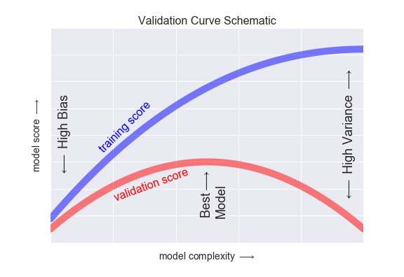
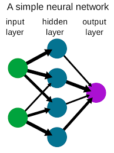

# ML Interview Questions


### Question Set 1

#### Machine Learning Interview Questions: 4 Categories
We’ve traditionally seen machine learning interview questions pop up in several categories.

1. The first really has to do with the **algorithms and theory** behind machine learning. You’ll have to show an understanding of how algorithms compare with one another and how to measure their efficacy and accuracy in the right way.

2. The second category has to do with your **programming skills** and your ability to execute on top of those algorithms and the theory.

3. The third has to do with your **general interest in machine learning**. You’ll be asked about what’s going on in the industry and how you keep up with the latest machine learning trends.

4. Finally, there are **company or industry-specific questions** that test your ability to take your general machine learning knowledge and turn it into actionable points to drive the bottom line forward.

We’ve divided this guide to machine learning interview questions into the categories we mentioned above so that you can more easily get to the information you need when it comes to machine learning interview questions.

#### Machine Learning Interview Questions: Algorithms/Theory
These algorithms questions will test your grasp of the theory behind machine learning.

**Q1: What’s the trade-off between bias and variance?**

**Answer:** Bias is error due to erroneous or overly simplistic assumptions in the learning algorithm you’re using. This can lead to the model underfitting your data, making it hard for it to have high predictive accuracy and for you to generalize your knowledge from the training set to the test set.

Variance is error due to too much complexity in the learning algorithm you’re using. This leads to the algorithm being highly sensitive to high degrees of variation in your training data, which can lead your model to overfit the data. You’ll be carrying too much noise from your training data for your model to be very useful for your test data.

The bias-variance decomposition essentially decomposes the learning error from any algorithm by adding the bias, the variance and a bit of irreducible error due to noise in the underlying dataset. Essentially, if you make the model more complex and add more variables, you’ll lose bias but gain some variance — in order to get the optimally reduced amount of error, you’ll have to tradeoff bias and variance. You don’t want either high bias or high variance in your model.

**Q2: What is the difference between supervised and unsupervised machine learning?**

**Answer:** Supervised learning requires training labeled data. For example, in order to do classification (a supervised learning task), you’ll need to first label the data you’ll use to train the model to classify data into your labeled groups. Unsupervised learning, in contrast, does not require labeling data explicitly.

**Q3: How is KNN different from k-means clustering?**

**Answer:** K-Nearest Neighbors is a supervised classification algorithm, while k-means clustering is an unsupervised clustering algorithm. While the mechanisms may seem similar at first, what this really means is that in order for K-Nearest Neighbors to work, you need labeled data you want to classify an unlabeled point into (thus the nearest neighbor part). K-means clustering requires only a set of unlabeled points and a threshold: the algorithm will take unlabeled points and gradually learn how to cluster them into groups by computing the mean of the distance between different points.

The critical difference here is that KNN needs labeled points and is thus supervised learning, while k-means doesn’t—and is thus unsupervised learning.

**Q4: Explain how a ROC curve works.**

**Answer:** The ROC curve is a graphical representation of the contrast between true positive rates and the false positive rate at various thresholds. It’s often used as a proxy for the trade-off between the sensitivity of the model (true positives) vs the fall-out or the probability it will trigger a false alarm (false positives).

**Q5: Define precision and recall.**

**Answer:** Recall is also known as the true positive rate: the amount of positives your model claims compared to the actual number of positives there are throughout the data. Precision is also known as the positive predictive value, and it is a measure of the amount of accurate positives your model claims compared to the number of positives it actually claims. It can be easier to think of recall and precision in the context of a case where you’ve predicted that there were 10 apples and 5 oranges in a case of 10 apples. You’d have perfect recall (there are actually 10 apples, and you predicted there would be 10) but 66.7% precision because out of the 15 events you predicted, only 10 (the apples) are correct.

**Q6: What is Bayes’ Theorem? How is it useful in a machine learning context?**

**Answer:** Bayes’ Theorem gives you the posterior probability of an event given what is known as prior knowledge.

Mathematically, it’s expressed as the true positive rate of a condition sample divided by the sum of the false positive rate of the population and the true positive rate of a condition. Say you had a 60% chance of actually having the flu after a flu test, but out of people who had the flu, the test will be false 50% of the time, and the overall population only has a 5% chance of having the flu. Would you actually have a 60% chance of having the flu after having a positive test?

Bayes’ Theorem says no. It says that you have a (.6 * 0.05) (True Positive Rate of a Condition Sample) / (.6*0.05)(True Positive Rate of a Condition Sample) + (.5*0.95) (False Positive Rate of a Population)  = 0.0594 or 5.94% chance of getting a flu.

Bayes’ Theorem is the basis behind a branch of machine learning that most notably includes the Naive Bayes classifier. That’s something important to consider when you’re faced with machine learning interview questions.

**Q7: Why is “Naive” Bayes naive?**

**Answer:** Despite its practical applications, especially in text mining, Naive Bayes is considered “Naive” because it makes an assumption that is virtually impossible to see in real-life data: the conditional probability is calculated as the pure product of the individual probabilities of components. This implies the absolute independence of features — a condition probably never met in real life.

As a Quora commenter put it whimsically, a Naive Bayes classifier that figured out that you liked pickles and ice cream would probably naively recommend you a pickle ice cream.

**Q8: Explain the difference between L1 and L2 regularization.**

**Answer:** L2 regularization tends to spread error among all the terms, while L1 is more binary/sparse, with many variables either being assigned a 1 or 0 in weighting. L1 corresponds to setting a Laplacean prior on the terms, while L2 corresponds to a Gaussian prior.

**Q9: What’s your favorite algorithm, and can you explain it to me in less than a minute?**

**Answer:** This type of question tests your understanding of how to communicate complex and technical nuances with poise and the ability to summarize quickly and efficiently. Make sure you have a choice and make sure you can explain different algorithms so simply and effectively that a five-year-old could grasp the basics!

**Q10: What’s the difference between Type I and Type II error?**

**Answer:** Don’t think that this is a trick question! Many machine learning interview questions will be an attempt to lob basic questions at you just to make sure you’re on top of your game and you’ve prepared all of your bases.

Type I error is a false positive, while Type II error is a false negative. Briefly stated, Type I error means claiming something has happened when it hasn’t, while Type II error means that you claim nothing is happening when in fact something is.

A clever way to think about this is to think of Type I error as telling a man he is pregnant, while Type II error means you tell a pregnant woman she isn’t carrying a baby.

**Q11: What’s a Fourier transform?**

**Answer:** A Fourier transform is a generic method to decompose generic functions into a superposition of symmetric functions. Or as this [more intuitive tutorial](https://betterexplained.com/articles/an-interactive-guide-to-the-fourier-transform/) puts it, given a smoothie, it’s how we find the recipe. The Fourier transform finds the set of cycle speeds, amplitudes, and phases to match any time signal. A Fourier transform converts a signal from time to frequency domain—it’s a very common way to extract features from audio signals or other time series such as sensor data.

**Q12: What’s the difference between probability and likelihood?**

TBD

**Q13: What is deep learning, and how does it contrast with other machine learning algorithms?**

**Answer:** Deep learning is a subset of machine learning that is concerned with neural networks: how to use backpropagation and certain principles from neuroscience to more accurately model large sets of unlabelled or semi-structured data. In that sense, deep learning represents an unsupervised learning algorithm that learns representations of data through the use of neural nets.

**Q14: What’s the difference between a generative and discriminative model?**

**Answer:** A generative model will learn categories of data while a discriminative model will simply learn the distinction between different categories of data. Discriminative models will generally outperform generative models on classification tasks.

**Q15: What cross-validation technique would you use on a time series dataset?**

**Answer:** Instead of using standard k-folds cross-validation, you have to pay attention to the fact that a time series is not randomly distributed data—it is inherently ordered by chronological order. If a pattern emerges in later time periods, for example, your model may still pick up on it even if that effect doesn’t hold in earlier years!

You’ll want to do something like forward chaining where you’ll be able to model on past data then look at forward-facing data.

- Fold 1 : training [1], test [2]

- Fold 2 : training [1 2], test [3]

- Fold 3 : training [1 2 3], test [4]

- Fold 4 : training [1 2 3 4], test [5]

- Fold 5 : training [1 2 3 4 5], test [6]

**Q16: How is a decision tree pruned?**

**Answer:** Pruning is what happens in decision trees when branches that have weak predictive power are removed in order to reduce the complexity of the model and increase the predictive accuracy of a decision tree model. Pruning can happen bottom-up and top-down, with approaches such as reduced error pruning and cost complexity pruning.

Reduced error pruning is perhaps the simplest version: replace each node. If it doesn’t decrease predictive accuracy, keep it pruned. While simple, this heuristic actually comes pretty close to an approach that would optimize for maximum accuracy.

**Q17: Which is more important to you: model accuracy or model performance?**

**Answer:** This question tests your grasp of the nuances of machine learning model performance! Machine learning interview questions often look towards the details. There are models with higher accuracy that can perform worse in predictive power—how does that make sense?

Well, it has everything to do with how model accuracy is only a subset of model performance, and at that, a sometimes misleading one. For example, if you wanted to detect fraud in a massive dataset with a sample of millions, a more accurate model would most likely predict no fraud at all if only a vast minority of cases were fraud. However, this would be useless for a predictive model—a model designed to find fraud that asserted there was no fraud at all! Questions like this help you demonstrate that you understand model accuracy isn’t the be-all and end-all of model performance.

**Q18: What’s the F1 score? How would you use it?**

**Answer:** The F1 score is a measure of a model’s performance. It is a weighted average of the precision and recall of a model, with results tending to 1 being the best, and those tending to 0 being the worst. You would use it in classification tests where true negatives don’t matter much.

**Q19: How would you handle an imbalanced dataset?**

**Answer:** An imbalanced dataset is when you have, for example, a classification test and 90% of the data is in one class. That leads to problems: an accuracy of 90% can be skewed if you have no predictive power on the other category of data! Here are a few tactics to get over the hump:

1. Collect more data to even the imbalances in the dataset.

2. Resample the dataset to correct for imbalances.

3. Try a different algorithm altogether on your dataset.

What’s important here is that you have a keen sense for what damage an unbalanced dataset can cause, and how to balance that.

**Q20: When should you use classification over regression?**

**Answer:** Classification produces discrete values and dataset to strict categories, while regression gives you continuous results that allow you to better distinguish differences between individual points. You would use classification over regression if you wanted your results to reflect the belongingness of data points in your dataset to certain explicit categories (ex: If you wanted to know whether a name was male or female rather than just how correlated they were with male and female names.)

**Q21: Name an example where ensemble techniques might be useful.**

**Answer:** Ensemble techniques use a combination of learning algorithms to optimize better predictive performance. They typically reduce overfitting in models and make the model more robust (unlikely to be influenced by small changes in the training data). 

You could list some examples of ensemble methods (bagging, boosting, the “bucket of models” method) and demonstrate how they could increase predictive power.

​

**Q22: How do you ensure you’re not overfitting with a model?**

**Answer:** This is a simple restatement of a fundamental problem in machine learning: the possibility of overfitting training data and carrying the noise of that data through to the test set, thereby providing inaccurate generalizations.

There are three main methods to avoid overfitting:

1. Keep the model simpler: reduce variance by taking into account fewer variables and parameters, thereby removing some of the noise in the training data.

2. Use cross-validation techniques such as k-folds cross-validation.

3. Use regularization techniques such as LASSO that penalize certain model parameters if they’re likely to cause overfitting.

**Q23: What evaluation approaches would you work to gauge the effectiveness of a machine learning model?**

**Answer:** You would first split the dataset into training and test sets, or perhaps use cross-validation techniques to further segment the dataset into composite sets of training and test sets within the data. You should then implement a choice selection of performance metrics: here is a fairly [comprehensive list](https://machinelearningmastery.com/classification-accuracy-is-not-enough-more-performance-measures-you-can-use/). You could use measures such as the F1 score, the accuracy, and the confusion matrix. What’s important here is to demonstrate that you understand the nuances of how a model is measured and how to choose the right performance measures for the right situations.

**Q24: How would you evaluate a logistic regression model?**

**Answer:** A subsection of the question above. You have to demonstrate an understanding of what the typical goals of a logistic regression are (classification, prediction, etc.) and bring up a few examples and use cases.

**Q25: What’s the “kernel trick” and how is it useful?**

**Answer:** The Kernel trick involves kernel functions that can enable in higher-dimension spaces without explicitly calculating the coordinates of points within that dimension: instead, kernel functions compute the inner products between the images of all pairs of data in a feature space. This allows them the very useful attribute of calculating the coordinates of higher dimensions while being computationally cheaper than the explicit calculation of said coordinates. Many algorithms can be expressed in terms of inner products. Using the kernel trick enables us effectively run algorithms in a high-dimensional space with lower-dimensional data.

**Machine Learning Interview Questions: Programming**
These machine learning interview questions test your knowledge of programming principles you need to implement machine learning principles in practice. Machine learning interview questions tend to be technical questions that test your logic and programming skills: this section focuses more on the latter.

**Q26: How do you handle missing or corrupted data in a dataset?**

**Answer:** You could find missing/corrupted data in a dataset and either drop those rows or columns, or decide to replace them with another value.

In Pandas, there are two very useful methods: isnull() and dropna() that will help you find columns of data with missing or corrupted data and drop those values. If you want to fill the invalid values with a placeholder value (for example, 0), you could use the fillna() method.

**Q27: Do you have experience with Spark or big data tools for machine learning?**

**Answer:** You’ll want to get familiar with the meaning of big data for different companies and the different tools they’ll want. Spark is the big data tool most in demand now, able to handle immense datasets with speed. Be honest if you don’t have experience with the tools demanded, but also take a look at job descriptions and see what tools pop up: you’ll want to invest in familiarizing yourself with them.

**Q28: Pick an algorithm. Write the pseudo-code for a parallel implementation.**

**Answer:** This kind of question demonstrates your ability to think in parallelism and how you could handle concurrency in programming implementations dealing with big data. Take a look at pseudocode frameworks such as [Peril-L](https://my.eng.utah.edu/~cs4960-01/lecture4.pdf) and visualization tools such as [Web Sequence Diagrams](https://www.websequencediagrams.com/) to help you demonstrate your ability to write code that reflects parallelism.

**Q31: Which data visualization libraries do you use? What are your thoughts on the best data visualization tools?**

**Answer:** What’s important here is to define your views on how to properly visualize data and your personal preferences when it comes to tools. Popular tools include R’s ggplot, Python’s seaborn and matplotlib, and tools such as Plot.ly and Tableau.

**Q36: How would you build a data pipeline?**

**Answer:** Data pipelines are the bread and butter of machine learning engineers, who take data science models and find ways to automate and scale them. Make sure you’re familiar with the tools to build data pipelines (such as Apache Airflow) and the platforms where you can host models and pipelines (such as Google Cloud or AWS or Azure). Explain the steps required in a functioning data pipeline and talk through your actual experience building and scaling them in production. 

**Machine Learning Interview Questions: Company/Industry Specific**
These machine learning interview questions deal with how to implement your general machine learning knowledge to a specific company’s requirements. You’ll be asked to create case studies and extend your knowledge of the company and industry you’re applying for with your machine learning skills.

**Q37: What do you think is the most valuable data in our business?**

**Answer:** This question or questions like it really try to test you on two dimensions. The first is your knowledge of the business and the industry itself, as well as your understanding of the business model. The second is whether you can pick how correlated data is to business outcomes in general, and then how you apply that thinking to your context about the company. You’ll want to research the business model and ask good questions to your recruiter—and start thinking about what business problems they probably want to solve most with their data. 

**Q38: How would you implement a recommendation system for our company’s users?**

**Answer:** A lot of machine learning interview questions of this type will involve the implementation of machine learning models to a company’s problems. You’ll have to research the company and its industry in-depth, especially the revenue drivers the company has, and the types of users the company takes on in the context of the industry it’s in.

**Q39: How can we use your machine learning skills to generate revenue?**

**Answer:** This is a tricky question. The ideal answer would demonstrate knowledge of what drives the business and how your skills could relate. For example, if you were interviewing for music-streaming startup Spotify, you could remark that your skills at developing a better recommendation model would increase user retention, which would then increase revenue in the long run.

The startup metrics Slideshare linked above will help you understand exactly what performance indicators are important for startups and tech companies as they think about revenue and growth.

**Q40: What do you think of our current data process?**

**Answer:** This kind of question requires you to listen carefully and impart feedback in a manner that is constructive and insightful. Your interviewer is trying to gauge if you’d be a valuable member of their team and whether you grasp the nuances of why certain things are set the way they are in the company’s data process based on company or industry-specific conditions. They’re trying to see if you can be an intellectual peer. Act accordingly.

**Machine Learning Interview Questions: General Machine Learning Interest**
This series of machine learning interview questions attempts to gauge your passion and interest in machine learning. The right answers will serve as a testament to your commitment to being a lifelong learner in machine learning.

**Q41: What are the last machine learning papers you’ve read?**

**Answer:** Keeping up with the latest scientific literature on machine learning is a must if you want to demonstrate an interest in a machine learning position. This overview of [deep learning in Nature](http://www.cs.toronto.edu/~hinton/absps/NatureDeepReview.pdf) by the scions of deep learning themselves (from Hinton to Bengio to LeCun) can be a good reference paper and an overview of what’s happening in deep learning — and the kind of paper you might want to cite.

**Q42: Do you have research experience in machine learning?**

**Answer:** Related to the last point, most organizations hiring for machine learning positions will look for your formal experience in the field. Research papers, co-authored or supervised by leaders in the field, can make the difference between you being hired and not. Make sure you have a summary of your research experience and papers ready—and an explanation for your background and lack of formal research experience if you don’t.

**Q43: What are your favorite use cases of machine learning models?**

**Answer:** The Quora thread below contains some examples, such as decision trees that categorize people into different tiers of intelligence based on IQ scores. Make sure that you have a few examples in mind and describe what resonated with you. It’s important that you demonstrate an interest in how machine learning is implemented.

**Q44: How would you approach the “Netflix Prize” competition?**

**Answer:** The Netflix Prize was a famed competition where Netflix offered $1,000,000 for a better collaborative filtering algorithm. The team that won called BellKor had a 10% improvement and used an ensemble of different methods to win. Some familiarity with the case and its solution will help demonstrate you’ve paid attention to machine learning for a while.

**Q45: Where do you usually source datasets?**

**Answer:** Machine learning interview questions like these try to get at the heart of your machine learning interest. Somebody who is truly passionate about machine learning will have gone off and done side projects on their own, and have a good idea of what great datasets are out there. If you’re missing any, check out [Quandl](https://www.quandl.com/) for economic and financial data, and [Kaggle’s Datasets](https://www.kaggle.com/datasets) collection for another great list.

**Q46: How do you think Google is training data for self-driving cars?**

**Answer:** Machine learning interview questions like this one really test your knowledge of different machine learning methods, and your inventiveness if you don’t know the answer. Google is currently using [recaptcha](https://www.google.com/recaptcha/about/) to source labeled data on storefronts and traffic signs. They are also building on training data collected by Sebastian Thrun at GoogleX—some of which was obtained by his grad students driving buggies on desert dunes!

**Q47: How would you simulate the approach AlphaGo took to beat Lee Sedol at Go?**

**Answer:** AlphaGo beating Lee Sedol, the best human player at Go, in a best-of-five series was a truly seminal event in the history of machine learning and deep learning. The Nature paper above describes how this was accomplished with “Monte-Carlo tree search with deep neural networks that have been trained by supervised learning, from human expert games, and by reinforcement learning from games of self-play.”

**Q48: What are your thoughts on GPT-3 and OpenAI’s model?**

**Answer:** [GPT-3 is a new language generation model developed by OpenAI](https://github.com/openai/gpt-3). It was marked as exciting because with very little change in architecture, and a ton more data, GPT-3 could generate what seemed to be human-like conversational pieces, up to and including novel-size works and the ability to create code from natural language. There are many perspectives on GPT-3 throughout the Internet — if it comes up in an interview setting, be prepared to address this topic (and trending topics like it) intelligently to demonstrate that you follow the latest advances in machine learning. 

**Q49: What models do you train for fun, and what GPU/hardware do you use?**

**Answer:** This question tests whether you’ve worked on machine learning projects outside of a corporate role and whether you understand the basics of how to resource projects and allocate GPU-time efficiently. Expect questions like this to come from hiring managers that are interested in getting a greater sense behind your portfolio, and what you’ve done independently.

**Q50: What are some of your favorite APIs to explore?** 

**Answer:** If you’ve worked with external data sources, it’s likely you’ll have a few favorite APIs that you’ve gone through. You can be thoughtful here about the kinds of experiments and pipelines you’ve run in the past, along with how you think about the APIs you’ve used before. 

**Q51: How do you think quantum computing will affect machine learning?**

**Answer:** With the recent announcement of more breakthroughs in quantum computing, the question of how this new format and way of thinking through hardware serves as a useful proxy to explain classical computing and machine learning, and some of the hardware nuances that might make some algorithms much easier to do on a quantum machine. Demonstrating some knowledge in this area helps show that you’re interested in machine learning at a much higher level than just implementation details.

___

### Question Set 2
**1. What Are the Different Types of Machine Learning?**
There are three types of machine learning:

**Supervised Learning**

In supervised machine learning, a model makes predictions or decisions based on past or labeled data. Labeled data refers to sets of data that are given tags or labels, and thus made more meaningful.


**Unsupervised Learning**
In unsupervised learning, we don't have labeled data. A model can identify patterns, anomalies, and relationships in the input data.


**Reinforcement Learning**
Using reinforcement learning, the model can learn based on the rewards it received for its previous action.


Consider an environment where an agent is working. The agent is given a target to achieve. Every time the agent takes some action toward the target, it is given positive feedback. And, if the action taken is going away from the goal, the agent is given negative feedback.

​

**2. What is Overfitting, and How Can You Avoid It?** 
Overfitting is a situation that occurs when a model learns the training set too well, taking up random fluctuations in the training data as concepts. These impact the model’s ability to generalize and don’t apply to new data. 

When a model is given the training data, it shows 100 percent accuracy—technically a slight loss. But, when we use the test data, there may be an error and low efficiency. This condition is known as overfitting.

There are multiple ways of avoiding overfitting, such as:

- Regularization. It involves a cost term for the features involved with the objective function

- Making a simple model. With lesser variables and parameters, the variance can be reduced 

- Cross-validation methods like k-folds can also be used

- If some model parameters are likely to cause overfitting, techniques for regularization like LASSO can be used that penalize these parameters

​

**3. What is ‘training Set’ and ‘test Set’ in a Machine Learning Model? How Much Data Will You Allocate for Your Training, Validation, and Test Sets?**

There is a three-step process followed to create a model:

1. Train the model

2. Test the model 

3. Deploy the model

Training Set|Test Set
-|-
The training set is examples given to the model to analyze and learn|The test set is used to test the accuracy of the hypothesis generated by the model
70% of the total data is typically taken as the training dataset|Remaining 30% is taken as testing dataset
This is labeled data used to train the model|We test without labeled data and then verify results with labels

Consider a case where you have labeled data for 1,000 records. One way to train the model is to expose all 1,000 records during the training process. Then you take a small set of the same data to test the model, which would give good results in this case.

But, this is not an accurate way of testing. So, we set aside a portion of that data called the ‘test set’ before starting the training process. The remaining data is called the ‘training set’ that we use for training the model. The training set passes through the model multiple times until the accuracy is high, and errors are minimized.


Now, we pass the test data to check if the model can accurately predict the values and determine if training is effective. If you get errors, you either need to change your model or retrain it with more data.


Regarding the question of how to split the data into a training set and test set, there is no fixed rule, and the ratio can vary based on individual preferences.

​

**4. How Do You Handle Missing or Corrupted Data in a Dataset?**
One of the easiest ways to handle missing or corrupted data is to drop those rows or columns or replace them entirely with some other value.

There are two useful methods in Pandas:

- IsNull() and dropna() will help to find the columns/rows with missing data and drop them

- Fillna() will replace the wrong values with a placeholder value


**5. How Can You Choose a Classifier Based on a Training Set Data Size?**
When the training set is small, a model that has a right bias and low variance seems to work better because they are less likely to overfit. 

For example, Naive Bayes works best when the training set is large. Models with low bias and high variance tend to perform better as they work fine with complex relationships.


**6. Explain the Confusion Matrix with Respect to Machine Learning Algorithms.**
A confusion matrix (or error matrix) is a specific table that is used to measure the performance of an algorithm. It is mostly used in supervised learning; in unsupervised learning, it’s called the matching matrix.

The confusion matrix has two parameters:

- Actual

- Predicted 

It also has identical sets of features in both of these dimensions.

Consider a confusion matrix (binary matrix) shown below:


Here,

For actual values:

Total Yes = 12+1 = 13

Total No = 3+9 = 12 

Similarly, for predicted values:

Total Yes = 12+3 = 15

Total No = 1+9 = 10 

For a model to be accurate, the values across the diagonals should be high. The total sum of all the values in the matrix equals the total observations in the test data set. 

For the above matrix, total observations = 12+3+1+9 = 25

Now, accuracy = sum of the values across the diagonal / total dataset

= (12+9) / 25

= 21 / 25

= 84%

**7. What Is a False Positive and False Negative and How Are They Significant?**
False positives are those cases which wrongly get classified as **True** but are **False**. 

False negatives are those cases which wrongly get classified as **False** but are **True**.

In the term ‘False Positive,’ the word ‘Positive’ refers to the ‘Yes’ row of the predicted value in the confusion matrix. The complete term indicates that the system has predicted it as a positive, but the actual value is negative. 


So, looking at the confusion matrix, we get:

False-positive = 3

True positive = 12

Similarly, in the term ‘False Negative,’ the word ‘Negative’ refers to the ‘No’ row of the predicted value in the confusion matrix. And the complete term indicates that the system has predicted it as negative, but the actual value is positive.

So, looking at the confusion matrix, we get:

False Negative = 1

True Negative = 9

**8. What Are the Three Stages of Building a Model in Machine Learning?**
The three stages of building a machine learning model are:

- **Model Building**

    Choose a suitable algorithm for the model and train it according to the requirement 

- **Model Testing**

    Check the accuracy of the model through the test data 

- **Applying the Model**

Make the required changes after testing and use the final model for real-time projects

Here, it’s important to remember that once in a while, the model needs to be checked to make sure it’s working correctly. It should be modified to make sure that it is up-to-date.

**9. What is Deep Learning?**

​[Deep learning](https://www.simplilearn.com/tutorials/deep-learning-tutorial/what-is-deep-learning) is a subset of machine learning that involves systems that think and learn like humans using artificial neural networks. The term ‘deep’ comes from the fact that you can have several layers of neural networks. 

One of the primary differences between machine learning and deep learning is that feature engineering is done manually in machine learning. In the case of deep learning, the model consisting of neural networks will automatically determine which features to use (and which not to use). 

**10. What Are the Differences Between Machine Learning and Deep Learning?**

Machine Learning|Deep Learning
-|-
Enables machines to take decisions on their own, based on past data|Enables machines to take decisions with the help of artificial neural networks
It needs only a small amount of data for training|It needs a large amount of training data 
Works well on the low-end system, so you don't need large machines|Needs high-end machines because it requires a lot of computing power  
Most features need to be identified in advance and manually coded|The machine learns the features from the data it is provided
The problem is divided into two parts and solved individually and then combined|The problem is solved in an end-to-end manner

​

**11. What Are the Applications of Supervised Machine Learning in Modern Businesses?**
Applications of supervised machine learning include:

- **Email Spam Detection**

    Here we train the model using historical data that consists of emails categorized as spam or not spam. This labeled information is fed as input to the model.

- **Healthcare Diagnosis**

    By providing images regarding a disease, a model can be trained to detect if a person is suffering from the disease or not.

- **Sentiment Analysis**

    This refers to the process of using algorithms to mine documents and determine whether they’re positive, neutral, or negative in sentiment. 

- **Fraud Detection**

    Training the model to identify suspicious patterns, we can detect instances of possible fraud.

**12. What is Semi-supervised Machine Learning?**

Supervised learning uses data that is completely labeled, whereas unsupervised learning uses no training data.

In the case of semi-supervised learning, the training data contains a small amount of labeled data and a large amount of unlabeled data.


**13. What Are Unsupervised Machine Learning Techniques?**

There are two techniques used in unsupervised learning: clustering and association.

**Clustering**
Clustering problems involve data to be divided into subsets. These subsets, also called clusters, contain data that are similar to each other. Different clusters reveal different details about the objects, unlike classification or regression.


**Association**
In an association problem, we identify patterns of associations between different variables or items.

For example, an e-commerce website can suggest other items for you to buy, based on the prior purchases that you have made, spending habits, items in your wishlist, other customers’ purchase habits, and so on.


​

**14. What is the Difference Between Supervised and Unsupervised Machine Learning?**
- **Supervised learning -** This model learns from the labeled data and makes a future prediction as output 

- **Unsupervised learning -** This model uses unlabeled input data and allows the algorithm to act on that information without guidance.

**15. What is the Difference Between Inductive Machine Learning and Deductive Machine Learning?**

Inductive Learning|Deductive Learning
-|-
It observes instances based on defined principles to draw a conclusion|It concludes experiences
Example: Explaining to a child to keep away from the fire by showing a video where fire causes damage|Example: Allow the child to play with fire. If he or she gets burned, they will learn that it is dangerous and will refrain from making the same mistake again

**16. Compare K-means and KNN Algorithms.**

K-means|KNN
-|-
​[K-Means](https://www.simplilearn.com/tutorials/machine-learning-tutorial/k-means-clustering-algorithm) is unsupervised|​[KNN](https://www.simplilearn.com/tutorials/machine-learning-tutorial/knn-in-python) is supervised in nature
K-Means is a clustering algorithm|KNN is a classification algorithm
The points in each cluster are similar to each other, and each cluster is different from its neighboring clusters|It classifies an unlabeled observation based on its K (can be any number) surrounding neighbors


**17. What Is ‘naive’ in the Naive Bayes Classifier?**

The classifier is called ‘naive’ because it makes assumptions that may or may not turn out to be correct. 

The algorithm assumes that the presence of one feature of a class is not related to the presence of any other feature (absolute independence of features), given the class variable.

For instance, a fruit may be considered to be a cherry if it is red in color and round in shape, regardless of other features. This assumption may or may not be right (as an apple also matches the description).

**18. Explain How a System Can Play a Game of Chess Using Reinforcement Learning.**

Reinforcement learning has an environment and an agent. The agent performs some actions to achieve a specific goal. Every time the agent performs a task that is taking it towards the goal, it is rewarded. And, every time it takes a step which goes against that goal or in reverse direction, it is penalized. 

Earlier, chess programs had to determine the best moves after much research on numerous factors. Building a machine designed to play such games would require many rules to be specified. 

With reinforced learning, we don’t have to deal with this problem as the learning agent learns by playing the game. It will make a move (decision), check if it’s the right move (feedback), and keep the outcomes in memory for the next step it takes (learning). There is a reward for every correct decision the system takes and punishment for the wrong one. 

**19. How Will You Know Which Machine Learning Algorithm to Choose for Your Classification Problem?**

While there is no fixed rule to choose an algorithm for a classification problem, you can follow these guidelines:

- If accuracy is a concern, test different algorithms and cross-validate them

- If the training dataset is small, use models that have low variance and high bias

- If the training dataset is large, use models that have high variance and little bias

**20. How is Amazon Able to Recommend Other Things to Buy? How Does the Recommendation Engine Work?**

Once a user buys something from Amazon, Amazon stores that purchase data for future reference and finds products that are most likely also to be bought, it is possible because of the Association algorithm, which can identify patterns in a given dataset. 


​

**21. When Will You Use Classification over Regression?**

Classification is used when your target is categorical, while regression is used when your target variable is continuous. Both classification and regression belong to the category of supervised machine learning algorithms. 

Examples of classification problems include:

- Predicting yes or no

- Estimating gender

- Breed of an animal

- Type of color

Examples of regression problems include:

- Estimating sales and price of a product

- Predicting the score of a team

- Predicting the amount of rainfall

​

**22. How Do You Design an Email Spam Filter?**

Building a spam filter involves the following process:

- The email spam filter will be fed with thousands of emails 

- Each of these emails already has a label: ‘spam’ or ‘not spam.’

- The supervised machine learning algorithm will then determine which type of emails are being marked as spam based on spam words like the lottery, free offer, no money, full refund, etc.

- The next time an email is about to hit your inbox, the spam filter will use statistical analysis and algorithms like Decision Trees and SVM to determine how likely the email is spam

- If the likelihood is high, it will label it as spam, and the email won’t hit your inbox

- Based on the accuracy of each model, we will use the algorithm with the highest accuracy after testing all the models


**23. What is a Random Forest?**

A ‘[random forest](https://www.simplilearn.com/tutorials/machine-learning-tutorial/random-forest-algorithm)’ is a supervised machine learning algorithm that is generally used for classification problems. It operates by constructing multiple decision trees during the training phase. The random forest chooses the decision of the majority of the trees as the final decision. 


**24. Considering a Long List of Machine Learning Algorithms, given a Data Set, How Do You Decide Which One to Use?**

There is no master algorithm for all situations. Choosing an algorithm depends on the following questions:

- How much data do you have, and is it continuous or categorical?

- Is the problem related to classification, association, clustering, or regression?

- Predefined variables (labeled), unlabeled, or mix?

- What is the goal?

Based on the above questions, the following algorithms can be used:


**25. What is Bias and Variance in a Machine Learning Model?**

**Bias**

Bias in a machine learning model occurs when the predicted values are further from the actual values. Low bias indicates a model where the prediction values are very close to the actual ones.

Underfitting: High bias can cause an algorithm to miss the relevant relations between features and target outputs. 

**Variance**

Variance refers to the amount the target model will change when trained with different training data. For a good model, the variance should be minimized. 

Overfitting: High variance can cause an algorithm to model the random noise in the training data rather than the intended outputs.

**26. What is the Trade-off Between Bias and Variance?**
The bias-variance decomposition essentially decomposes the learning error from any algorithm by adding the bias, variance, and a bit of irreducible error due to noise in the underlying dataset. 

Necessarily, if you make the model more complex and add more variables, you’ll lose bias but gain variance. To get the optimally-reduced amount of error, you’ll have to trade off bias and variance. Neither high bias nor high variance is desired.

High bias and low variance algorithms train models that are consistent, but inaccurate on average.

High variance and low bias algorithms train models that are accurate but inconsistent.

**27. Define Precision and Recall.**

**Precision**

Precision is the ratio of several events you can correctly recall to the total number of events you recall (mix of correct and wrong recalls).

Precision = (True Positive) / (True Positive + False Positive)

**Recall**

A recall is the ratio of a number of events you can recall the number of total events.

Recall = (True Positive) / (True Positive + False Negative)

​

**28. What is Decision Tree Classification?**
A decision tree builds classification (or regression) models as a tree structure, with datasets broken up into ever-smaller subsets while developing the decision tree, literally in a tree-like way with branches and nodes. Decision trees can handle both categorical and numerical data. 

**29. What is Pruning in Decision Trees, and How Is It Done?**
Pruning is a technique in machine learning that reduces the size of decision trees. It reduces the complexity of the final classifier, and hence improves predictive accuracy by the reduction of overfitting. 

Pruning can occur in:

- **Top-down fashion.** It will traverse nodes and trim subtrees starting at the root

- **Bottom-up fashion.** It will begin at the leaf nodes

There is a popular pruning algorithm called reduced error pruning, in which:

- Starting at the leaves, each node is replaced with its most popular class

- If the prediction accuracy is not affected, the change is kept

- There is an advantage of simplicity and speed

**30. Briefly Explain Logistic Regression.**

Logistic regression is a classification algorithm used to predict a binary outcome for a given set of independent variables. 

The output of logistic regression is either a 0 or 1 with a threshold value of generally 0.5. Any value above 0.5 is considered as 1, and any point below 0.5 is considered as 0.


​

**31. Explain the K Nearest Neighbor Algorithm.**
K nearest neighbor algorithm is a classification algorithm that works in a way that a new data point is assigned to a neighboring group to which it is most similar. 

In K nearest neighbors, K can be an integer greater than 1. So, for every new data point, we want to classify, we compute to which neighboring group it is closest. 

Let us classify an object using the following example. Consider there are three clusters:

- Football

- Basketball 

- Tennis ball


Let the new data point to be classified is a black ball. We use KNN to classify it. Assume K = 5 (initially). 

Next, we find the K (five) nearest data points, as shown.


Observe that all five selected points do not belong to the same cluster. There are three tennis balls and one each of basketball and football. 

When multiple classes are involved, we prefer the majority. Here the majority is with the tennis ball, so the new data point is assigned to this cluster.

**32. What is a Recommendation System?**
Anyone who has used Spotify or shopped at Amazon will recognize a recommendation system: It’s an information filtering system that predicts what a user might want to hear or see based on choice patterns provided by the user.

**33. What is Kernel SVM?**
Kernel SVM is the abbreviated version of the kernel support vector machine. Kernel methods are a class of algorithms for pattern analysis, and the most common one is the kernel SVM.

**34. What Are Some Methods of Reducing Dimensionality?**
You can reduce dimensionality by combining features with feature engineering, removing collinear features, or using algorithmic dimensionality reduction.

Now that you have gone through these machine learning interview questions, you must have got an idea of your strengths and weaknesses in this domain.

___

### Question Set 3

**1. What are the types of Machine Learning?**
In all the ML Interview Questions that we would be going to discuss, this is one of the most basic question.

So, basically, there are three types of Machine Learning techniques:

**Supervised Learning:** In this type of the Machine Learning technique, machines learn under the supervision of labeled data. There is a training dataset on which the machine is trained, and it gives the output according to its training.

**Unsupervised Learning:** Unlike supervised learning, it has unlabeled data. So, there is no supervision under which it works on the data. Basically, unsupervised learning tries to identify patterns in data and make clusters of similar entities. After that, when a new input data is fed into the model, it does not identify the entity; rather, it puts the entity in a cluster of similar objects.

**Reinforcement Learning:** Reinforcement learning includes models that learn and traverse to find the best possible move. The algorithms for reinforcement learning are constructed in a way that they try to find the best possible suite of action on the basis of the reward and punishment theory.

**2. Differentiate between classification and regression in Machine Learning.**

In Machine Learning, there are various types of prediction problems based on supervised and unsupervised learning. These are classification, regression, clustering, and association. Here, we will discuss about classification and regression.

**Classification:** In classification, we try to create a Machine Learning model that assists us in differentiating data into separate categories. The data is labeled and categorized based on the input parameters.

For example, imagine that we want to make predictions on the churning out customers for a particular product based on some data recorded. Either the customers will churn out or they will not. So, the labels for this would be ‘Yes’ and ‘No.’

**Regression:** It is the process of creating a model for distinguishing data into continuous real values, instead of using classes or discrete values. It can also identify the distribution movement depending on the historical data. It is used for predicting the occurrence of an event depending on the degree of association of variables.

For example, the prediction of weather condition depends on factors such as temperature, air pressure, solar radiation, elevation of the area, and distance from sea. The relation between these factors assists us in predicting the weather condition.


**3. What is Linear Regression?**
Linear Regression is a supervised Machine Learning algorithm. It is used to find the linear relationship between the dependent and the independent variables for predictive analysis.

The equation for Linear Regression:
```
Y = A + BX
```

where:

- **X** is the input or the independent variable

- **Y** is the output or the dependent variable

- **a** is the intercept and **b** is the coefficient of X

Below is the **best fit line** that shows the data of weight (**Y** or the dependent variable) and height (**X** or the independent variable) of 21-years-old candidates scattered over the plot. This straight line shows the best linear relationship that would help in predicting the weight of candidates according to their height.


To get this **best fit line**, we will try to find the best values of a and b. By adjusting the values of a and b, we will try to reduce errors in the prediction of Y.

This is how linear regression helps in finding the linear relationship and predicting the output.

**4. How will you determine the Machine Learning algorithm that is suitable for your problem?**

To identify the Machine Learning algorithm for our problem, we should follow the below steps:

**Step 1: Problem Classification:** Classification of the problem depends on the classification of input and output:

- **Classifying the input:** Classification of the input depends on whether we have data labeled (supervised learning) or unlabeled (unsupervised learning), or whether we have to create a model that interacts with the environment and improves itself (reinforcement learning).

- **Classifying the output:** If we want the output of our model as a class, then we need to use some classification techniques.

If it is giving the output as a number, then we must use regression techniques and, if the output is a different cluster of inputs, then we should use clustering techniques.

**Step 2: Checking the algorithms in hand:** After classifying the problem, we have to look for the available algorithms that can be deployed for solving the classified problem.

**Step 3: Implementing the algorithms:** If there are multiple algorithms available, then we will implement each one of them, one by one. Finally, we would select the algorithm that gives the best performance.

**5. What are Bias and Variance?**

- **Bias** is the difference between the average prediction of our model and the correct value. If the bias value is high, then the prediction of the model is not accurate. Hence, the bias value should be as low as possible to make the desired predictions.

- **Variance** is the number that gives the difference of prediction over a training set and the anticipated value of other training sets. High variance may lead to large fluctuation in the output. Therefore, the model’s output should have low variance.

The below diagram shows the bias–variance trade off:


Here, the desired result is the blue circle at the center. If we get off from the blue section, then the prediction goes wrong.

**6. What is Variance Inflation Factor?**

Variance Inflation Factor (VIF) is the estimate of the volume of multicollinearity in a collection of many regression variables.

VIF = Variance of the model / Variance of the model with a single independent variable

We have to calculate this ratio for every independent variable. If VIF is high, then it shows the high collinearity of the independent variables.

**7. Explain false negative, false positive, true negative, and true positive with a simple example.**

**True Positive (TP):** When the Machine Learning model **correctly** predicts the condition, it is said to have a True Positive value.

**True Negative (TN):** When the Machine Learning model **correctly** predicts the negative condition or class, then it is said to have a True Negative value.

**False Positive (FP):** When the Machine Learning model **incorrectly** predicts a negative class or condition, then it is said to have a False Positive value.

**False Negative (FN):** When the Machine Learning model **incorrectly** predicts a positive class or condition, then it is said to have a False Negative value.

**8. What is a Confusion Matrix?**

Confusion matrix is used to explain a model’s performance and gives the summary of predictions on the classification problems. It assists in identifying the uncertainty between classes.

A confusion matrix gives the count of correct and incorrect values and also the error types.**Accuracy of the model:**


<center>Accuracy of the model</center>


For example, consider this confusion matrix. It consists of values as True Positive, True Negative, False Positive, and False Negative for a classification model. Now, the accuracy of the model can be calculated as follows:


<center>What is a Confusion Matrix</center>

Thus, in our example:
```
Accuracy = (200 + 50) / (200 + 50 + 10 + 60) = 0.78
```

This means that the model’s accuracy is 0.78, corresponding to its True Positive, True Negative, False Positive, and False Negative values.

**9. What do you understand by Type I and Type II errors?**

**Type I Error:** Type I error (False Positive) is an error where the outcome of a test shows the non-acceptance of a true condition.

For example, a cricket match is going on and, when a batsman is not out, the umpire declares that he is out. This is a false positive condition. Here, the test does not accept the true condition that the batsman is not out.

**Type II Error:** Type II error (False Negative) is an error where the outcome of a test shows the acceptance of a false condition.

For example, the CT scan of a person shows that he is not having a disease but, in reality, he is having it. Here, the test accepts the false condition that the person is not having the disease.

**10. When should you use classification over regression?**

Both classification and regression are associated with prediction. Classification involves the identification of values or entities that lie in a specific group. The regression method, on the other hand, entails predicting a response value from a consecutive set of outcomes.

The classification method is chosen over regression when the output of the model needs to yield the belongingness of data points in a dataset to a particular category.

For example, we have some names of bikes and cars. We would not be interested in finding how these names are correlated to bikes and cars. Rather, we would check whether each name belongs to the bike category or to the car category.

**11. Explain Logistic Regression.**

Logistic regression is the proper regression analysis used when the dependent variable is categorical or binary. Like all regression analyses, logistic regression is a technique for predictive analysis. Logistic regression is used to explain data and the relationship between one dependent binary variable and one or more independent variables. Also, it is employed to predict the probability of a categorical dependent variable.

We can use logistic regression in the following scenarios:

- To predict whether a citizen is a Senior Citizen (1) or not (0)

- To check whether a person is having a disease (Yes) or not (No)

There are three types of logistic regression:

- **Binary Logistic Regression:** In this, there are only two outcomes possible.

**Example:** To predict whether it will rain (1) or not (0)

- **Multinomial Logistic Regression:** In this, the output consists of three or more unordered categories.

**Example:** Prediction on the regional languages (Kannada, Telugu, Marathi, etc.)

- **Ordinal Logistic Regression:** In ordinal logistic regression, the output consists of three or more ordered categories.

**Example:** Rating an Android application from 1 to 5 stars.

​

**12. Imagine, you are given a dataset consisting of variables having more than 30% missing values. Let’s say, out of 50 variables, 8 variables have missing values, which is higher than 30%. How will you deal with them?**

To deal with the missing values, we will do the following:

- We will specify a different class for the missing values.

- Now, we will check the distribution of values, and we would hold those missing values that are defining a pattern.

- Then, we will charge these into a yet another class, while eliminating others.

​

**13. How do you handle the missing or corrupted data in a dataset?**

In Python Pandas, there are two methods that are very useful. We can use these two methods to locate the lost or corrupted data and discard those values:

- **isNull():** For detecting the missing values, we can use the isNull() method.

- **dropna():** For removing the columns/rows with null values, we can use the dropna() method.

Also, we can use **fillna()** to fill the void values with a placeholder value.

​

**14. Explain Principal Component Analysis (PCA).**

Firstly, this is one of the most important Machine Learning Interview Questions.

In the real world, we deal with multi-dimensional data. Thus, data visualization and computation become more challenging with the increase in dimensions. In such a scenario, we might have to reduce the dimensions to analyze and visualize the data easily. We do this by:

- Removing irrelevant dimensions

- Keeping only the most relevant dimensions

This is where we use Principal Component Analysis (PCA).

Finding a fresh collection of uncorrelated dimensions (orthogonal) and ranking them on the basis of variance are the goals of Principal Component Analysis.

**The Mechanism of PCA:**

- Compute the covariance matrix for data objects

- Compute the Eigen vectors and the Eigen values in a descending order

- To get the new dimensions, select the initial N Eigen vectors

- Finally, change the initial n-dimensional data objects into N-dimensions

**Example:** Below are the two graphs showing data points (objects) and two directions: one is ‘green’ and the other is ‘yellow.’ We got the Graph 2 by rotating the Graph 1 so that the x-axis and y-axis represent the ‘green’ and ‘yellow’ directions, respectively.
<div align='center'> 


Explain Principal Component Analysis (PCA)


 Output from PCA</div>

After the rotation of the data points, we can infer that the green direction (x-axis) gives us the line that best fits the data points.

Here, we are representing 2-dimensional data. But in real-life, the data would be multi-dimensional and complex. So, after recognizing the importance of each direction, we can reduce the area of dimensional analysis by cutting off the less-significant ‘directions.’

Now, we will look into another important Machine Learning Interview Question on PCA.

**15. Why rotation is required in PCA? What will happen if you don’t rotate the components?**

Rotation is a significant step in PCA as it maximizes the separation within the variance obtained by components. Due to this, the interpretation of components becomes easier.

The motive behind doing PCA is to choose fewer components that can explain the greatest variance in a dataset. When rotation is performed, the original coordinates of the points get changed. However, there is no change in the relative position of the components.

If the components are not rotated, then we need more extended components to describe the variance.

**16. We know that one hot encoding increases the dimensionality of a dataset, but label encoding doesn’t. How?**

When we use one **hot encoding**, there is an increase in the dimensionality of a dataset. The reason for the increase in dimensionality is that, for every class in the categorical variables, it forms a different variable.

**Example:** Suppose, there is a variable ‘Color.’ It has three sub-levels as Yellow, Purple, and Orange. So, one hot encoding ‘Color’ will create three different variables as Color.Yellow, Color.Porple, and Color.Orange.

In **label encoding**, the sub-classes of a certain variable get the value as 0 and 1. So, we use label encoding only for binary variables.

This is the reason that one hot encoding increases the dimensionality of data and label encoding does not.

**17. How can you avoid overfitting?**

Overfitting happens when a machine has an inadequate dataset and it tries to learn from it. So, overfitting is inversely proportional to the amount of data.

For small databases, we can bypass overfitting by the cross-validation method. In this approach, we will divide the dataset into two sections. These two sections will comprise testing and training sets. To train the model, we will use the training dataset and, for testing the model for new inputs, we will use the testing dataset.

This is how we can avoid overfitting.

**18. Why do we need a validation set and a test set?**

We split the data into three different categories while creating a model:

1. **Training set:** We use the training set for building the model and adjusting the model’s variables. But, we cannot rely on the correctness of the model build on top of the training set. The model might give incorrect outputs on feeding new inputs.

2. **Validation set:** We use a validation set to look into the model’s response on top of the samples that don’t exist in the training dataset. Then, we will tune hyperparameters on the basis of the estimated benchmark of the validation data.

When we are evaluating the model’s response using the validation set, we are indirectly training the model with the validation set. This may lead to the overfitting of the model to specific data. So, this model won’t be strong enough to give the desired response to the real-world data.

1. **Test set:** The test dataset is the subset of the actual dataset, which is not yet used to train the model. The model is unaware of this dataset. So, by using the test dataset, we can compute the response of the created model on hidden data. We evaluate the model’s performance on the basis of the test dataset.

**Note:** We always expose the model to the test dataset after tuning the hyperparameters on top of the validation set.

As we know, the evaluation of the model on the basis of the validation set would not be enough. Thus, we use a test set for computing the efficiency of the model.

**19. What is a Decision Tree?**

A decision tree is used to explain the sequence of actions that must be performed to get the desired output. It is a hierarchical diagram that shows the actions.
<center>


What is a Decision Tree</center>


We can create an algorithm for a decision tree on the basis of the hierarchy of actions that we have set.

In the above decision tree diagram, we have made a sequence of actions for driving a vehicle with/without a license.

**20. Explain the difference between KNN and K-means Clustering.**

**K-nearest neighbors:** It is a supervised Machine Learning algorithm. In KNN, we give the identified (labeled) data to the model. Then, the model matches the points based on the distance from the closest points.
<center>


K-nearest neighbors</center>


**K-means clustering:** It is an unsupervised Machine Learning algorithm. In this, we give the unidentified (unlabeled) data to the model. Then, the algorithm creates batches of points based on the average of the distances between distinct points.
<center>


K-means clustering</center>


**21. What is Dimensionality Reduction?**

In the real world, we build Machine Learning models on top of features and parameters. These features can be multi-dimensional and large in number. Sometimes, the features may be irrelevant and it becomes a difficult task to visualize them.

Here, we use dimensionality reduction to cut down the irrelevant and redundant features with the help of principal variables. These principal variables are the subgroup of the parent variables that conserve the feature of the parent variables.

**22. Both being tree-based algorithms, how is Random Forest different from Gradient Boosting Algorithm (GBM)?**

The main difference between a random forest and GBM is the use of techniques. Random forest advances predictions using a technique called ‘bagging.’ On the other hand, GBM advances predictions with the help of a technique called ‘boosting.’

**Bagging:** In bagging, we apply arbitrary sampling and we divide the dataset into N After that, we build a model by employing a single training algorithm. Following, we combine the final predictions by polling. Bagging helps increase the efficiency of the model by decreasing the variance to eschew overfitting.

**Boosting:** In boosting, the algorithm tries to review and correct the inadmissible predictions at the initial iteration. After that, the algorithm’s sequence of iterations for correction continues until we get the desired prediction. Boosting assists in reducing bias and variance, both, for making the weak learners strong.

**23. Suppose, you found that your model is suffering from high variance. Which algorithm do you think could handle this situation and why?**
 
**Handling High Variance**

- For handling issues of high variance, we should use the bagging algorithm.

- Bagging algorithm would split data into sub-groups with replicated sampling of random data.

- Once the algorithm splits the data, we use random data to create rules using a particular training algorithm.

- After that, we use polling for combining the predictions of the model.

**24. What is ROC curve and what does it represent?**

ROC stands for ‘Receiver Operating Characteristic.’ We use ROC curves to represent the trade-off between True and False positive rates, graphically.

In ROC, AUC (Area Under the Curve) gives us an idea about the accuracy of the model.


The above graph shows an ROC curve. Greater the Area Under the Curve better the performance of the model.

Next, we would be looking at Machine Learning Interview Questions on Rescaling, Binarizing, and Standardizing.

**25. What is Rescaling of data and how is it done?**

In real-world scenarios, the attributes present in data will be in a varying pattern. So, rescaling of the characteristics to a common scale gives benefit to algorithms to process the data efficiently.

We can rescale the data using Scikit-learn. The code for rescaling the data using MinMaxScaler is as follows:

```
#Rescaling data
import pandas
import scipy
import numpy
​
from sklearn.preprocessing import MinMaxScaler
​
names = ['Abhi', 'Piyush', 'Pranay', 'Sourav', 'Sid', 'Mike', 'pedi', 'Jack', 'Tim']
Dataframe = pandas.read_csv(url, names=names)
Array = dataframe.values
​
# Splitting the array into input and output
X = array[:,0:8]
Y = array[:,8]
​
Scaler = MinMaxScaler(feature_range=(0, 1))
rescaledX = scaler.fit_transform(X)
​
# Summarizing the modified data
numpy.set_printoptions(precision=3)
print(rescaledX[0:5,:])
​
```

**26. What is Binarizing of data? How to Binarize?**
In most of the Machine Learning Interviews, apart from theoretical questions, interviewers focus on the implementation part. So, this ML Interview Questions in focused on the implementation of the theoretical concepts.

Converting data into binary values on the basis of threshold values is known as the binarizing of data. The values that are less than the threshold are set to 0 and the values that are greater than the threshold are set to 1. This process is useful when we have to perform feature engineering, and we can also use it for adding unique features.

We can binarize data using Scikit-learn. The code for binarizing the data using Binarizer is as follows:

```
from sklearn.preprocessing import Binarizer
import pandas
import numpy
names = ['Abhi', 'Piyush', 'Pranay', 'Sourav', 'Sid', 'Mike', 'pedi', 'Jack', 'Tim']
dataframe = pandas.read_csv(url, names=names)
array = dataframe.values
# Splitting the array into input and output
X = array[:,0:8]
Y = array[:,8]
binarizer = Binarizer(threshold=0.0).fit(X)
binaryX = binarizer.transform(X)
# Summarizing the modified data
numpy.set_printoptions(precision=3)
print(binaryX[0:5,:])
```

**27. How to Standardize data?**

Standardization is the method that is used for rescaling data attributes. The attributes would likely have a value of mean as **0** and the value of standard deviation as 1. The main objective of standardization is to prompt the mean and standard deviation for the attributes.

We can standardize the data using Scikit-learn. The code for standardizing the data using StandardScaler is as follows:
```
# Python code to Standardize data (0 mean, 1 stdev)
from sklearn.preprocessing import StandardScaler
import pandas
import numpy
names = ['Abhi', 'Piyush', 'Pranay', 'Sourav', 'Sid', 'Mike', 'pedi', 'Jack', 'Tim']
dataframe = pandas.read_csv(url, names=names)
array = dataframe.values
# Separate the array into input and output components
X = array[:,0:8]
Y = array[:,8]
scaler = StandardScaler().fit(X)
rescaledX = scaler.transform(X)
# Summarize the transformed data
numpy.set_printoptions(precision=3)
print(rescaledX[0:5,:])
```

**28. Executing a binary classification tree algorithm is a simple task. But, how does a tree splitting take place? How does the tree determine which variable to break at the root node and which at its child nodes?**

Gini index and Node Entropy assist the binary classification tree to take decisions. Basically, the tree algorithm determines the feasible feature that is used to distribute data into the most genuine child nodes.

According to Gini index, if we arbitrarily pick a pair of objects from a group, then they should be of identical class and the possibility for this event should be **1**.

To compute the Gini index, we should do the following:

1. Compute Gini for sub-nodes with the formula: The sum of the square of probability for success and failure (p^2 + q^2)

2. Compute Gini for split by weighted Gini rate of every node of the split

Now, Entropy is the degree of indecency that is given by the following:

where **a** and **b** are the probabilities of success and failure of the node

When **Entropy = 0**, the node is homogenous

When **Entropy is high**, both groups are present at 50–50 percent in the node.

Finally, to determine the suitability of the node as a root node, the entropy should be very low.

**29. What is SVM (Support Vector Machines)?**

SVM is a Machine Learning algorithm that is majorly used for classification. It is used on top of the high dimensionality of the characteristic vector.

Below is the code for the SVM classifier:

```
# Introducing required libraries
from sklearn import datasets
from sklearn.metrics import confusion_matrix
from sklearn.model_selection import train_test_split
# Stacking the Iris dataset
iris = datasets.load_iris()
# A -> features and B -> label
A = iris.data
B = iris.target
# Breaking A and B into train and test data
A_train, A_test, B_train, B_test = train_test_split(A, B, random_state = 0)
# Training a linear SVM classifier
from sklearn.svm import SVC
svm_model_linear = SVC(kernel = 'linear', C = 1).fit(A_train, B_train)
svm_predictions = svm_model_linear.predict(A_test)
# Model accuracy for A_test
accuracy = svm_model_linear.score(A_test, B_test)
# Creating a confusion matrix
cm = confusion_matrix(B_test, svm_predictions)
```

**30. Implement the KNN classification algorithm.**

We will use the Iris dataset for implementing the KNN classification algorithm.

```
# KNN classification algorithm
from sklearn.datasets import load_iris
from sklearn.neighbors import KNeighborsClassifier
import numpy as np
from sklearn.model_selection import train_test_split
iris_dataset=load_iris()
A_train, A_test, B_train, B_test = train_test_split(iris_dataset["data"], iris_dataset["target"], random_state=0)
kn = KNeighborsClassifier(n_neighbors=1) 
kn.fit(A_train, B_train)
A_new = np.array([[8, 2.5, 1, 1.2]])
prediction = kn.predict(A_new)
print("Predicted target value: {}\n".format(prediction))
print("Predicted feature name: {}\n".format
(iris_dataset["target_names"][prediction]))
print("Test score: {:.2f}".format(kn.score(A_test, B_test)))
```
Output:
Predicted Target Name: [0]
Predicted Feature Name: [‘ Setosa’]
Test Score: 0.92 

​

### Question Set 4
**1. Explain the terms Artificial Intelligence (AI), Machine Learning (ML and Deep Learning?**

​[Artificial Intelligence](https://www.mygreatlearning.com/blog/what-is-artificial-intelligence/) (AI) is the domain of producing intelligent machines. ML refers to systems that can assimilate from experience (training data) and Deep Learning (DL) states to systems that learn from experience on large data sets. ML can be considered as a subset of AI. Deep Learning (DL) is ML but useful to large data sets. The figure below roughly encapsulates the relation between AI, ML, and DL:


In summary, DL is a subset of ML & both were the subsets of AI.

Additional Information: ASR (Automatic Speech Recognition) & [NLP](https://www.mygreatlearning.com/blog/natural-language-processing-tutorial/) (Natural Language Processing) fall under AI and overlay with ML & DL as ML is often utilized for NLP and ASR tasks.


**2. What are the different types of Learning/ Training models in ML?**

ML algorithms can be primarily classified depending on the presence/absence of target variables.

**A. Supervised learning:** [Target is present]
The machine learns using labelled data. The model is trained on an existing data set before it starts making decisions with the new data.
The target variable is continuous: Linear Regression, polynomial Regression, quadratic Regression.
The target variable is categorical: Logistic regression, Naive Bayes, KNN, SVM, Decision Tree, Gradient Boosting, ADA boosting, Bagging, Random forest etc.

**B. Unsupervised learning:** [Target is absent]
The machine is trained on unlabelled data and without any proper guidance. It automatically infers patterns and relationships in the data by creating clusters. The model learns through observations and deduced structures in the data.
Principal component Analysis, Factor analysis, Singular Value Decomposition etc.

**C. Reinforcement Learning:**
The model learns through a trial and error method. This kind of learning involves an agent that will interact with the environment to create actions and then discover errors or rewards of that action.

**3. What is the difference between deep learning and machine learning?**


​


Machine Learning involves algorithms that learn from patterns of data and then apply it to decision making. Deep Learning, on the other hand, is able to learn through processing data on its own and is quite similar to the human brain where it identifies something, analyse it, and makes a decision.
The key differences are as follow:

- The manner in which data is presented to the system.

- Machine learning algorithms always require structured data and deep learning networks rely on layers of artificial neural networks.

**4. What is the main key difference between supervised and unsupervised machine learning?**

Supervised learning technique needs labeled data to train the model. For example, to solve a classification problem (a supervised learning task), you need to have label data to train the model and to classify the data into your labeled groups. Unsupervised learning does not  need any labelled dataset. This is the main key difference between supervised learning and unsupervised learning.

​

**5. How do you select important variables while working on a data set?**

There are various means to select important variables from a data set that include the following:

- Identify and discard correlated variables before finalizing on important variables

- The variables could be selected based on ‘p’ values from Linear Regression

- Forward, Backward, and Stepwise selection

- Lasso Regression

- Random Forest and plot variable chart

- Top features can be selected based on information gain for the available set of features.

**6. There are many machine learning algorithms till now. If given a data set, how can one determine which algorithm to be used for that?**

Machine Learning algorithm to be used purely depends on the type of data in a given dataset. If data is linear then, we use linear regression. If data shows non-linearity then, the bagging algorithm would do better. If the data is to be analyzed/interpreted for some business purposes then we can use decision trees or SVM. If the dataset consists of images, videos, audios then, neural networks would be helpful to get the solution accurately.

So, there is no certain metric to decide which algorithm to be used for a given situation or a data set. We need to explore the data using EDA (Exploratory Data Analysis) and understand the purpose of using the dataset to come up with the best fit algorithm. So, it is important to study all the algorithms in detail.


**7. How are covariance and correlation different from one another?**

Covariance measures how two variables are related to each other and how one would vary with respect to changes in the other variable. If the value is positive it means there is a direct relationship between the variables and one would increase or decrease with an increase or decrease in the base variable respectively, given that all other conditions remain constant.

Correlation quantifies the relationship between two random variables and has only three specific values, i.e., 1, 0, and -1.

1 denotes a positive relationship, -1 denotes a negative relationship, and 0 denotes that the two variables are independent of each other.

**8. State the differences between causality and correlation?**

Causality applies to situations where one action, say X, causes an outcome, say Y, whereas Correlation is just relating one action (X) to another action(Y) but X does not necessarily cause Y.


**9. We look at machine learning software almost all the time. How do we apply Machine Learning to Hardware?**

We have to build ML algorithms in System Verilog which is a Hardware development Language and then program it onto an FPGA to apply Machine Learning to hardware.

**10. Explain One-hot encoding and Label Encoding. How do they affect the dimensionality of the given dataset?**

One-hot encoding is the representation of categorical variables as binary vectors. Label Encoding is converting labels/words into numeric form. Using one-hot encoding increases the dimensionality of the data set. Label encoding doesn’t affect the dimensionality of the data set. One-hot encoding creates a new variable for each level in the variable whereas, in Label encoding, the levels of a variable get encoded as 1 and 0.


**Deep Learning Interview Questions**

Deep Learning is a part of machine learning that works with neural networks. It involves a hierarchical structure of networks that set up a process to help machines learn the human logics behind any action. We have compiled a list of the frequently asked deep leaning interview questions to help you prepare.

**What is overfitting?**

Overfitting is a type of modelling error which results in the failure to predict future observations effectively or fit additional data in the existing model. It occurs when a function is too closely fit to a limited set of data points and usually ends with more parameters

**What is Multilayer Perceptron and Boltzmann Machine?**

The Boltzmann machine is a simplified version of the multilayer perceptron. This is a two layer model with a visible input layer and a hidden layer which makes stochastic decisions

**11. When does regularization come into play in Machine Learning?**
At times when the model begins to underfit or overfit, regularization becomes necessary. It is a regression that diverts or regularizes the coefficient estimates towards zero. It reduces flexibility and discourages learning in a model to avoid the risk of overfitting. The model complexity is reduced and it becomes better at predicting.


**12. What is Bias, Variance and what do you mean by Bias-Variance Tradeoff?**
Both are errors in Machine Learning Algorithms. When the algorithm has limited flexibility to deduce the correct observation from the dataset, it results in bias. On the other hand, variance occurs when the model is extremely sensitive to small fluctuations.

If one adds more features while building a model, it will add more complexity and we will lose bias but gain some variance. In order to maintain the optimal amount of error, we perform a tradeoff between bias and variance based on the needs of a business.


Bias stands for the error because of the erroneous or overly simplistic assumptions in the learning algorithm . This  assumption can lead to the model underfitting the data, making it hard for it to have high predictive accuracy and for you to generalize your knowledge from the training set to the test set.

Variance is also an error because of  too much complexity in the learning algorithm. This can be the reason for the algorithm being highly sensitive to high degrees of variation in training data, which can lead your model to overfit the data. Carrying too much noise from the training data for your model to be very useful for your test data.

The bias-variance decomposition essentially decomposes the learning error from any algorithm by adding the bias, the variance and a bit of irreducible error due to noise in the underlying dataset. Essentially, if you make the model more complex and add more variables, you’ll lose bias but gain some variance — in order to get the optimally reduced amount of error, you’ll have to trade off bias and variance. You don’t want either high bias or high variance in your model.

**13. How can we relate standard deviation and variance?**

Standard deviation refers to the spread of your data from the mean. Variance is the average degree to which each point differs from the mean i.e. the average of all data points. We can relate Standard deviation and Variance because it is the square root of Variance.

**14. A data set is given to you and it has missing values which spread along 1standard deviation from the mean. How much of the data would remain untouched?**

It is given that the data is spread across mean that is the data is spread across an average. So, we can presume that it is a normal distribution. In a normal distribution, about 68% of data lies in 1 standard deviation from averages like mean, mode or median. That means about 32% of the data remains uninfluenced by missing values.

**15. Is a high variance in data good or bad?**

Higher variance directly means that the data spread is big and the feature has a variety of data. Usually, high variance in a feature is seen as not so good quality.


​

**16. If your dataset is suffering from high variance, how would you handle it?**

For datasets with high variance, we could use the bagging algorithm to handle it. Bagging algorithm splits the data into subgroups with sampling replicated from random data. After the data is split, random data is used to create rules using a training algorithm. Then we use polling technique to combine all the predicted outcomes of the model.

**17. A data set is given to you about utilities fraud detection. You have built aclassifier model and achieved a performance score of 98.5%. Is this a goodmodel? If yes, justify. If not, what can you do about it?**

Data set about utilities fraud detection is not balanced enough i.e. imbalanced. In such a data set, accuracy score cannot be the measure of performance as it may only be predict the majority class label correctly but in this case our point of interest is to predict the minority label. But often minorities are treated as noise and ignored. So, there is a high probability of misclassification of the minority label as compared to the majority label. For evaluating the model performance in case of imbalanced data sets, we should use Sensitivity (True Positive rate) or Specificity (True Negative rate) to determine class label wise performance of the classification model. If the minority class label’s performance is not so good, we could do the following:

1. We can use under sampling or over sampling to balance the data.

2. We can change the prediction threshold value.

3. We can assign weights to labels such that the minority class labels get larger weights.

4. We could detect anomalies.

**18. Explain the handling of missing or corrupted values in the given dataset.**

An easy way to handle missing values or corrupted values is to drop the corresponding rows or columns. If there are too many rows or columns to drop then we consider replacing the missing or corrupted values with some new value.

Identifying missing values and dropping the rows or columns can be done by using IsNull() and dropna( ) functions in Pandas. Also, the Fillna() function in Pandas replaces the incorrect values with the placeholder value.

**19. What is Time series?**

A Time series is a sequence of numerical data points in successive order. It tracks the movement of the chosen data points, over a specified period of time and records the data points at regular intervals. Time series doesn’t require any minimum or maximum time input. Analysts often use Time series to examine data according to their specific requirement.

**20. What is a Box-Cox transformation?**

Box-Cox transformation is a power transform which transforms non-normal dependent variables into normal variables as normality is the most common assumption made while using many statistical techniques. It has a lambda parameter which when set to 0 implies that this transform is equivalent to log-transform. It is used for variance stabilization and also to normalize the distribution.

**21. What is the difference between stochastic gradient descent (SGD) and gradient descent (GD)?**

Gradient Descent and Stochastic Gradient Descent are the algorithms that find the set of parameters that will minimize a loss function.
The difference is that in Gradient Descend, all training samples are evaluated for each set of parameters. While in Stochastic Gradient Descent only one training sample is evaluated for the set of parameters identified.


**22. What is the exploding gradient problem while using back propagation technique?**

When large error gradients accumulate and result in large changes in the neural network weights during training, it is called the exploding gradient problem. The values of weights can become so large as to overflow and result in NaN values. This makes the model unstable and the learning of the model to stall just like the vanishing gradient problem.


**23. Can you mention some advantages and disadvantages of decision trees?**

The advantages of decision trees are that they are easier to interpret, are nonparametric and hence robust to outliers, and have relatively few parameters to tune.
On the other hand, the disadvantage is that they are prone to overfitting.

**24. Explain the differences between Random Forest and Gradient Boosting machines.**

Random forests are a significant number of decision trees pooled using averages or majority rules at the end. Gradient boosting machines also combine decision trees but at the beginning of the process unlike Random forests. Random forest creates each tree independent of the others while gradient boosting develops one tree at a time. Gradient boosting yields better outcomes than random forests if parameters are carefully tuned but it’s not a good option if the data set contains a lot of outliers/anomalies/noise as it can result in overfitting of the model.Random forests perform well for [multiclass object detection](http://www.svcl.ucsd.edu/publications/conference/2014/nips2014.pdf). Gradient Boosting performs well when there is data which is not balanced such as in [real time risk assessment](https://www.academia.edu/7707785/Application_of_Stochastic_Gradient_Boosting_SGB_Technique_to_Enhance_the_Reliability_of_Real_Time_Risk_Assessment_Using_AVI_and_RTMS_Data).​

**25. What is a confusion matrix and why do you need it?**

Confusion matrix (also called the error matrix) is a table that is frequently used to illustrate the performance of a classification model i.e. classifier on a set of test data for which the true values are well-known.

It allows us to visualize the performance of an algorithm/model. It allows us to easily identify the confusion between different classes. It is used as a performance measure of a model/algorithm.

A confusion matrix is known as a summary of predictions on a classification model. The number of right and wrong predictions were summarized with count values and broken down by each class label. It gives us information about the errors made through the classifier and also the types of errors made by a classifier.


**26. What’s a Fourier transform?**

Fourier Transform is a mathematical technique that transforms any function of time to a function of frequency. Fourier transform is closely related to Fourier series. It takes any time-based pattern for input and calculates the overall cycle offset, rotation speed and strength for all possible cycles. Fourier transform is best applied to waveforms since it has functions of time and space. Once a Fourier transform applied on a waveform, it gets decomposed into a sinusoid.

**27. What do you mean by Associative Rule Mining (ARM)?**

Associative Rule Mining is one of the techniques to discover patterns in data like features (dimensions) which occur together and features (dimensions) which are correlated. It is mostly used in Market-based Analysis to find how frequently an itemset occurs in a transaction. Association rules have to satisfy minimum support and minimum confidence at the very same time. Association rule generation generally comprised of two different steps:

- “A min support threshold is given to obtain all frequent item-sets in a database.”

- “A min confidence constraint is given to these frequent item-sets in order to form the association rules.”

Support is a measure of how often the “item set” appears in the data set and Confidence is a measure of how often a particular rule has been found to be true.

**28. What is Marginalisation? Explain the process.**

Marginalisation is summing the probability of a random variable X given joint probability distribution of X with other variables. It is an application of the law of total probability.

P(X=x) = ∑YP(X=x,Y) 

Given the joint probability P(X=x,Y), we can use marginalization to find P(X=x). So, it is to find distribution of one random variable by exhausting cases on other random variables.

**29. Explain the phrase “Curse of Dimensionality”.**

The Curse of Dimensionality refers to the situation when your data has too many features.

The phrase is used to express the difficulty of using brute force or grid search to optimize a function with too many inputs.

It can also refer to several other issues like:

- If we have more features than observations, we have a risk of overfitting the model.

- When we have too many features, observations become harder to cluster. Too many dimensions cause every observation in the dataset to appear equidistant from all others and no meaningful clusters can be formed.

Dimensionality reduction techniques like PCA come to the rescue in such cases.

**30. What is the Principle Component Analysis?**

The idea here is to reduce the dimensionality of the data set by reducing the number of variables that are correlated with each other. Although the variation needs to be retained to the maximum extent.

The variables are transformed into a new set of variables that are known as Principal Components’. These PCs are the eigenvectors of a covariance matrix and therefore are orthogonal.

**NLP Interview Questions**

NLP or Natural Language Processing helps machines analyse natural languages with the intention of learning them. It extracts information from data by applying machine learning algorithms. Apart from learning the basics of NLP, it is important to prepare specifically for the interviews.

**Explain Dependency Parsing in NLP?**

Dependency Parsing, also known as Syntactic parsing in NLP is a process of assigning syntactic structure to a sentence and identifying its dependency parses. This process is crucial to understand the correlations between the “head” words in the syntactic [read more…](https://www.mygreatlearning.com/blog/nlp-interview-questions/)​

Which of the following architecture can be trained faster and needs less amount of training data

a. LSTM based Language Modelling

b. Transformer architecture

**31. Why is rotation of components so important in Principle Component Analysis (PCA)?**

Rotation in PCA is very important as it maximizes the separation within the variance obtained by all the components because of which interpretation of components would become easier. If the components are not rotated, then we need extended components to describe variance of the components.

**32. What are outliers? Mention three methods to deal with outliers.**

A data point that is considerably distant from the other similar data points is known as an outlier. They may occur due to experimental errors or variability in measurement. They are problematic and can mislead a training process, which eventually results in longer training time, inaccurate models, and poor results.

The three methods to deal with outliers are:
**Univariate method** – looks for data points having extreme values on a single variable
**Multivariate method** – looks for unusual combinations on all the variables
**Minkowski error** – reduces the contribution of potential outliers in the training process

**33. What is the difference between regularization and normalisation?**

Normalisation adjusts the data; regularisation adjusts the prediction function. If your data is on very different scales (especially low to high), you would want to normalise the data. Alter each column to have compatible basic statistics. This can be helpful to make sure there is no loss of accuracy. One of the goals of model training is to identify the signal and ignore the noise if the model is given free rein to minimize error, there is a possibility of suffering from overfitting. Regularization imposes some control on this by providing simpler fitting functions over complex ones.

**34. Explain the difference between Normalization and Standardization.**

Normalization and Standardization are the two very popular methods used for feature scaling. Normalization refers to re-scaling the values to fit into a range of [0,1]. Standardization refers to re-scaling data to have a mean of 0 and a standard deviation of 1 (Unit variance). Normalization is useful when all parameters need to have the identical positive scale however the outliers from the data set are lost. Hence, standardization is recommended for most applications.

**35. List the most popular distribution curves along with scenarios where you will use them in an algorithm.**

The most popular distribution curves are as follows- Bernoulli Distribution, Uniform Distribution, Binomial Distribution, Normal Distribution, Poisson Distribution, and Exponential Distribution.
Each of these distribution curves is used in various scenarios.

Bernoulli Distribution can be used to check if a team will win a championship or not, a newborn child is either male or female, you either pass an exam or not, etc.

**Uniform distribution** is a probability distribution that has a constant probability. Rolling a single dice is one example because it has a fixed number of outcomes.

**Binomial distribution** is a probability with only two possible outcomes, the prefix ‘bi’ means two or twice. An example of this would be a coin toss. The outcome will either be heads or tails.

**Normal distribution** describes how the values of a variable are distributed. It is typically a symmetric distribution where most of the observations cluster around the central peak. The values further away from the mean taper off equally in both directions. An example would be the height of students in a classroom.

**Poisson distribution** helps predict the probability of certain events happening when you know how often that event has occurred. It can be used by businessmen to make forecasts about the number of customers on certain days and allows them to adjust supply according to the demand.

**Exponential distribution** is concerned with the amount of time until a specific event occurs. For example, how long a car battery would last, in months.

​

**36. How do we check the normality of a data set or a feature?**

Visually, we can check it using plots. There is a list of Normality checks, they are as follow:

- Shapiro-Wilk W Test

- Anderson-Darling Test

- Martinez-Iglewicz Test

- Kolmogorov-Smirnov Test

- D’Agostino Skewness Test

**37. What is [Linear Regression](https://www.mygreatlearning.com/blog/linear-regression-in-machine-learning/)?**

Linear Function can be defined as a Mathematical function on a 2D plane as,  Y =Mx +C, where Y is a dependent variable and X is Independent Variable, C is Intercept and M is slope and same can be expressed as Y is a Function of X or Y = F(x).

At any given value of X, one can compute the value of Y, using the equation of Line. This relation between Y and X, with a degree of the polynomial as 1 is called Linear Regression.

In Predictive Modeling, LR is represented as Y = Bo + B1x1 + B2x2
The value of B1 and B2 determines the strength of the correlation between features and the dependent variable.

Example: Stock Value in $ = Intercept + (+/-B1)*(Opening value of Stock) + (+/-B2)*(Previous Day Highest value of Stock)

**38. Differentiate between regression and classification.**

Regression and classification are categorized under the same umbrella of supervised machine learning. The main difference between them is that the output variable in the regression is numerical (or continuous) while that for classification is categorical (or discrete).

Example: To predict the definite Temperature of a place is Regression problem whereas predicting whether the day will be Sunny cloudy or there will be rain is a case of classification. 

**39. What is target imbalance? How do we fix it? A scenario where you have performed target imbalance on data. Which metrics and algorithms do you find suitable to input this data onto?**

If you have categorical variables as the target when you cluster them together or perform a frequency count on them if there are certain categories which are more in number as compared to others by a very significant number. This is known as the target imbalance.

Example: Target column – 0,0,0,1,0,2,0,0,1,1 [0s: 60%, 1: 30%, 2:10%] 0 are in majority. To fix this, we can perform up-sampling or down-sampling. Before fixing this problem let’s assume that the performance metrics used was confusion metrics. After fixing this problem we can shift the metric system to AUC: ROC. Since we added/deleted data [up sampling or downsampling], we can go ahead with a stricter algorithm like SVM, Gradient boosting or ADA boosting. 

**40. List all assumptions for data to be met before starting with linear regression.**

Before starting linear regression, the assumptions to be met are as follow:

- Linear relationship

- Multivariate normality

- No or little multicollinearity

- No auto-correlation

- Homoscedasticity

**41. When does the linear regression line stop rotating or finds an optimal spot where it is fitted on data?** 

A place where the highest RSquared value is found, is the place where the line comes to rest. RSquared represents the amount of variance captured by the virtual linear regression line with respect to the total variance captured by the dataset. 

**42. Why is logistic regression a type of classification technique and not a regression? Name the function it is derived from?**

Since the target column is categorical, it uses linear regression to create an odd function that is wrapped with a log function to use regression as a classifier. Hence, it is a type of classification technique and not a regression. It is derived from cost function. 

**43. What could be the issue when the beta value for a certain variable varies way too much in each subset when regression is run on different subsets of the given dataset?**

Variations in the beta values in every subset implies that the dataset is heterogeneous. To overcome this problem, we can use a different model for each of the clustered subsets of the dataset or use a non-parametric model such as decision trees.

**44. What does the term Variance Inflation Factor mean?**

Variation Inflation Factor (VIF) is the ratio of variance of the model to variance of the model with only one independent variable. VIF gives the estimate of volume of multicollinearity in a set of many regression variables.

VIF = Variance of model Variance of model with one independent variable

**45. Which machine learning algorithm is known as the lazy learner and why is it called so?**

KNN is a Machine Learning algorithm known as a lazy learner. K-NN is a lazy learner because it doesn’t learn any machine learnt values or variables from the training data but dynamically calculates distance every time it wants to classify, hence memorises the training dataset instead. 

**Python Interview Questions**

Here’s a list of the top 101 interview questions with answers to help you prepare. The first set of questions and answers are curated for freshers while the second set is designed for advanced users.

**What are functions in Python?**

Functions in Python refer to blocks that have organised, and reusable codes to perform single, and related events. Functions are important to create better modularity for applications which reuse high degree of coding. Python has a number of built-in functions ​

What are dataframes?

A pandas dataframe is a data structure in pandas which is mutable. Pandas has support for heterogeneous data which is arranged across two axes.( rows and columns).


**46. Is it possible to use KNN for image processing?** 


Yes, it is possible to use KNN for image processing. It can be done by converting the 3-dimensional image into a single-dimensional vector and using the same as input to KNN. 

**47. Differentiate between K-Means and KNN algorithms?**

KNN is Supervised Learning where-as K-Means is Unsupervised Learning. With KNN, we predict the label of the unidentified element based on its nearest neighbour and further extend this approach for solving classification/regression-based problems. 

K-Means is Unsupervised Learning, where we don’t have any Labels present, in other words, no Target Variables and thus we try to cluster the data based upon their coordinates and try to establish the nature of the cluster based on the elements filtered for that cluster.

**48. How does the SVM algorithm deal with self-learning?** 

SVM has a learning rate and expansion rate which takes care of this. The learning rate compensates or penalises the hyperplanes for making all the wrong moves and expansion rate deals with finding the maximum separation area between classes. 

**49. What are Kernels in SVM? List popular kernels used in SVM along with a scenario of their applications.**

The function of kernel is to take data as input and transform it into the required form. A few popular Kernels used in SVM are as follows: RBF, Linear, Sigmoid, Polynomial, Hyperbolic, Laplace, etc. 

**50. What is Kernel Trick in an SVM Algorithm?**

Kernel Trick is a mathematical function which when applied on data points, can find the region of classification between two different classes. Based on the choice of function, be it linear or radial, which purely depends upon the distribution of data, one can build a classifier. 

**51. What are ensemble models? Explain how ensemble techniques yield better learning as compared to traditional classification ML algorithms?**

Ensemble is a group of models that are used together for prediction both in classification and regression class. Ensemble learning helps improve ML results because it combines several models. By doing so, it allows a better predictive performance compared to a single model. 
They are superior to individual models as they reduce variance, average out biases, and have lesser chances of overfitting.

**52. What are overfitting and underfitting? Why does the decision tree algorithm suffer often with overfitting problem?**

Overfitting is a statistical model or machine learning algorithm which captures the noise of the data. Underfitting is a model or machine learning algorithm which does not fit the data well enough and occurs if the model or algorithm shows low variance but high bias.

In decision trees, overfitting occurs when the tree is designed to perfectly fit all samples in the training data set. This results in branches with strict rules or sparse data and affects the accuracy when predicting samples that aren’t part of the training set.

**53. What is OOB error and how does it occur?**

For each bootstrap sample, there is one-third of data that was not used in the creation of the tree, i.e., it was out of the sample. This data is referred to as out of bag data. In order to get an unbiased measure of the accuracy of the model over test data, out of bag error is used. The out of bag data is passed for each tree is passed through that tree and the outputs are aggregated to give out of bag error. This percentage error is quite effective in estimating the error in the testing set and does not require further cross-validation. 

**54. Why boosting is a more stable algorithm as compared to other ensemble algorithms?**

Boosting focuses on errors found in previous iterations until they become obsolete. Whereas in bagging there is no corrective loop. This is why boosting is a more stable algorithm compared to other ensemble algorithms. 

**55. How do you handle outliers in the data?**

Outlier is an observation in the data set that is far away from other observations in the data set. We can discover outliers using tools and functions like box plot, scatter plot, Z-Score, IQR score etc. and then handle them based on the visualization we have got. To handle outliers, we can cap at some threshold, use transformations to reduce skewness of the data and remove outliers if they are anomalies or errors.


​

**56. List popular cross validation techniques.**
There are mainly six types of cross validation techniques. They are as follow:

- K fold

- Stratified k fold

- Leave one out

- Bootstrapping

- Random search cv

- Grid search cv

**57. Is it possible to test for the probability of improving model accuracy without cross-validation techniques? If yes, please explain.**

Yes, it is possible to test for the probability of improving model accuracy without cross-validation techniques. We can do so by running the ML model for say n number of iterations, recording the accuracy. Plot all the accuracies and remove the 5% of low probability values. Measure the left [low] cut off and right [high] cut off. With the remaining 95% confidence, we can say that the model can go as low or as high [as mentioned within cut off points]. 

**58. Name a popular dimensionality reduction algorithm.**

Popular dimensionality reduction algorithms are Principal Component Analysis and Factor Analysis.
Principal Component Analysis creates one or more index variables from a larger set of measured variables. Factor Analysis is a model of the measurement of a latent variable. This latent variable cannot be measured with a single variable and is seen through a relationship it causes in a set of **y** variables.

**59. How can we use a dataset without the target variable into supervised learning algorithms?** 

Input the data set into a clustering algorithm, generate optimal clusters, label the cluster numbers as the new target variable. Now, the dataset has independent and target variables present. This ensures that the dataset is ready to be used in supervised learning algorithms. 

**60. List all types of popular [recommendation systems](https://www.mygreatlearning.com/blog/masterclass-on-movie-recommendation-system/)? Name and explain two personalized recommendation systems along with their ease of implementation.** 

Popularity based recommendation, content-based recommendation, user-based collaborative filter, and item-based recommendation are the popular types of recommendation systems.
Personalised Recommendation systems are- Content-based recommendation, user-based collaborative filter, and item-based recommendation. User-based collaborative filter and item-based recommendations are more personalised. Ease to maintain: Similarity matrix can be maintained easily with Item-based recommendation.

**61. How do we deal with sparsity issues in recommendation systems? How do we measure its effectiveness? Explain.** 

Singular value decomposition can be used to generate the prediction matrix. RMSE is the measure that helps us understand how close the prediction matrix is to the original matrix.  

**62. Name and define techniques used to find similarities in the recommendation system.** 

Pearson correlation and Cosine correlation are techniques used to find similarities in recommendation systems. 

**63. State the limitations of Fixed Basis Function.**

Linear separability in feature space doesn’t imply linear separability in input space. So, Inputs are non-linearly transformed using vectors of basic functions with increased dimensionality. Limitations of Fixed basis functions are:

1. Non-Linear transformations cannot remove overlap between two classes but they can increase overlap.

2. Often it is not clear which basis functions are the best fit for a given task. So, learning the basic functions can be useful over using fixed basis functions.

3. If we want to use only fixed ones, we can use a lot of them and let the model figure out the best fit but that would lead to overfitting the model thereby making it unstable. 

​

**64. Define and explain the concept of Inductive Bias with some examples.**

Inductive Bias is a set of assumptions that humans use to predict outputs given inputs that the learning algorithm has not encountered yet. When we are trying to learn Y from X and the hypothesis space for Y is infinite, we need to reduce the scope by our beliefs/assumptions about the hypothesis space which is also called inductive bias. Through these assumptions, we constrain our hypothesis space and also get the capability to incrementally test and improve on the data using hyper-parameters. Examples:

1. We assume that Y varies linearly with X while applying Linear regression.

2. We assume that there exists a hyperplane separating negative and positive examples.

**65. Explain the term instance-based learning.**

Instance Based Learning is a set of procedures for regression and classification which produce a class label prediction based on resemblance to its nearest neighbors in the training data set. These algorithms just collects all the data and get an answer when required or queried. In simple words they are a set of procedures for solving new problems based on the solutions of already solved problems in the past which are similar to the current problem.

**66. Keeping train and test split criteria in mind, is it good to perform scaling before the split or after the split?** 

Scaling should be done post-train and test split ideally. If the data is closely packed, then scaling post or pre-split should not make much difference.

**67. Define precision, recall and F1 Score?**


<center>precision and recall - machine learning interview questions</center>

The metric used to access the performance of the classification model is Confusion Metric. Confusion Metric can be further interpreted with the following terms:-

**True Positives (TP)** – These are the correctly predicted positive values. It implies that the value of the actual class is yes and the value of the predicted class is also yes.

**True Negatives (TN)** – These are the correctly predicted negative values. It implies that the value of the actual class is no and the value of the predicted class is also no.

**False positives and false negatives**, these values occur when your actual class contradicts with the predicted class.

**Now,**
**Recall,** also known as Sensitivity is the ratio of true positive rate (TP), to all observations in actual class – yes
Recall = TP/(TP+FN)

**Precision** is the ratio of positive predictive value, which measures the amount of accurate positives model predicted viz a viz number of positives it claims.
Precision = TP/(TP+FP)

**Accuracy** is the most intuitive performance measure and it is simply a ratio of correctly predicted observation to the total observations.
Accuracy = (TP+TN)/(TP+FP+FN+TN)

**F1 Score** is the weighted average of Precision and Recall. Therefore, this score takes both false positives and false negatives into account. Intuitively it is not as easy to understand as accuracy, but F1 is usually more useful than accuracy, especially if you have an uneven class distribution. Accuracy works best if false positives and false negatives have a similar cost. If the cost of false positives and false negatives are very different, it’s better to look at both Precision and Recall.

**68. Plot validation score and training score with data set size on the x-axis and another plot with model complexity on the x-axis.**

For high bias in the models, the performance of the model on the validation data set is similar to the performance on the training data set. For high variance in the models, the performance of the model on the validation set is worse than the performance on the training set.




**69. What is Bayes’ Theorem? State at least 1 use case with respect to the machine learning context?**

Bayes’ Theorem describes the probability of an event, based on prior knowledge of conditions that might be related to the event. For example, if cancer is related to age, then, using Bayes’ theorem, a person’s age can be used to more accurately assess the probability that they have cancer than can be done without the knowledge of the person’s age.
Chain rule for Bayesian probability can be used to predict the likelihood of the next word in the sentence.

**70. What is Naive Bayes? Why is it Naive?**

Naive Bayes classifiers are a series of classification algorithms that are based on the Bayes theorem. This family of algorithm shares a common principle which treats every pair of features independently while being classified. 

Naive Bayes is considered Naive because the attributes in it (for the class) is independent of others in the same class.  This lack of dependence between two attributes of the same class creates the quality of naiveness.

**71. Explain how a Naive Bayes Classifier works.**

Naive Bayes classifiers are a family of algorithms which are derived from the Bayes theorem of probability. It works on the fundamental assumption that every set of two features that is being classified is independent of each other and every feature makes an equal and independent contribution to the outcome.​​​


**72. What do the terms prior probability and marginal likelihood in context of Naive Bayes theorem mean?**

Prior probability is the percentage of dependent binary variables in the data set. If you are given a dataset and dependent variable is either 1 or 0 and percentage of 1 is 65% and percentage of 0 is 35%. Then, the probability that any new input for that variable of being 1 would be 65%.

Marginal likelihood is the denominator of the Bayes equation and it makes sure that the posterior probability is valid by making its area 1.


​​

**73. Explain the difference between Lasso and Ridge?**

Lasso(L1) and Ridge(L2) are the regularization techniques where we penalize the coefficients to find the optimum solution. In ridge, the penalty function is defined by the sum of the squares of the coefficients and for the Lasso, we penalize the sum of the absolute values of the coefficients. Another type of regularization method is ElasticNet, it is a hybrid penalizing function of both lasso and ridge. 

**74. What’s the difference between probability and likelihood?**

Probability is the measure of the likelihood that an event will occur that is, what is the certainty that a specific event will occur? Where-as a likelihood function is a function of parameters within the parameter space that describes the probability of obtaining the observed data.
So the fundamental difference is, Probability attaches to possible results; likelihood attaches to hypotheses. 

**75. Why would you Prune your tree?**

In the context of data science or AIML, pruning refers to the process of reducing redundant branches of a decision tree. Decision Trees are prone to overfitting, pruning the tree helps to reduce the size and minimizes the chances of overfitting. Pruning involves turning branches of a decision tree into leaf nodes and removing the leaf nodes from the original branch. It serves as a tool to perform the tradeoff.

**76. Model accuracy or Model performance? Which one will you prefer and why?**

This is a trick question, one should first get a clear idea, what is Model Performance? If Performance means speed, then it depends upon the nature of the application, any application related to the real-time scenario will need high speed as an important feature. Example: The best of Search Results will lose its virtue if the Query results do not appear fast.

If Performance is hinted at Why Accuracy is not the most important virtue – For any imbalanced data set, more than Accuracy, it will be an F1 score than will explain the business case and in case data is imbalanced, then Precision and Recall will be more important than rest.

**77. List the advantages and limitations of the Temporal Difference Learning Method.**

Temporal Difference Learning Method is a mix of Monte Carlo method and Dynamic programming method. Some of the advantages of this method include:

1. It can learn in every step online or offline.

2. It can learn from a sequence which is not complete as well.

3. It can work in continuous environments.

4. It has lower variance compared to MC method and is more efficient than MC method.

*Limitations of TD method are:*

1. It is a biased estimation.

2. It is more sensitive to initialization.

**78. How would you handle an imbalanced dataset?**

Sampling Techniques can help with an imbalanced dataset. There are two ways to perform sampling, Under Sample or Over Sampling.

In Under Sampling, we reduce the size of the majority class to match minority class thus help by improving performance w.r.t storage and run-time execution, but it potentially discards useful information.

For Over Sampling, we upsample the Minority class and thus solve the problem of information loss, however, we get into the trouble of having Overfitting.

There are other techniques as well –
**Cluster-Based Over Sampling** – In this case, the K-means clustering algorithm is independently applied to minority and majority class instances. This is to identify clusters in the dataset. Subsequently, each cluster is oversampled such that all clusters of the same class have an equal number of instances and all classes have the same size

**Synthetic Minority Over-sampling Technique (SMOTE)** – A subset of data is taken from the minority class as an example and then new synthetic similar instances are created which are then added to the original dataset. This technique is good for Numerical data points.

**79. Mention some of the EDA Techniques?**
Exploratory Data Analysis (EDA) helps analysts to understand the data better and forms the foundation of better models. 

**Visualization**

- Univariate visualization

- Bivariate visualization

- Multivariate visualization

**Missing Value Treatment** – Replace missing values with Either Mean/Median

**Outlier Detection** – Use Boxplot to identify the distribution of Outliers, then Apply IQR to set the boundary for IQR

**Transformation** – Based on the distribution, apply a transformation on the features

**Scaling the Dataset** – Apply MinMax, Standard Scaler or Z Score Scaling mechanism to scale the data.

**Feature Engineering** – Need of the domain, and SME knowledge helps Analyst find derivative fields which can fetch more information about the nature of the data

**Dimensionality reduction** — Helps in reducing the volume of data without losing much information

**80.  Mention why feature engineering is important in model building and list out some of the techniques used for feature engineering.**

Algorithms necessitate features with some specific characteristics to work appropriately. The data is initially in a raw form. You need to extract features from this data before supplying it to the algorithm. This process is called feature engineering. When you have relevant features, the complexity of the algorithms reduces. Then, even if a non-ideal algorithm is used, results come out to be accurate.

Feature engineering primarily has two goals:

- Prepare the suitable input data set to be compatible with the machine learning algorithm constraints.

- Enhance the performance of machine learning models.

Some of the techniques used for feature engineering include Imputation, Binning, Outliers Handling, Log transform, grouping operations, One-Hot encoding, Feature split, Scaling, Extracting date.

**81. Differentiate between Statistical Modeling and Machine Learning?**

Machine learning models are about making accurate predictions about the situations, like Foot Fall in restaurants, Stock-Price, etc. where-as, Statistical models are designed for inference about the relationships between variables, as What drives the sales in a restaurant, is it food or Ambience.

**82. Differentiate between Boosting and Bagging?**

Bagging and Boosting are variants of Ensemble Techniques.

**Bootstrap Aggregation or bagging** is a method that is used to reduce the variance for algorithms having very high variance. Decision trees are a particular family of classifiers which are susceptible to having high bias.

Decision trees have a lot of sensitiveness to the type of data they are trained on. Hence generalization of results is often much more complex to achieve in them despite very high fine-tuning. The results vary greatly if the training data is changed in decision trees.

Hence bagging is utilised where multiple decision trees are made which are trained on samples of the original data and the final result is the average of all these individual models.

**Boosting** is the process of using an n-weak classifier system for prediction such that every weak classifier compensates for the weaknesses of its classifiers. By weak classifier, we imply a classifier which performs poorly on a given data set. 

It’s evident that boosting is not an algorithm rather it’s a process. Weak classifiers used are generally logistic regression, shallow decision trees etc.

There are many algorithms which make use of boosting processes but two of them are mainly used: Adaboost and Gradient Boosting and XGBoost.

**83. What is the significance of Gamma and Regularization in SVM?**

The gamma defines influence. Low values meaning ‘far’ and high values meaning ‘close’.  If gamma is too large, the radius of the area of influence of the support vectors only includes the support vector itself and no amount of regularization with C will be able to prevent overfitting.  If gamma is very small, the model is too constrained and cannot capture the complexity of the data.

The regularization parameter (lambda) serves as a degree of importance that is given to miss-classifications. This can be used to draw the tradeoff with OverFitting.

**84. Define ROC curve work**

The graphical representation of the contrast between true positive rates and the false positive rate at various thresholds is known as the ROC curve. It is used as a proxy for the trade-off between true positives vs the false positives.


**85. What is the difference between a generative and discriminative model?**

A generative model learns the different categories of data. On the other hand, a discriminative model will only learn the distinctions between different categories of data. Discriminative models perform much better than the generative models when it comes to classification tasks.

**86. What are hyperparameters and how are they different from parameters?**

A parameter is a variable that is internal to the model and whose value is estimated from the training data. They are often saved as part of the learned model. Examples include weights, biases etc.

A hyperparameter is a variable that is external to the model whose value cannot be estimated from the data. They are often used to estimate model parameters. The choice of parameters is sensitive to implementation. Examples include learning rate, hidden layers etc.​


**87. What is shattering a set of points? Explain VC dimension.**

In order to shatter a given configuration of points, a classifier must be able to, for all possible assignments of positive and negative for the points, perfectly partition the plane such that positive points are separated from negative points. For a configuration of n points, there are 2n possible assignments of positive or negative. 

When choosing a classifier, we need to consider the type of data to be classified and this can be known by VC dimension of a classifier. It is defined as cardinality of the largest set of points that the classification algorithm i.e. the classifier can shatter. In order to have a VC dimension of at least n, a classifier must be able to shatter a single given configuration of n points.

**88. What are some differences between a linked list and an array?**

Arrays and Linked lists are both used to store linear data of similar types. However, there are a few difference between them.

Array|Linked List
-|-
Elements are well-indexed, making specific element accessing easier|Elements need to be accessed in a cumulative manner
Operations (insertion, deletion) are faster in array|Linked list takes linear time, making operations a bit slower
Arrays are of fixed size|Linked lists are dynamic and flexible
Memory is assigned during compile time in an array|Memory is allocated during execution or runtime in Linked list.
Elements are stored consecutively in arrays.|Elements are stored randomly in Linked list
Memory utilization is inefficient in the array|Memory utilization is efficient in the linked list.

**89. What is the meshgrid () method and the contourf () method? State some usesof both.**

The meshgrid( ) function in numpy takes two arguments as input : range of x-values in the grid, range of y-values in the grid whereas meshgrid needs to be built before the contourf( ) function in matplotlib is used which takes in many inputs : x-values, y-values, fitting curve (contour line) to be plotted in grid, colours etc.

 Meshgrid () function is used to create a grid using 1-D arrays of x-axis inputs and y-axis inputs to represent the matrix indexing. Contourf () is used to draw filled contours using the given x-axis inputs, y-axis inputs, contour line, colours etc.

**90. Describe a hash table.**

Hashing is a technique for identifying unique objects from a group of similar objects. Hash functions are large keys converted into small keys in hashing techniques. The values of hash functions are stored in data structures which are known hash table.

**91. List the advantages and disadvantages of using [neural networks](https://www.mygreatlearning.com/blog/types-of-neural-networks/).**

Advantages:

We can store information on the entire network instead of storing it in a database. It has the ability to work and give a good accuracy even with inadequate information. A neural network has parallel processing ability and distributed memory.

Disadvantages:

Neural Networks requires processors which are capable of parallel processing. It’s unexplained functioning of the network is also quite an issue as it reduces the trust in the network in some situations like when we have to show the problem we noticed to the network. Duration of the network is mostly unknown. We can only know that the training is finished by looking at the error value but it doesn’t give us optimal results.​



**92. You have to train a 12GB dataset using a neural network with a machine which has only 3GB RAM. How would you go about it?**

We can use NumPy arrays to solve this issue. Load all the data into an array. In NumPy, arrays have a property to map the complete dataset without loading it completely in memory. We can pass the index of the array, dividing data into batches, to get the data required and then pass the data into the neural networks. But be careful about keeping the batch size normal.

**93. Write a simple code to binarize data.**

Conversion of data into binary values on the basis of certain threshold is known as binarizing of data. Values below the threshold are set to 0 and those above the threshold are set to 1 which is useful for feature engineering.

Code:
```
from sklearn.preprocessing import Binarizer
import pandas
import numpy
names_list = ['Alaska', 'Pratyush', 'Pierce', 'Sandra', 'Soundarya', 'Meredith', 'Richard', 'Jackson', 'Tom',’Joe’]
data_frame = pandas.read_csv(url, names=names_list)
array = dataframe.values
# Splitting the array into input and output 
A = array [: 0:7]
B = array [:7]
binarizer = Binarizer(threshold=0.0). fit(X)
binaryA = binarizer.transform(A)
numpy.set_printoptions(precision=5)
print (binaryA [0:7:])
```


**94. What is an Array?**

The array is defined as a collection of similar items, stored in a contiguous manner. Arrays is an intuitive concept as the need to group similar objects together arises in our day to day lives. Arrays satisfy the same need. How are they stored in the memory? Arrays consume blocks of data, where each element in the array consumes one unit of memory. The size of the unit depends on the type of data being used. For example, if the data type of elements of the array is int, then 4 bytes of data will be used to store each element. For character data type, 1 byte will be used. This is implementation specific, and the above units may change from computer to computer.

Example:

fruits = [‘apple’, banana’, pineapple’]

In the above case, fruits is a list that comprises of three fruits. To access them individually, we use their indexes. Python and C are 0- indexed languages, that is, the first index is 0. MATLAB on the contrary starts from 1, and thus is a 1-indexed language.

**95. What are the advantages and disadvantages of using an Array?**

Advantages:

1. Random access is enabled

2. Saves memory

3. Cache friendly

4. Predictable compile timing

5. Helps in re-usability of code

Disadvantages: 

1. Addition and deletion of records is time consuming even though we get the element of interest immediately through random access. This is due to the fact that the elements need to be reordered after insertion or deletion.

2. If contiguous blocks of memory are not available in the memory, then there is an overhead on the CPU to search for the most optimal contiguous location available for the requirement.

Now that we know what arrays are, we shall understand them in detail by solving some interview questions. Before that, let us see the functions that Python as a language provides for arrays, also known as, lists.

append() – Adds an element at the end of the list
copy() – returns a copy of a list.
reverse() – reverses the elements of the list
sort() – sorts the elements in ascending order by default.

Lists is an effective data structure provided in python. There are various functionalities associated with the same. Let us consider the scenario where we want to copy a list to another list. If the same operation had to be done in C programming language, we would have to write our own function to implement the same.

On the contrary, Python provides us with a function called copy. We can copy a list to another just by calling the copy function.

```
new_list = old_list.copy()
```

We need to be careful while using the function. copy() is a shallow copy function, that is, it only stores the references of the original list in the new list. If the given argument is a compound data structure like a list then python creates another object of the same type (in this case, a new list) but for everything inside old list, only their reference is copied. Essentially, the new list consists of references to the elements of the older list.

Hence, upon changing the original list, the new list values also change. This can be dangerous in many applications. Therefore, Python provides us with another functionality called as deepcopy.  Intuitively, we may consider that deepcopy() would follow the same paradigm, and the only difference would be that for each element we will recursively call deepcopy. Practically, this is not the case.

deepcopy() preserves the graphical structure of the original compound data. Let us understand this better with the help of an example:


```
import copy.deepcopy
a = [1,2]
b = [a,a] # there's only 1 object a
c = deepcopy(b)
​
#check the result by executing these lines
c[0] is a # return False, a new object a' is created
c[0] is c[1] # return True, c is [a',a'] not [a',a'']
```

This is the tricky part, during the process of deepcopy() a hashtable implemented as a dictionary in python is used to map: old_object reference onto new_object reference. 

Therefore, this prevents unnecessary duplicates and thus preserves the structure of the copied compound data structure. Thus, in this case, c[0] is not equal to a, as internally their addresses are different.

```
Normal copy
>>> a = [[1, 2, 3], [4, 5, 6]]
>>> b = list(a)
>>> a
[[1, 2, 3], [4, 5, 6]]
>>> b
[[1, 2, 3], [4, 5, 6]]
>>> a[0][1] = 10
>>> a
[[1, 10, 3], [4, 5, 6]]
>>> b   # b changes too -> Not a deepcopy.
[[1, 10, 3], [4, 5, 6]]
  
Deep copy
 
>>> import copy
>>> b = copy.deepcopy(a)
>>> a
[[1, 10, 3], [4, 5, 6]]
>>> b
[[1, 10, 3], [4, 5, 6]]
>>> a[0][1] = 9
>>> a
[[1, 9, 3], [4, 5, 6]]
>>> b    # b doesn't change -> Deep Copy
[[1, 10, 3], [4, 5, 6]]
```
Now that we have understood the concept of lists, let us solve interview questions to get better exposure on the same.

**101.Explain Eigenvectors and Eigenvalues.**

**Ans.** Linear transformations are helpful to understand using eigenvectors. They find their prime usage in the creation of covariance and correlation matrices in data science.

Simply put, eigenvectors are directional entities along which linear transformation features like compression, flip etc. can be applied.

Eigenvalues are the magnitude of the linear transformation features along each direction of an Eigenvector.

**102. How would you define the number of clusters in a clustering algorithm?**

**Ans.** The number of clusters can be determined by finding the silhouette score. Often we aim to get some inferences from data using clustering techniques so that we can have a broader picture of a number of classes being represented by the data. In this case, the silhouette score helps us determine the number of cluster centres to cluster our data along.

Another technique that can be used is the elbow method.

**103. What are the performance metrics that can be used to estimate the efficiency of a linear regression model?**

**Ans.** The performance metric that is used in this case is:

1. Mean Squared Error

2. R2 score

3. Adjusted  R2 score

4. Mean Absolute score

**104. What is the default method of splitting in decision trees?**

The default method of splitting in decision trees is the Gini Index. Gini Index is the measure of impurity of a particular node.

This can be changed by making changes to classifier parameters. 

**105. How is p-value useful?**

**Ans.** The p-value gives the probability of the null hypothesis is true. It gives us the statistical significance of our results. In other words, p-value determines the confidence of a model in a particular output.

**106. Can logistic regression be used for classes more than 2?**

**Ans.** No, logistic regression cannot be used for classes more than 2 as it is a binary classifier. For multi-class classification algorithms like Decision Trees, Naïve Bayes’ Classifiers are better suited.

**107. What are the hyperparameters of a logistic regression model?**

**Ans.** Classifier penalty, classifier solver and classifier C are the trainable hyperparameters of a Logistic Regression Classifier. These can be specified exclusively with values in Grid Search to hyper tune a Logistic Classifier.

**108. Name a few hyper-parameters of decision trees?**

**Ans.** The most important features which one can tune in decision trees are:

1. Splitting criteria

2. Min_leaves

3. Min_samples

4. Max_depth

**109. How to deal with multicollinearity?**

**Ans.** Multi collinearity can be dealt with by the following steps:

- Remove highly correlated predictors from the model.

- Use [Partial Least Squares Regression (PLS)](https://blog.minitab.com/en/statistics-and-quality-data-analysis/giving-thanks-for-the-regression-menu-v2) or [Principal Components Analysis](https://support.minitab.com/en-us/minitab/19/),

**110. What is Heteroscedasticity?**

**Ans.** It is a situation in which the variance of a variable is unequal across the range of values of the predictor variable.

It should be avoided in regression as it introduces unnecessary variance.  

**111.   Is ARIMA model a good fit for every time series problem?**

**Ans.** No, ARIMA model is not suitable for every type of time series problem. There are situations where ARMA model and others also come in handy.

ARIMA is best when different standard temporal structures require to be captured for time series data.

**112.   How do you deal with the class imbalance in a classification problem?**

**Ans.** Class imbalance can be dealt with in the following ways:

1. Using class weights

2. Using Sampling

3. Using SMOTE

4. Choosing loss functions like Focal Loss

**113.   What is the role of cross-validation?**

**Ans.** Cross-validation is a technique which is used to increase the performance of a machine learning algorithm, where the machine is fed sampled data out of the same data for a few times. The sampling is done so that the dataset is broken into small parts of the equal number of rows, and a random part is chosen as the test set, while all other parts are chosen as train sets.

**114.   What is a voting model?**

**Ans.** A voting model is an ensemble model which combines several classifiers but to produce the final result, in case of a classification-based model, takes into account, the classification of a certain data point of all the models and picks the most vouched/voted/generated option from all the given classes in the target column.

**115.   How to deal with very few data samples? Is it possible to make a model out of it?**

**Ans.** If very few data samples are there, we can make use of oversampling to produce new data points. In this way, we can have new data points.

**116.   What are the hyperparameters of an SVM?**

**Ans.** The gamma value, c value and the type of kernel are the hyperparameters of an SVM model.

**117.   What is Pandas Profiling?**

**Ans.** Pandas profiling is a step to find the effective number of usable data. It gives us the statistics of NULL values and the usable values and thus makes variable selection and data selection for building models in the preprocessing phase very effective.

**118.   What impact does correlation have on PCA?**

**Ans.** If data is correlated PCA does not work well. Because of the correlation of variables the effective variance of variables decreases. Hence correlated data when used for PCA does not work well.

**119.   How is PCA different from LDA?**

**Ans.** PCA is unsupervised. LDA is unsupervised.

PCA takes into consideration the variance. LDA takes into account the distribution of classes.

**120.   What distance metrics can be used in KNN?**

**Ans.** Following distance metrics can be used in KNN.

- Manhattan

- Minkowski

- Tanimoto

- Jaccard

- Mahalanobis

**121.   Which metrics can be used to measure correlation of categorical data?**

**Ans.** Chi square test can be used for doing so. It gives the measure of correlation between categorical predictors.

**122.   Which algorithm can be used in value imputation in both categorical and continuous categories of data?**

**Ans.** KNN is the only algorithm that can be used for imputation of both categorical and continuous variables.

**123.   When should ridge regression be preferred over lasso?**

**Ans.** We should use ridge regression when we want to use all predictors and not remove any as it reduces the coefficient values but does not nullify them.

**124.   Which algorithms can be used for important variable selection?**

**Ans.** Random Forest, Xgboost and plot variable importance charts can be used for variable selection.

**125.   What ensemble technique is used by Random forests?**

**Ans.** Bagging is the technique used by Random Forests. Random forests are a collection of trees which work on sampled data from the original dataset with the final prediction being a voted average of all trees.

**126.   What ensemble technique is used by gradient boosting trees?**

**Ans.** Boosting is the technique used by GBM.

**127.   If we have a high bias error what does it mean? How to treat it?**

**Ans.** High bias error means that that model we are using is ignoring all the important trends in the model and the model is underfitting.

To reduce underfitting:

- We need to increase the complexity of the model

- Number of features need to be increased

Sometimes it also gives the impression that the data is noisy. Hence noise from data should be removed so that most important signals are found by the model to make effective predictions.

Increasing the number of epochs results in increasing the duration of training of the model. It’s helpful in reducing the error.

**128.   Which type of sampling is better for a classification model and why?**

**Ans.** Stratified sampling is better in case of classification problems because it takes into account the balance of classes in train and test sets. The proportion of classes is maintained and hence the model performs better. In case of random sampling of data, the data is divided into two parts without taking into consideration the balance classes in the train and test sets. Hence some classes might be present only in tarin sets or validation sets. Hence the results of the resulting model are poor in this case.

**129.   What is a good metric for measuring the level of multicollinearity?**

**Ans.** VIF or 1/tolerance is a good measure of measuring multicollinearity in models. VIF is the percentage of the variance of a predictor which remains unaffected by other predictors. So higher the VIF value, greater is the multicollinearity amongst the predictors.

A **rule of thumb** for interpreting the variance inflation factor:

- 1 = not correlated.

- Between 1 and 5 = moderately correlated.

- Greater than 5 = highly correlated.

**130.   When can be a categorical value treated as a continuous variable and what effect does it have when done so?**

**Ans.** A categorical predictor can be treated as a continuous one when the nature of data points it represents is ordinal. If the predictor variable is having ordinal data then it can be treated as continuous and its inclusion in the model increases the performance of the model.

**132.   What is the role of maximum likelihood in logistic regression.**

**Ans.** Maximum likelihood equation helps in estimation of most probable values of the estimator’s predictor variable coefficients which produces results which are the most likely or most probable and are quite close to the truth values.

**133.   Which distance do we measure in the case of KNN?**

**Ans.** The hamming distance is measured in case of KNN for the determination of nearest neighbours. Kmeans uses euclidean distance.

**133.   What is a pipeline?**

**Ans**. A pipeline is a sophisticated way of writing software such that each intended action while building a model can be serialized and the process calls the individual functions for the individual tasks. The tasks are carried out in sequence for a given sequence of data points and the entire process can be run onto n threads by use of composite estimators in scikit learn.

**134.   Which sampling technique is most suitable when working with time-series data?**

**Ans.** We can use a custom iterative sampling such that we continuously add samples to the train set. We only should keep in mind that the sample used for validation should be added to the next train sets and a new sample is used for validation.

**135.   What are the benefits of pruning?**

**Ans.** Pruning helps in the following:

1. Reduces overfitting

2. Shortens the size of the tree

3. Reduces complexity of the model

4. Increases bias

**136.   What is normal distribution?**

**Ans.** The distribution having the below properties is called normal distribution. 

- The [mean, mode and median](https://www.statisticshowto.com/probability-and-statistics/statistics-definitions/mean-median-mode/) are all equal.

- The curve is symmetric at the center (i.e. around the mean, μ).

- Exactly half of the values are to the left of center and exactly half the values are to the right.

- The total area under the curve is 1.

**137.   What is the 68 per cent rule in normal distribution?**

**Ans.** The normal distribution is a bell-shaped curve. Most of the data points are around the median. Hence approximately 68 per cent of the data is around the median. Since there is no skewness and its bell-shaped. 

**138.   What is a chi-square test?**

**Ans.** A chi-square determines if a sample data matches a population. 

A chi-square test for independence compares two variables in a contingency table to see if they are related.

A very small chi-square test statistics implies observed data fits the expected data extremely well. 

**139.   What is a random variable?**

**Ans.** A Random Variable is a set of possible values from a random experiment. Example: Tossing a coin: we could get Heads or Tails. Rolling of a dice: we get 6 values

**140.   What is the degree of freedom?**

**Ans.** It is the number of independent values or quantities which can be assigned to a statistical distribution. It is used in Hypothesis testing and chi-square test.

**141.   Which kind of recommendation system is used by amazon to recommend similar items?**

**Ans.** Amazon uses a collaborative filtering algorithm for the recommendation of similar items. It’s a user to user similarity based mapping of user likeness and susceptibility to buy.

**142.   What is a false positive?**

**Ans.** It is a test result which wrongly indicates that a particular condition or attribute is present.

Example – “Stress testing, a routine diagnostic tool used in detecting heart disease, results in a significant number of false positives in women”

**143.   What is a false negative?**

**Ans.** A test result which wrongly indicates that a particular condition or attribute is absent.

Example – “it’s possible to have a false negative—the test says you aren’t pregnant when you are”

**144.   What is the error term composed of in regression?**

**Ans.** Error is a sum of bias error+variance error+ irreducible error in regression. Bias and variance error can be reduced but not the irreducible error.

**145.   Which performance metric is better R2 or adjusted R2?**

**Ans.** Adjusted R2 because the performance of predictors impacts it. R2 is independent of predictors and shows performance improvement through increase if the number of predictors is increased.

**146.   What’s the difference between Type I and Type II error?**

Type I and Type II error in machine learning refers to false values. Type I is equivalent to a False positive while Type II is equivalent to a False negative. In Type I error, a hypothesis which ought to be accepted doesn’t get accepted. Similarly, for Type II error, the hypothesis gets rejected which should have been accepted in the first place.

**147.   What do you understand by L1 and L2 regularization?**

L2 regularization: It tries to spread error among all the terms. L2 corresponds to a Gaussian prior.

L1 regularization: It is more binary/sparse, with many variables either being assigned a 1 or 0 in weighting. L1 corresponds to setting a Laplacean prior on the terms.

**148.   Which one is better, Naive Bayes Algorithm or Decision Trees?**

Although it depends on the problem you are solving, but some general advantages are following:

**Naive Bayes:**

- Work well with small dataset compared to DT which need more data

- Lesser overfitting

- Smaller in size and faster in processing

**Decision Trees:**

- Decision Trees are very flexible, easy to understand, and easy to debug

- No preprocessing or transformation of features required

- Prone to overfitting but you can use pruning or Random forests to avoid that.

**149.   What do you mean by the ROC curve?**

Receiver operating characteristics (ROC curve): ROC curve illustrates the diagnostic ability of a binary classifier. It is calculated/created by plotting True Positive against False Positive at various threshold settings. The performance metric of ROC curve is AUC (area under curve). Higher the area under the curve, better the prediction power of the model.

**150.   What do you mean by AUC curve?**

AUC (area under curve). Higher the area under the curve, better the prediction power of the model.

**151.   What is log likelihood in logistic regression?**

It is the sum of the likelihood residuals. At record level, the natural log of the error (residual) is calculated for each record, multiplied by minus one, and those values are totaled. That total is then used as the basis for deviance (2 x ll) and likelihood (exp(ll)).

The same calculation can be applied to a naive model that assumes absolutely no predictive power, and a saturated model assuming perfect predictions.

The likelihood values are used to compare different models, while the deviances (test, naive, and saturated) can be used to determine the predictive power and accuracy. Logistic regression accuracy of the model will always be 100 percent for the development data set, but that is not the case once a model is applied to another data set.

**152.   How would you evaluate a logistic regression model?**

Model Evaluation is a very important part in any analysis to answer the following questions,

How well does the model fit the data?, Which predictors are most important?, Are the predictions accurate?

So the following are the criterion to access the model performance,

**1. Akaike Information Criteria (AIC):** In simple terms, AIC estimates the relative amount of information lost by a given model. So the less information lost the higher the quality of the model. Therefore, we always prefer models with minimum AIC.

**2. Receiver operating characteristics (ROC curve):** ROC curve illustrates the diagnostic ability of a binary classifier. It is calculated/ created by plotting True Positive against False Positive at various threshold settings. The performance metric of ROC curve is AUC (area under curve). Higher the area under the curve, better the prediction power of the model.

**3. Confusion Matrix:** In order to find out how well the model does in predicting the target variable, we use a confusion matrix/ classification rate. It is nothing but a tabular representation of actual Vs predicted values which helps us to find the accuracy of the model.

**153.   What are the advantages of SVM algorithms?**

SVM algorithms have basically advantages in terms of complexity. First I would like to clear that both Logistic regression as well as SVM can form non linear decision surfaces and can be coupled with the kernel trick. If Logistic regression can be coupled with kernel then why use SVM?

- SVM is found to have better performance practically in most cases.

- SVM is computationally cheaper O(N^2*K) where K is no of support vectors (support vectors are those points that lie on the class margin) where as logistic regression is O(N^3)

- Classifier in SVM depends only on a subset of points . Since we need to maximize distance between closest points of two classes (aka margin) we need to care about only a subset of points unlike logistic regression.

**154.   Why does XGBoost perform better than SVM?**

First reason is that XGBoos is an ensemble method that uses many trees to make a decision so it gains power by repeating itself.

SVM is a linear separator, when data is not linearly separable SVM needs a Kernel to project the data into a space where it can separate it, there lies its greatest strength and weakness, by being able to project data into a high dimensional space SVM can find a linear separation for almost any data but at the same time it needs to use a Kernel and we can argue that there’s not a perfect kernel for every dataset.

**155.   What is the difference between SVM Rank and SVR (Support Vector Regression)?**

One is used for ranking and the other is used for regression.

There is a crucial difference between regression and ranking. In regression, the absolute value is crucial. A real number is predicted.

In ranking, the only thing of concern is the ordering of a set of examples. We only want to know which example has the highest rank, which one has the second-highest, and so on. From the data, we only know that example 1 should be ranked higher than example 2, which in turn should be ranked higher than example 3, and so on. We do not know by how much example 1 is ranked higher than example 2, or whether this difference is bigger than the difference between examples 2 and 3.

**156.   What is the difference between the normal soft margin SVM and SVM with a linear kernel?**

**Hard-margin**

You have the basic SVM – hard margin. This assumes that data is very well behaved, and you can find a perfect classifier – which will have 0 error on train data.

**Soft-margin**

Data is usually not well behaved, so SVM hard margins may not have a solution at all. So we allow for a little bit of error on some points. So the training error will not be 0, but average error over all points is minimized.

**Kernels**

The above assume that the best classifier is a straight line. But what is it is not a straight line. (e.g. it is a circle, inside a circle is one class, outside is another class). If we are able to map the data into higher dimensions – the higher dimension may give us a straight line.

**157.   How is linear classifier relevant to SVM?**

An svm is a type of linear classifier. If you don’t mess with kernels, it’s arguably the most simple type of linear classifier.

Linear classifiers (all?) learn linear fictions from your data that map your input to scores like so: scores = Wx + b. Where W is a matrix of learned weights, b is a learned bias vector that shifts your scores, and x is your input data. This type of function may look familiar to you if you remember y = mx + b from high school.

A typical svm loss function ( the function that tells you how good your calculated scores are in relation to the correct labels ) would be hinge loss. It takes the form: Loss = sum over all scores except the correct score of max(0, scores – scores(correct class) + 1).

**158.   What are the advantages of using a naive Bayes for classification?**

- Very simple, easy to implement and fast.

- If the NB conditional independence assumption holds, then it will converge quicker than discriminative models like logistic regression.

- Even if the NB assumption doesn’t hold, it works great in practice.

- Need less training data.

- Highly scalable. It scales linearly with the number of predictors and data points.

- Can be used for both binary and mult-iclass classification problems.

- Can make probabilistic predictions.

- Handles continuous and discrete data.

- Not sensitive to irrelevant features.

**159.   Are Gaussian Naive Bayes the same as binomial Naive Bayes?**

Binomial Naive Bayes: It assumes that all our features are binary such that they take only two values. Means 0s can represent “word does not occur in the document” and 1s as “word occurs in the document”.

Gaussian Naive Bayes: Because of the assumption of the normal distribution, Gaussian Naive Bayes is used in cases when all our features are continuous. For example in Iris dataset features are sepal width, petal width, sepal length, petal length. So its features can have different values in the data set as width and length can vary. We can’t represent features in terms of their occurrences. This means data is continuous. Hence we use Gaussian Naive Bayes here.

**160.   What is the difference between the Naive Bayes Classifier and the Bayes classifier?**

Naive Bayes assumes conditional independence, <div>P(X/|Y, Z)=P(X|Z)</div>

<div>P(X|Y,Z)=P(X|Z)</div>

<div>P(X|Y,Z)=P(X|Z)</div>, Whereas more general Bayes Nets (sometimes called Bayesian Belief Networks), will allow the user to specify which attributes are, in fact, conditionally independent.

For the Bayesian network as a classifier, the features are selected based on some scoring functions like Bayesian scoring function and minimal description length(the two are equivalent in theory to each other given that there is enough training data). The scoring functions mainly restrict the structure (connections and directions) and the parameters(likelihood) using the data. After the structure has been learned the class is only determined by the nodes in the Markov blanket(its parents, its children, and the parents of its children), and all variables given the Markov blanket are discarded.

**161.   In what real world applications is Naive Bayes classifier used?**

Some of real world examples are as given below

- To mark an email as spam, or not spam?

- Classify a news article about technology, politics, or sports?

- Check a piece of text expressing positive emotions, or negative emotions?

- Also used for face recognition software

**162.   Is naive Bayes supervised or unsupervised?**

First, Naive Bayes is not one algorithm but a family of Algorithms that inherits the following attributes:

1.Discriminant Functions

2.Probabilistic Generative Models

3.Bayesian Theorem

4.Naive Assumptions of Independence and Equal Importance of feature vectors.

Moreover, it is a special type of Supervised Learning algorithm that could do simultaneous multi-class predictions (as depicted by standing topics in many news apps).

Since these are generative models, so based upon the assumptions of the random variable mapping of each feature vector these may even be classified as Gaussian Naive Bayes, Multinomial Naive Bayes, Bernoulli Naive Bayes, etc.

**163.   What do you understand by selection bias in Machine Learning?**

Selection bias stands for the bias which was introduced by the selection of individuals, groups or data for doing analysis in a way that the proper randomization is not achieved. It ensures that the sample obtained is not representative of the population intended to be analyzed and sometimes it is referred to as the selection effect. This is the part of distortion of a statistical analysis which results from the method of collecting samples. If you don’t take the  selection bias into the account then some conclusions of the study may not be accurate.

The types of selection bias includes:

1. **Sampling bias:** It is a systematic error due to a non-random sample of a population causing some members of the population to be less likely to be included than others resulting in a biased sample.

2. **Time interval:** A trial may be terminated early at an extreme value (often for ethical reasons), but the extreme value is likely to be reached by the variable with the largest variance, even if all variables have a similar mean.

3. **Data:** When specific subsets of data are chosen to support a conclusion or rejection of bad data on arbitrary grounds, instead of according to previously stated or generally agreed criteria.

4. **Attrition:** Attrition bias is a kind of selection bias caused by attrition (loss of participants) discounting trial subjects/tests that did not run to completion.

**164.   What do you understand by Precision and Recall?**

In pattern recognition, The information retrieval and classification in machine learning are part of **precision**. It is also called as positive predictive value which is the fraction of relevant instances among the retrieved instances.

**Recall** is also known as sensitivity and the fraction of the total amount of relevant instances which  were actually retrieved. 

Both precision and recall are therefore based on an understanding and measure of relevance.

**165.   What Are the Three Stages of Building a Model in Machine Learning?**

To build a model in machine learning, you need to follow few steps:

1. Understand the business model

2. Data acquisitions

3. Data cleaning

4. Exploratory data analysis

5. Use machine learning algorithms to make a model

6. Use unknown dataset to check the accuracy of the model

**166.   How Do You Design an Email Spam Filter in Machine Learning?**

1. Understand the business model: Try to understand the related attributes for the spam mail

2. Data acquisitions: Collect the spam mail to read the hidden pattern from them

3. Data cleaning: Clean the unstructured or semi structured data

4. Exploratory data analysis: Use statistical concepts to understand the data like spread, outlier, etc.

5. Use machine learning algorithms to make a model: can use naive bayes or some other algorithms as well

6. Use unknown dataset to check the accuracy of the model

**167.   What is the difference between Entropy and Information Gain?**

The **information gain** is based on the decrease in **entropy** after a dataset is split on an attribute. Constructing a decision tree is all about finding the attribute that returns the highest **information gain** (i.e., the most homogeneous branches). Step 1: Calculate **entropy** of the target.

**168.   What are collinearity and multicollinearity?**

**Collinearity** is a linear association **between** two predictors. **Multicollinearity** is a situation where two or more predictors are highly linearly related.

**169.   What is Kernel SVM?**

SVM algorithms have basically advantages in terms of complexity. First I would like to clear that both Logistic regression as well as SVM can form non linear decision surfaces and can be coupled with the kernel trick. If Logistic regression can be coupled with kernel then why use SVM?

- SVM is found to have better performance practically in most cases.

- SVM is computationally cheaper O(N^2*K) where K is no of support vectors (support vectors are those points that lie on the class margin) where as logistic regression is O(N^3)

- Classifier in SVM depends only on a subset of points . Since we need to maximize distance between closest points of two classes (aka margin) we need to care about only a subset of points unlike logistic regression.

**170.   What is the process of carrying out a linear regression?**

**Linear Regression** Analysis consists of more than just fitting a **linear** line through a cloud of data points. It consists of 3 stages–

 (1) analyzing the correlation and directionality of the data,

 (2) estimating the **model**, i.e., fitting the line, 

and (3) evaluating the validity and usefulness of the **model**.

___

### Question Set 5

**1. What is the difference between Type I Error & Type II Error? Also, Explain the Power of the test?**

When we perform hypothesis testing we consider two types of Error, Type I error and Type II error, sometimes we reject the null hypothesis when we should not or choose not to reject the null hypothesis when we should. 

A Type I Error is committed when we reject the null hypothesis when the null hypothesis is actually true. On the other hand, a Type II error is made when we do not reject the null hypothesis and the null hypothesis is actually false. 

The probability of a Type I error is denoted by α and the probability of Type II error is denoted by β.

For a given sample n, a decrease in α will increase β and vice versa. Both α  and β decrease as n increases. 


The table given below explains the situation around the Type I error and Type II error:

Decision|Null Hypothesis is true|Null hypothesis is false
-|-|-|
**Reject the Null Hypothesis**|Type I error|Correct Decision
**Fail to reject Null Hypothesis**|Correct Decision|Type II error

Two correct decisions are possible: not rejecting the null hypothesis when the null hypothesis is true and rejecting the null hypothesis when the null hypothesis is false. 

Conversely, two incorrect decisions are also possible: Rejecting the null hypothesis when the null hypothesis is true(Type I error), and not rejecting the null hypothesis when the null hypothesis is false (Type II error).

Type I error is false positive while Type II error is a false negative.

Power of Test: The Power of the test is defined as the probability of rejecting the null hypothesis when the null hypothesis is false. Since β is the probability of a Type II error, the power of the test is defined as 1- β.  In advanced statistics, we compare various types of tests based on their size and power, where the size denotes the actual proportion of rejections when the null is true and the power denotes the actual proportion of rejections when the null is false. 

**2. What do you understand by Over-fitting and Under-fitting?**

Overfitting is observed when there is a small amount of data and a large number of variables, If the model we finish with ends up modelling the noise as well, we call it “overfitting” and if we are not modelling all the information, we call it “underfitting”. Most commonly underfitting is observed when a linear model is fitted to a non-linear data. 

The hope is that the model that does the best on testing data manages to capture/model all the information but leave out all the noise. Overfitting can be avoided by using cross-validation techniques(like K Folds) and regularisation techniques (like Lasso regression). 

**3. When do you use the Classification Technique over the Regression Technique?**

Classification problems are mainly used when the output is the categorical variable (Discrete) whereas Regression Techniques are used when the output variable is Continuous variable.

In the Regression algorithm, we attempt to estimate the mapping function (f) from input variables (x) to numerical (continuous) output variable (y).

For example, Linear regression, Support Vector Machine (SVM) and Regression trees.

In the Classification algorithm, we attempt to estimate the mapping function (f) from the input variable (x) to the discrete or categorical output variable (y). 

For example, Logistic Regression, naïve Bayes, Decision Trees & K nearest neighbours.

Both Classifications, as well as Regression techniques, are Supervised Machine Learning Algorithms.

**4. What is the importance of Data Cleansing?**

**Ans.** As the name suggests, data cleansing is a process of removing or updating the information that is incorrect, incomplete, duplicated, irrelevant, or formatted improperly. It is very important to improve the quality of data and hence the accuracy and productivity of the processes and organisation as a whole.

Real-world data is often captured in formats which have hygiene issues. There are sometimes errors due to various reasons which make the data inconsistent and sometimes only some features of the data. Hence data cleansing is done to filter the usable data from the raw data, otherwise many systems consuming the data will produce erroneous results.

**5. Which are the important steps of Data Cleaning?**

Different types of data require different types of cleaning, the most important steps of Data Cleaning are:

1. Data Quality

2. Removing Duplicate Data (also irrelevant data)

3. Structural errors

4. Outliers

5. Treatment for Missing Data

Data Cleaning is an important step before analysing data, it helps to increase the accuracy of the model. This helps organisations to make an informed decision.

Data Scientists usually spends 80% of their time cleaning data.

**6. How is k-NN different from k-means clustering?**

**Ans.** K-nearest neighbours is a classification algorithm, which is a subset of supervised learning. K-means is a clustering algorithm, which is a subset of unsupervised learning.

And K-NN is a Classification or Regression Machine Learning Algorithm while K-means is a Clustering Machine Learning Algorithm. 

K-NN is the number of nearest neighbours used to classify or (predict in case of continuous variable/regression) a test sample, whereas K-means is the number of clusters the algorithm is trying to learn from the data.   

**7. What is p-value?**

**Ans.** p-value helps you determine the strengths of your results when you perform a hypothesis test. It is a number between 0 and 1. The claim which is on trial is called the Null Hypothesis. Lower p-values, i.e. ≤ 0.05, means we can reject the Null Hypothesis. A high p-value, i.e. ≥ 0.05, means we can accept the Null Hypothesis. An exact p-value 0.05 indicates that the Hypothesis can go either way.

P-value is the measure of the probability of events other than suggested by the null hypothesis. It effectively means the probability of events rarer than the event being suggested by the null hypothesis.

**8. How is Data Science different from Big Data and Data Analytics?**

**Ans.** [Data Science](https://www.mygreatlearning.com/blog/what-is-data-science/) utilises algorithms and tools to draw meaningful and commercially useful insights from raw data. It involves tasks like data modelling, data cleansing, analysis, pre-processing etc. 
[Big Data](https://www.mygreatlearning.com/blog/big-scope-big-data-india/) is the enormous set of structured, semi-structured, and unstructured data in its raw form generated through various channels.
And finally, Data Analytics provides operational insights into complex business scenarios. It also helps in predicting upcoming opportunities and threats for an organisation to exploit.

Essentially, big data is the process of handling large volumes of data. It includes standard practices for data management and processing at a high speed maintaining the consistency of data. Data analytics is associated with gaining meaningful insights from the data through mathematical or non-mathematical processes. Data Science is the art of making intelligent systems so that they learn from data and then make decisions according to past experiences.

**9. What is the use of Statistics in Data Science?**

**Ans.** Statistics provides tools and methods to identify patterns and structures in data to provide a deeper insight into it. Serves a great role in data acquisition, exploration, analysis, and validation. It plays a really powerful [role in Data Science](https://www.mygreatlearning.com/blog/different-data-science-jobs-roles-industry/).

Data Science is a derived field which is formed from the overlap of statistics probability and computer science. Whenever one needs to do estimations, statistics is involved. Many algorithms in data science are built on top of statistical formulae and processes. Hence statistics is an important part of data science.

​

**10. What is the difference between Supervised Learning and Unsupervised Learning?**

**Ans.** Supervised Machine Learning requires labelled data for training while Unsupervised Machine Learning does not require labelled data. It can be trained on unlabelled data.

To elaborate, supervised learning involves training of the model with a target value whereas unsupervised has no known results to learn and it has a state-based or adaptive mechanism to learn by itself. Supervised learning involves high computation costs whereas unsupervised learning has low training cost. Supervised learning finds applications in classification and regression tasks whereas unsupervised learning finds applications in clustering and association rule mining.

**11. What is a Linear Regression?**

**Ans.** The [linear regression](https://www.mygreatlearning.com/blog/linear-regression-in-machine-learning/) equation is a one-degree equation with the most basic form being Y = mX + C where m is the slope of the line and C is the standard error. It is used when the response variable is continuous in nature for example height, weight, and the number of hours. It can be a simple linear regression if it involves continuous dependent variable with one independent variable and a multiple linear regression if it has multiple independent variables. 

Linear regression is a standard statistical practice to calculate the best fit line passing through the data points when plotted. The best fit line is chosen in such a way so that the distance of each data point is minimum from the line which reduces the overall error of the system. Linear regression assumes that the various features in the data are linearly related to the target. It is often used in predictive analytics for calculating estimates in the foreseeable future.

**12. What is logistic regression?**

**Ans.** Logistic regression is a technique in predictive analytics which is used when we are doing predictions on a variable which is dichotomous(binary) in nature. For example, yes/no or true/false etc. The equation for this method is of the form Y = eX + e – X . It is used for classification based tasks. It finds out probabilities for a data point to belong to a particular class for classification.

**13. Explain Normal Distribution**

**Ans.** Normal Distribution is also called the Gaussian Distribution. It is a type of probability distribution such that most of the values lie near the mean. It has the following characteristics:

- The mean, median, and mode of the distribution coincide

- The distribution has a bell-shaped curve

- The total area under the curve is 1

- Exactly half of the values are to the right of the centre, and the other half to the left of the centre

**14. Mention some drawbacks of the linear model**

**Ans.** Here a few drawbacks of the linear model:

- The assumption regarding the linearity of the errors

- It is not usable for binary outcomes or count outcome

- It can’t solve certain overfitting problems

- It also assumes that there is no multicollinearity in the data.

**15. Which one would you choose for text analysis, R or Python?**

**Ans.** [Python](https://www.mygreatlearning.com/blog/python-tutorial-for-beginners-a-complete-guide/) would be a better choice for text analysis as it has the Pandas library to facilitate easy to use data structures and high-performance data analysis tools. However, depending on the complexity of data one could use either which suits best.

**16. What steps do you follow while making a decision tree?**

**Ans.** The steps involved in making a decision tree are:

1. Determine the Root of the Tree Step

2. Calculate Entropy for The Classes Step

3. Calculate Entropy After Split for Each Attribute

4. Calculate Information Gain for each split

5. Perform the Split

6. Perform Further Splits Step

7. Complete the Decision Tree


**17. What is correlation and covariance in statistics?**

**Ans.** Correlation is defined as the measure of the relationship between two variables. If two variables are directly proportional to each other, then its positive correlation. If the variables are indirectly proportional to each other, it is known as a negative correlation. Covariance is the measure of how much two random variables vary together.

**18. What is ‘Naive’ in a Naive Bayes?**

**Ans.** A naive Bayes classifier assumes that the presence (or absence) of a particular feature of a class is unrelated to the presence (or absence) of any other feature, given the class variable. Basically, it’s “naive” because it makes assumptions that may or may not turn out to be correct.

**19. How can you select k for k-means?**

**Ans.** The two methods to calculate the optimal value of k in k-means are:

1. Elbow method

2. Silhouette score method

Silhouette score is the most prevalent while determining the optimal value of k.

**20. What Native Data Structures Can You Name in Python? Of These, Which Are Mutable, and Which Are Immutable?**

**Ans.** The native data structures of python are:

- Lists

- Tuples

- Sets

- Dictionary

Tuples are immutable. Others are mutable.

**21. What libraries do data scientists use to plot data in Python?**

**Ans.** The libraries used for data plotting are:

- matplotlib

- seaborn

- ggplot.

Apart from these, there are many opensource tools, but the aforementioned are the most used in common practice.

**22. How is Memory Managed in Python?**

**Ans.** Memory management in Python involves a private heap containing all Python objects and data structures. The management of this private heap is ensured internally by the Python memory manager.

**23. What is a recall?**

**Ans.** Recall gives the rate of true positives with respect to the sum of true positives and false negatives. It is also known as true positive rate.

**24. What are lambda functions?**

**Ans.** A lambda function is a small anonymous function. A lambda function can take any number of arguments, but can only have one expression.

**25. What is reinforcement learning?**

**Ans.** Reinforcement learning is an unsupervised learning technique in machine learning. It is a state-based learning technique. The models have predefined rules for state change which enable the system to move from one state to another, while the training phase.

**26. What is Entropy and Information Gain in decision tree algorithm?**

**Ans.** Entropy is used to check the homogeneity of a sample. If the value of entropy is ‘0’ then the sample is completely homogenous. On the other hand, if entropy has a value ‘1’, the sample is equally divided. Entropy controls how a Decision Tree decides to split the data. It actually affects how a Decision Tree draws its boundaries.

The information gain depends on the decrease in entropy after the dataset is split on an attribute. Constructing a decision tree is always about finding the attributes that return highest information gain.

**27. What is Cross-Validation?**

**Ans.** It is a model validation technique to asses how the outcomes of a statistical analysis will infer to an independent data set. It is majorly used where prediction is the goal and one needs to estimate the performance accuracy of a predictive model in practice.
The goal here is to define a data-set for testing a model in its training phase and limit overfitting and underfitting issues. The validation and the training set is to be drawn from the same distribution to avoid making things worse.

​

**28. What is Bias-Variance tradeoff?**

**Ans.** The error introduced in your model because of over-simplification of the algorithm is known as Bias. On the other hand, Variance is the error introduced to your model because of the complex nature of machine learning algorithm. In this case, the model also learns noise and perform poorly on the test dataset.

The bias-variance tradeoff is the optimum balance between bias and variance in a machine learning model. If you try to decrease bias, the variance will increase and vice-versa.

Total Error= Square of bias+variance+irreducible error. Bias variance tradeoff is the process of finding the exact number of features while model creation such that the error is kept minimum, but also taking effective care such that the model does not overfit or underfit.

**29. Mention the types of biases that occur during sampling?**

**Ans.** The three types of biases that occur during sampling are:
a. Self-Selection Bias
b. Under coverage bias
c. Survivorship Bias

Self selection is when the participants of the analysis select themselves. Undercoverage occurs when very few samples are selected from a segment of the population. Survivorship bias occurs when the observations recorded at the end of the investigation are a non-random set of those present at the beginning of the investigation.

**30. What is the Confusion Matrix?**

**Ans.** A confusion matrix is a 2X2 table that consists of four outputs provided by the binary classifier.

A binary classifier predicts all data instances of a test dataset as either positive or negative. This produces four outcomes-

1. True positive(TP) — Correct positive prediction

2. False-positive(FP) — Incorrect positive prediction

3. True negative(TN) — Correct negative prediction

4. False-negative(FN) — Incorrect negative prediction

It helps in calculating various measures including error rate (FP+FN)/(P+N), specificity(TN/N), accuracy(TP+TN)/(P+N), sensitivity (TP/P), and precision( TP/(TP+FP) ).

A confusion matrix is essentially used to evaluate the performance of a machine learning model when the truth values of the experiments are already known and the target class has more than two categories of data. It helps in visualisation and evaluation of the results of the statistical process.

**31. Explain selection bias**

**Ans.** Selection bias occurs when the research does not have a random selection of participants. It is a distortion of statistical analysis resulting from the method of collecting the sample. Selection bias is also referred to as the selection effect. When professionals fail to take selection bias into account, their conclusions might be inaccurate.

Some of the different types of selection biases are:

- Sampling Bias – A systematic error that results due to a non-random sample

- Data – Occurs when specific data subsets are selected to support a conclusion or reject bad data

- Attrition – Refers to the bias caused due to tests that didn’t run to completion.

**32. What are exploding gradients?**

**Ans.** Exploding Gradients is the problematic scenario where large error gradients accumulate to result in very large updates to the weights of neural network models in the training stage. In an extreme case, the value of weights can overflow and result in NaN values. Hence the model becomes unstable and is unable to learn from the training data.

**33. Explain the Law of Large Numbers**

**Ans.** The ‘Law of Large Numbers’ states that if an experiment is repeated independently a large number of times, the average of the individual results is close to the expected value. It also states that the sample variance and standard deviation also converge towards the expected value.

**34. What is the importance of A/B testing**

**Ans.** The goal of A/B testing is to pick the best variant among two hypotheses, the use cases of this kind of testing could be a web page or application responsiveness, landing page redesign, banner testing, marketing campaign performance etc. 
The first step is to confirm a conversion goal, and then statistical analysis is used to understand which alternative performs better for the given conversion goal.

**35. Explain Eigenvectors and Eigenvalues**

**Ans.** Eigenvectors depict the direction in which a linear transformation moves and acts by compressing, flipping, or stretching. They are used to understand linear transformations and are generally calculated for a correlation or covariance matrix. 
The eigenvalue is the strength of the transformation in the direction of the eigenvector. 

An eigenvector’s direction remains unchanged when a linear transformation is applied to it.

​

**36. Why Is Re-sampling Done?**

**Ans.** Resampling is done to:

- Estimate the accuracy of sample statistics with the subsets of accessible data at hand

- Substitute data point labels while performing significance tests

- Validate models by using random subsets

**37. What is systematic sampling and cluster sampling**

**Ans.** Systematic sampling is a type of probability sampling method. The sample members are selected from a larger population with a random starting point but a fixed periodic interval. This interval is known as the sampling interval. The sampling interval is calculated by dividing the population size by the desired sample size.

Cluster sampling involves dividing the sample population into separate groups, called clusters. Then, a simple random sample of clusters is selected from the population. Analysis is conducted on data from the sampled clusters.

**38.What are Autoencoders?**

**Ans.** An autoencoder is a kind of artificial neural network. It is used to learn efficient data codings in an unsupervised manner. It is utilised for learning a representation (encoding) for a set of data, mostly for dimensionality reduction, by training the network to ignore signal “noise”. Autoencoder also tries to generate a representation as close as possible to its original input from the reduced encoding.

**39. What are the steps to build a Random Forest Model?**

A Random Forest is essentially a build up of a number of decision trees. The steps to build a random forest model include:

Step1: Select ‘k’ features from a total of ‘m’ features, randomly. Here k << m

Step2: Calculate node D using the best split point — along the ‘k’ features 

Step 3: Split the node into daughter nodes using best splitStep 4: Repeat Steps 2 and 3 until the leaf nodes are finalised

Step5: Build a Random forest by repeating steps 1-4 for ‘n’ times to create ‘n’ number of trees. 

**40. How do you avoid the overfitting of your model?**

Overfitting basically refers to a model that is set only for a small amount of data. It tends to ignore the bigger picture. Three important methods to avoid overfitting are:

- Keeping the model simple—using fewer variables and removing major amount of the noise in the training data

- Using cross-validation techniques. E.g.: k folds cross-validation 

- Using regularisation techniques — like LASSO, to penalise model parameters that are more likely to cause overfitting.

**41. Differentiate between univariate, bivariate, and multivariate analysis.**

Univariate data, as the name suggests, contains only one variable. The univariate analysis describes the data and finds patterns that exist within it. 

Bivariate data contains two different variables. The bivariate analysis deals with causes, relationships and analysis between those two variables.

Multivariate data contains three or more variables. Multivariate analysis is similar to that of a bivariate, however, in a multivariate analysis, there exists more than one dependent variable.

**42. How is random forest different from decision trees?**

**Ans.** A Decision Tree is a single structure. Random forest is a collection of decision trees.

**43. What is dimensionality reduction? What are its benefits?**

Dimensionality reduction is defined as the process of converting a data set with vast dimensions into data with lesser dimensions — in order to convey similar information concisely. 

This method is mainly beneficial in compressing data and reducing storage space. It is also useful in reducing computation time due to fewer dimensions. Finally,  it helps remove redundant features — for instance, storing a value in two different units (meters and inches) is avoided.

In short, dimensionality reduction is the process of reducing the number of random variables under consideration, by obtaining a set of principal variables. It can be divided into feature selection and feature extraction.

**44. For the given points, how will you calculate the Euclidean distance in Python? plot1 = [1,3 ]  ; plot2 = [2,5]**

**Ans.**
```
<code>import math
# Example points in 2-dimensional space...
x = (1,3)
y = (2,5)
distance = math.sqrt(sum([(a - b) ** 2 for a, b in zip(x, y)]))
print("Euclidean distance from x to y: ",distance)</code>
```

**45. Mention feature selection methods used to select the right variables.**
The methods for feature selection can be broadly classified into two types:

Filter Methods: These methods involve:

- Linear discrimination analysis

- ANOVA

- Chi-Square

Wrapper Methods: These methods involve

- Forward Selection: One feature at a time is tested and a good fit is obtained

- Backward Selection: All features are reviewed to see what works better

- Recursive Feature Elimination: Every different feature is looked at recursively and paired together accordingly. 

Others are Forward Elimination, Backward Elimination for Regression, Cosine Similarity-Based Feature Selection for Clustering tasks, Correlation-based eliminations etc.

**46. What are the different types of clustering algorithms?**

**Ans.** Kmeans Clustering, KNN (K nearest neighbour), Hierarchial clustering, Fuzzy Clustering are some of the common examples of clustering algorithms.

**47. How should you maintain a deployed model?**

**Ans.** A deployed model needs to be retrained after a while so as to improve the performance of the model. Since deployment, a track should be kept of the predictions made by the model and the truth values. Later this can be used to retrain the model with the new data. Also, root cause analysis for wrong predictions should be done.

**48. Which of the following machine learning algorithms can be used for inputting missing values of both categorical and continuous variables? K-means clustering Linear regression K-NN (k-nearest neighbour) Decision trees**

**Ans.** KNN and Kmeans

**49. What is a ROC Curve? Explain how a ROC Curve works?**

**Ans.** AUC – ROC curve is a performance measurement for the classification problem at various thresholds settings. ROC is a probability curve and AUC represents the degree or measure of separability. It tells how much model is capable of distinguishing between classes. Higher the AUC, better the model is at predicting 0s as 0s and 1s as 1s.

**50. How do you find RMSE and MSE in a linear regression model?**

**Ans.** Mean square error is the squared sum of (actual value-predicted value) for all data points. It gives an estimate of the total square sum of errors. Root mean square is the square root of the squared sum of errors.

**51. Can you cite some examples where a false negative holds more importance than a false positive?**

**Ans.** In cases of predictions when we are doing disease prediction based on symptoms for diseases like cancer.

**52. How can outlier values be treated?**

**Ans.** Outlier treatment can be done by replacing the values with mean, mode, or a cap off value. The other method is to remove all rows with outliers if they make up a small proportion of the data. A data transformation can also be done on the outliers.

**53. How can you calculate accuracy using a confusion matrix?**

**Ans.** Accuracy score can be calculated by the formula: (TP+TN)/(TP+TN+FP+FN), where TP= True Positive, TN=True Negatives, FP=False positive, and FN=False Negative.

**54. What is the difference between “long” and “wide” format data?**

**Ans.** Wide-format is where we have a single row for every data point with multiple columns to hold the values of various attributes. The long format is where for each data point we have as many rows as the number of attributes and each row contains the value of a particular attribute for a given data point.

**55. Explain the SVM machine learning algorithm in detail.**

**Ans.** SVM is an ML algorithm which is used for classification and regression. For classification, it finds out a muti dimensional hyperplane to distinguish between classes. SVM uses kernels which are namely linear, polynomial, and rbf. There are few parameters which need to be passed to SVM in order to specify the points to consider while the calculation of the hyperplane.

**56. What are the various steps involved in an analytics project?**

**Ans.** The steps involved in a text analytics project are:

1. Data collection

2. Data cleansing

3. Data pre-processing

4. Creation of train test and validation sets

5. Model creation

6. Hyperparameter tuning

7. Model deployment

**57. Explain Star Schema.**

**Ans.** Star schema is a data warehousing concept in which all schema is connected to a central schema.

**58. How Regularly Must an Algorithm be Updated?**

**Ans.** It completely depends on the accuracy and precision being required at the point of delivery and also on how much new data we have to train on. For a model trained on 10 million rows its important to have new data with the same volume or close to the same volume. Training on 1 million new data points every alternate week, or fortnight won’t add much value in terms of increasing the efficiency of the model.

**59. What is Collaborative Filtering?**

**Ans.** Collaborative filtering is a technique that can filter out items that a user might like on the basis of reactions by similar users. It works by searching a large group of people and finding a smaller set of users with tastes similar to a particular user.

**60. How will you define the number of clusters in a clustering algorithm?**

**Ans.** By determining the Silhouette score and elbow method, we determine the number of clusters in the algorithm.

**61. What is Ensemble Learning? Define types.**

**Ans.** Ensemble learning is clubbing of multiple weak learners (ml classifiers) and then using aggregation for result prediction. It is observed that even if the classifiers perform poorly individually, they do better when their results are aggregated. An example of ensemble learning is random forest classifier.

**62. What are the support vectors in SVM?**

**Ans.** Support vectors are data points that are closer to the hyperplane and influence the position and orientation of the hyperplane. Using these support vectors, we maximise the margin of the classifier. Deleting the support vectors will change the position of the hyperplane. These are the points that help us build our SVM.

**63. What is pruning in Decision Tree?**

**Ans.** Pruning is the process of reducing the size of a decision tree. The reason for pruning is that the trees prepared by the base algorithm can be prone to overfitting as they become incredibly large and complex.

**64. What are the various classification algorithms?**

**Ans.** Different types of classification algorithms include logistic regression, SVM, Naive Bayes, decision trees, and random forest.

**65. What are Recommender Systems?**

**Ans.** A recommendation engine is a system, which on the basis of data analysis of the history of users and behaviour of similar users, suggests products, services, information to users. A recommendation can take user-user relationship, product-product relationships, product-user relationship etc. for recommendations.

**66. List out the libraries in Python used for Data Analysis and Scientific Computations.**

**Ans.** The libraries NumPy, Scipy, Pandas, sklearn, Matplotlib which are most prevalent. For deep learning Pytorch, Tensorflow is great tools to learn.

**67. State the difference between the expected value and the mean value.**

**Ans.** Mathematical expectation, also known as the expected value, is the summation or integration of possible values from a random variable. Mean value is the average of all data points.

**68. How are NumPy and SciPy related?**

**Ans.** NumPy and SciPy are python libraries with support for arrays and mathematical functions. They are very handy tools for data science.

**79. Treating a categorical variable as a continuous variable would result in a better predictive model?**

**Ans.** There is no substantial evidence for that, but in some cases, it might help. It’s totally a brute force approach. Also, it only works when the variables in question are ordinal in nature.

**80. How and by what methods data visualisations can be effectively used?**

**Ans.** Data visualisation is greatly helpful while creation of reports. There are quite a few reporting tools available such as tableau, Qlikview etc. which make use of plots, graphs etc for representing the overall idea and results for analysis. Data visualisations are also used in exploratory data analysis so that it gives us an overview of the data.

**81. You are given a data set consisting of variables with more than 30 per cent missing values. How will you deal with them?**

**Ans.** If 30 per cent data is missing from a single column then, in general, we remove the column. If the column is too important to be removed we may impute values. For imputation, several methods can be used and for each method of imputation, we need to evaluate the model. We should stick with one that model which gives us the best results and generalises well to unseen data.

**82. What is skewed Distribution & uniform distribution?**

**Ans.** The skewed distribution is a distribution in which the majority of the data points lie to the right or left of the centre. A uniform distribution is a probability distribution in which all outcomes are equally likely.

**83. What can be used to see the count of different categories in a column in pandas?**

**Ans.** value_counts will show the count of different categories.

**84. What is the default missing value marker in pandas, and how can you detect all missing values in a DataFrame?**

**Ans.** NaN is the missing values marker in pandas. All rows with missing values can be detected by is_null() function in pandas.

**85. What is root cause analysis?**

**Ans.** Root cause analysis is the process of tracing back of occurrence of an event and the factors which lead to it. It’s generally done when a software malfunctions. In data science, root cause analysis helps businesses understand the semantics behind certain outcomes.

**86. What is a Box-Cox Transformation?**

**Ans.** A Box Cox transformation is a way to normalise variables. Normality is an important assumption for many statistical techniques; if your data isn’t normal, applying a Box-Cox means that you are able to run a broader number of tests.

**87. What if instead of finding the best split, we randomly select a few splits and just select the best from them. Will it work?**

**Ans.** The decision tree is based on a greedy approach. It selects the best option for each branching. If we randomly select the best split from average splits, it would give us a locally best solution and not the best solution producing sub-par and sub-optimal results.

**92. How to get the items of series A not present in series B?**

**Ans.** We can do so by using series.isin() in pandas.

**93. How to get frequency counts of unique items of a series?**

**Ans.** pandas.Series.value_counts gives the frequency of items in a series.

**94. How to convert a numpy array to a dataframe of given shape?**

**Ans.** If matrix is the numpy array in question: df = pd.DataFrame(matrix) will convert matrix into a dataframe.

**95. What is Data Aggregation?**

**Ans.** Data aggregation is a process in which aggregate functions are used to get the necessary outcomes after a groupby. Common aggregation functions are sum, count, avg, max, min.

**96. What is Pandas Index?**

**Ans.** An index is a unique number by which rows in a pandas dataframe are numbered.

**97. Describe Data Operations in Pandas?**

**Ans.** Common data operations in pandas are data cleaning, data preprocessing, data transformation, data standardisation, data normalisation, data aggregation.

**98. Define GroupBy in Pandas?**

**Ans.** groupby is a special function in pandas which is used to group rows together given certain specific columns which have information for categories used for grouping data together.

**99. How to convert the index of a series into a column of a dataframe?**

**Ans.** df = df.reset_index() will convert index to a column in a pandas dataframe.

**100. How to keep only the top 2 most frequent values as it is and replace everything else as ‘Other’?**

```
s = pd.Series(np.random.randint(1, 5, [12]))
print(s.value_counts())
s[~s.isin(ser.value_counts().index[:2])] = 'Other'

```
​
**101. How to convert the first character of each element in a series to uppercase?**

**Ans.** pd.Series([x.title() for x in s])

**102. How to get the minimum, 25th percentile, median, 75th, and max of a numeric series?**

**Ans.**

```
randomness= np.random.RandomState(100)
s = pd.Series(randomness.normal(100, 55, 5))
np.percentile(ser, q=[0, 25, 50, 75, 100])
```

**103. What kind of data does Scatterplot matrices represent?**

**Ans.** Scatterplot matrices are most commonly used to visualise multidimensional data. It is used in visualising bivariate relationships between a combination of variables.

**104. What is the hyperbolic tree?**

**Ans.** A hyperbolic tree or hypertree is an information visualisation and graph drawing method inspired by hyperbolic geometry.

**105. What is scientific visualisation? How it is different from other visualisation techniques?**

**Ans.** Scientific visualization is representing data graphically as a means of gaining insight from the data. It is also known as visual data analysis. This helps to understand the system that can be studied in ways previously impossible.

**106. What are some of the downsides of Visualisation?**

**Ans.** Few of the downsides of visualisation are: It gives estimation not accuracy, a different group of the audience may interpret it differently, Improper design can cause confusion.

**107. What is the difference between a tree map and heat map?**

**Ans.** A heat map is a type of visualisation tool that compares different categories with the help of colours and size. It can be used to compare two different measures. The ‘tree map’ is a chart type that illustrates hierarchical data or part-to-whole relationships.

**108. What is disaggregation and aggregation of data?**

**Ans.** Aggregation basically is combining multiple rows of data at a single place from low level to a higher level. Disaggregation, on the other hand, is the reverse process i.e breaking the aggregate data to a lower level.

**109. What are some common data quality issues when dealing with Big Data?**

**Ans.** Some of the major quality issues when dealing with big data are duplicate data, incomplete data, the inconsistent format of data, incorrect data, the volume of data(big data), no proper storage mechanism, etc.

**110. What is a confusion matrix?**

**Ans.** A confusion matrix is a table for visualising the performance of a classification algorithm on a set of test data for which the true values are known.

**111. What is clustering?**

**Ans.** Clustering means dividing data points into a number of groups. The division is done in a way that all the data points in the same group are more similar to each other than the data points in other groups. A few types of clustering are Hierarchical clustering, K means clustering, Density-based clustering, Fuzzy clustering etc.

**112. What are the data mining packages in R?**

**Ans.** A few popular data mining packages in R are Dplyr- data manipulation, Ggplot2- data visualisation, purrr- data wrangling, Hmisc- data analysis, datapasta- data import etc.

​

​

​

​

​

​

​

​

​

