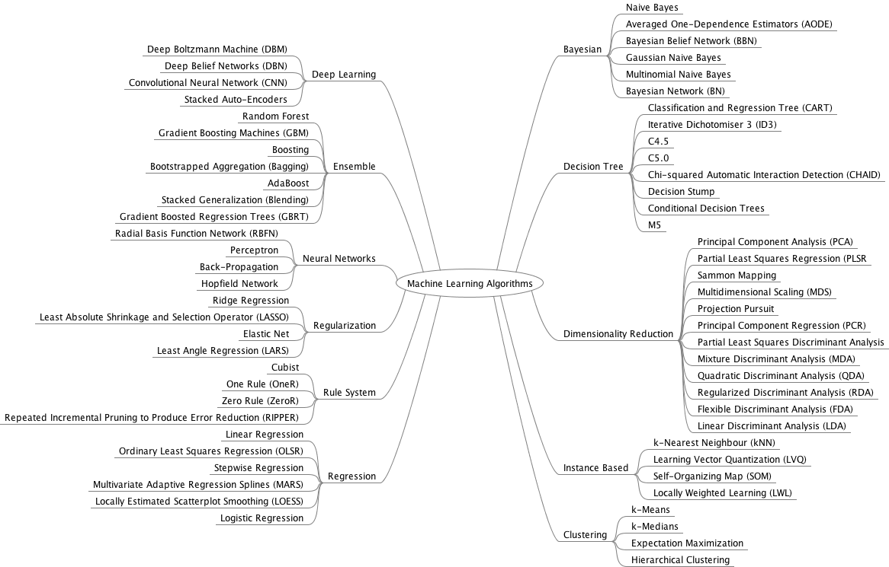
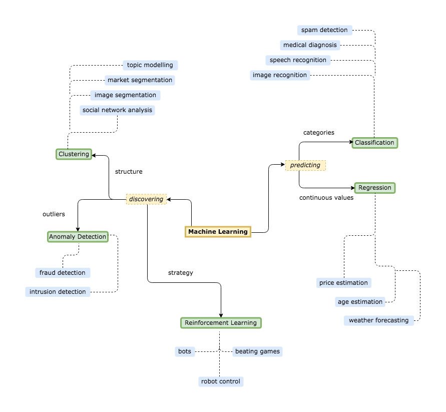

# ML Time

### Improving the Aftermath Management of an Earthquake
[Improving the Aftermath Management of an Earthquake | Omdena   
From a broad problem statement to a functional AI prototype in only two months to unite families in the aftermath of an earthquake.   
omdena.com](https://omdena.com/projects/ai-earthquake/)

​ 
___

### Happy Valentine's Day from MATLAB ❤️ Code ⬇️
[MathWorks on LinkedIn: Happy Valentine's Day from MATLAB ❤️ Code ⬇️   [y,x,z] = ndgrid(linspace | 103 comments   
Happy Valentine's Day from MATLAB ❤️ Code ⬇️   [y,x,z] = ndgrid(linspace(-2,2,100),linspace(-2,2,100),linspace(-2,2,100));  f = (x.^2+9/4*y.^2+z.^2-1).... 103 comments on LinkedIn  
www.linkedin.com](https://www.linkedin.com/posts/the-mathworks_2_happy-valentines-day-from-matlab-code-activity-6766687084829790208-XApw/)

___

### 50+ Statistics Interview Questions and Answers for Data Scientists for 2021
[https://towardsdatascience.com/50-statistics-interview-questions-and-answers-for-data-scientists-for-2021-24f886221271  
towardsdatascience.com](https://towardsdatascience.com/50-statistics-interview-questions-and-answers-for-data-scientists-for-2021-24f886221271)

___

### DIY- Multi-Level Dendrogram
[Siddharth Pawar on LinkedIn: #vismydata #vismydata #tableau   
Sixth DIY from #vismydata  DIY- Multi-Level Dendrogram  Multi-Level Dendrogram is used to analyze the data containing parent-child relations between two...   
www.linkedin.com](https://www.linkedin.com/posts/siddharth-pawar_vismydata-tableau-tableaudesktop-activity-6766344350101245952-kg0a/)
​

___

### How to use ML to perform RF modulation recognition?
[James Heaton on LinkedIn: Xilinx/Vitis-Tutorials   
Want to learn how to use ML to perform RF modulation recognition? Check out our new Vitis-AI tutorial that Jon Beckwith and I created....   
www.linkedin.com](https://www.linkedin.com/posts/james-heaton-66035310_xilinxvitis-tutorials-activity-6766037565733789696-XCft/)
​

___

### Tools for building robust, state-of-the-art machine learning models
[Tools for building robust, state-of-the-art machine learning models   
The Data Exchange Podcast: Michael Mahoney on meta-analysis and adversarial training, and predicting trends in machine learning.   
thedataexchange.media](https://thedataexchange.media/tools-for-building-robust-state-of-the-art-machine-learning-models/amp/)
​

___

### English Audio Speech-to-Text Transcript with Hugging Face | Python NLP
​[https://www.linkedin.com/posts/amrrs_english-audio-speech-to-text-transcript-with-activity-6766025732201287680-1DSy/](https://www.linkedin.com/posts/amrrs_english-audio-speech-to-text-transcript-with-activity-6766025732201287680-1DSy/)​

___

### Neural Re-rendering for Full-frame Video Stabilization

[Neural Re-rendering for Full-frame Video Stabilization   
alex04072000.github.io](https://alex04072000.github.io/NeRViS/)
​

___

### AI-ML Cheat Sheets

[Sign Up | LinkedIn   
500 million+ members | Manage your professional identity. Build and engage with your professional network. Access knowledge, insights and opportunities.   
www.linkedin.com](https://www.linkedin.com/login?session_redirect=https%3A%2F%2Fwww%2Elinkedin%2Ecom%2Ffeed%2Fupdate%2Furn%3Ali%3Aactivity%3A6765855868929089537)

___
​

### Q4 2020 Food Delivery & Rideshare Sales Report
[Q4 2020 Food Delivery & Rideshare Sales Report   
Ahead of election and Prop 22 ballot, DoorDash leads with 48%, surpassing Uber Eats + Postmates (35%) and GrubHub (15%)   
medium.com](https://medium.com/edison-discovers/q4-2020-food-delivery-rideshare-sales-report-70382329c1b1)
​

___

### AI PAPER SUMMARY
[AI Paper Summary Category | MarkTechPost   
www.marktechpost.com](https://www.marktechpost.com/category/tech-news/ai-paper-summary/)

___

### Microservices Architecture at Netflix!
[Srivathsan Vijayaraghavan on LinkedIn: Check out the Microservices Architecture at Netflix! 1. Client sends   
Check out the Microservices Architecture at Netflix! 1. Client sends a Play request to Backend running on Amazon Web Services (AWS). The request is handled...   
www.linkedin.com](https://www.linkedin.com/posts/srivathsan97_check-out-the-microservices-architecture-activity-6747814131904208896-ZdC2)

___

# 10 Awesome Data Science Courses to make you an Awesome Data Scientist
[Sign Up | LinkedIn   
500 million+ members | Manage your professional identity. Build and engage with your professional network. Access knowledge, insights and opportunities.   
www.linkedin.com](https://www.linkedin.com/login?session_redirect=https%3A%2F%2Fwww%2Elinkedin%2Ecom%2Ffeed%2Fupdate%2Furn%3Ali%3Aactivity%3A6765214718861938688)

___

### Yann LeCun’s Deep Learning Course
[Arpit Singh on LinkedIn: #DataScience #ML #machinelearning | 20 comments   
Yann LeCun’s Deep Learning Course — Deep Learning DS-GA 1008 — has been made *Free and Now Fully Available Online!!  The course is led by Yann LeCun himself... 20 comments on LinkedIn   
www.linkedin.com](https://www.linkedin.com/posts/imarpit_datascience-ml-machinelearning-activity-6765103006779260928-Z4t-)

 

___

### Analyzing seasonality with Fourier transforms using Python & SciPy
[Theophano Mitsa Ph.D. on LinkedIn: Analyzing seasonality with Fourier transforms using Python & SciPy   
https://lnkd.in/en5EMcg...   
www.linkedin.com](https://www.linkedin.com/posts/theophano-mitsa-ph-d-2a62349_analyzing-seasonality-with-fourier-transforms-activity-6764900192136286208-D2HP)

___

### An open-source text annotation tool for humans
[Steve Nouri on LinkedIn: #innovation #artificialintelligence #machinelearning | 59 comments   
An open-source text annotation tool for humans.   Annotation features for : Text classification Sequence labeling  Sequence to sequence tasks.   Label ... 59 comments on LinkedIn   
www.linkedin.com](https://www.linkedin.com/posts/stevenouri_innovation-artificialintelligence-machinelearning-activity-6764884431628062720-X6_c)

___

### PORORO: Platform Of neuRal mOdels for natuRal language prOcessing 
[Vincent Boucher on LinkedIn: #MachineLearning #NaturalLanguageProcessing #NLP   
PORORO  Platform Of neuRal mOdels for natuRal language prOcessing : https://lnkd.in/dniSG7G  #MachineLearning #NaturalLanguageProcessing #NLP...   
www.linkedin.com](https://www.linkedin.com/posts/montrealai_machinelearning-naturallanguageprocessing-activity-6764654087054102528-NgTz)

___

### Indian Flag with Turtle using Python
 This Republic day I tried to do something creative and made an Indian Flag with Turtle using Python. Turtle is a pre-installed Python library. It enables users to create pictures and shapes by providing them with a virtual canvas. 

[​https://www.linkedin.com/posts/ayushi7rawat_python3-githubcli-python-ugcPost-6759845965777125376-Il15​](​https://www.linkedin.com/posts/ayushi7rawat_python3-githubcli-python-ugcPost-6759845965777125376-Il15​)

You can also refer to the YouTube video tutorial for better understanding: [https://lnkd.in/dUrctgE](https://lnkd.in/dUrctgE) 

GitHub Repo: [https://lnkd.in/disintQ](https://lnkd.in/disintQ) 

Blog link: [https://lnkd.in/dcUuTgg​](https://lnkd.in/dcUuTgg​)

___

### The Shiny AWS Book

[The Shiny AWS Book   
A proven process for deploying applications in the cloud with Shiny and AWS   
business-science.github.io](https://business-science.github.io/shiny-production-with-aws-book/?utm_content=buffere8902&utm_medium=social&utm_source=linkedin.com&utm_campaign=buffer)
​

___

### 10 Most Stable Linux Distros In 2021

[10 Most Stable Linux Distros In 2021   
Here are the ten most stable Linux Distros to try in 2021.   
analyticsindiamag.com](https://analyticsindiamag.com/10-most-stable-linux-distros-in-2021/)
​

___

### Python’s Pandas vs. R’s dplyr
[Python’s Pandas vs. R’s dplyr – Which Is The Best Data Analysis Library | R-bloggers   
Pandas vs. dplyr It’s difficult to find the ultimate go-to library for data analysis. Both R and Python provide excellent options, so the question quickly becomes “which data analysis library is the most convenient”. Today’s article aims to answer this question, assuming you’re equally skilled in both ...   
www.linkedin.com](https://www.r-bloggers.com/2021/02/pythons-pandas-vs-rs-dplyr-which-is-the-best-data-analysis-library/?utm_source=feedburner&utm_medium=email&utm_campaign=Feed%3A+RBloggers+%28R+bloggers%29)
​
 

___

### Top Ten Kaggle Notebooks For Data Science Enthusiasts In 2021
[Top Ten Kaggle Notebooks For Data Science Enthusiasts In 2021   
Here are top ten Kaggle Notebooks a data science enthusiast must know.   
analyticsindiamag.com](https://www.r-bloggers.com/2021/02/pythons-pandas-vs-rs-dplyr-which-is-the-best-data-analysis-library/?utm_source=feedburner&utm_medium=email&utm_campaign=Feed%3A+RBloggers+%28R+bloggers%29)
​
 

___

### An R package to build your resume or CV
[Ludovic BOCKEN, PhDs (c) on LinkedIn: jaredlander/resumer   
An R package to build your resume or CV. Nice Jared Lander. So when you get to the interview you can say, "My resume? I built it in R."  https://lnkd.in...   
www.linkedin.com](https://www.linkedin.com/posts/ludovicbocken_jaredlanderresumer-activity-6763816345650925569-3yGw)
​

___

### Applied Data Science: Free E-Book
[Machine Learning India on LinkedIn: Applied Data Science: Free E-Book | 14 comments   
Applied Data Science: Free E-Book, for you all! 🤓 Save for later, follow us, Machine Learning India, for more of such awesome resources! 🦾  #datascience... 14 comments on LinkedIn   
www.linkedin.com](https://www.linkedin.com/posts/mlindia_applied-data-science-free-e-book-activity-6763351573801308160-xLOp/)

___

### "The Data Engineering Cookbook" by Andreas Kretz!!
[Arpit Singh on LinkedIn: The Data Engineering Cookbook by Andreas Kretz   
"The Data Engineering Cookbook" by Andreas Kretz!!   This is truly a complete package & one of the best resources for aspiring #Data Engineers. It includes...   
www.linkedin.com](https://www.linkedin.com/posts/imarpit_the-data-engineering-cookbook-by-andreas-activity-6763295036466626560-4itW/)

___

### Data Cleaning
[uday kiran reddy kondreddy on LinkedIn: data cleaning   
Learn why Data Cleaning is important.  credits - Learn.MachineLearning and follow them for more Exciting information.  #datascience #deeplearning #machinelearning...   
www.linkedin.com](https://www.linkedin.com/posts/udaykondreddy_data-cleaning-ugcPost-6762952860109033472-l_Ty)

___

### Wind Forecast
[Florian Roscheck on LinkedIn: flrs/caiso_wind_forecast   
My quest: Forecasting the supply of wind energy in the California power grid based on weather data!  🤩 As a student of Matt Dancho's High-Performance...    
www.linkedin.com](https://www.linkedin.com/posts/florianroscheck_flrscaisowindforecast-activity-6762438711935418368-sJci)

___

### Fundamentals of Python Programming
[Arpit Singh on LinkedIn: Fundamentals of Python Programming by Richard Halterman | 16 comments   
"Fundamentals of Python Programming" by Richard L. Halterman (Southern Adventist University)!!  This book mainly focuses on introducing #Python programming... 16 comments on LinkedIn   
www.linkedin.com](https://www.linkedin.com/posts/imarpit_fundamentals-of-python-programming-by-richard-activity-6762191400550359040-gMNa)

___

### Mistakes to avoid as a Data Scientist
[Learn.MachineLearning on LinkedIn: mistakes to avoid | 11 comments   
Mistakes to avoid as a Data Scientist. (MUST READ)  Follow Learn.MachineLearning for more exciting information.  If you are not following our Instagram... 11 comments on LinkedIn   
www.linkedin.com](https://www.linkedin.com/posts/learn-machine-learning_mistakes-to-avoid-activity-6762604522880806913-pTyz)

___

### Fake AI generated blog
[MIT Technology Review on LinkedIn: A college kid created a fake, AI-generated blog. It reached #1 on  | 16 comments   
In August, a college kid's fake, AI-generated blog fooled tens of thousands, illustrating the dangers of this technology. “From the time that I thought... 16 comments on LinkedIn   
www.linkedin.com](https://www.linkedin.com/posts/mit-technology-review_a-college-kid-created-a-fake-ai-generated-activity-6762716435434225664-tflA)

___

### ML Interview Questions
[Arpit Singh on LinkedIn: 41 Essential Machine Learning Interview QnAs   
41 Essential #MachineLearning Interview Questions & Answers (via Springboard)!!   👉 To easily download this PDF, just click on it to make it full screen...   
www.linkedin.com](https://www.linkedin.com/posts/imarpit_41-essential-machine-learning-interview-qnas-activity-6762550818743873536-VS9U)

___

### BudgetML
[ebhy/budgetml   
Deploy a ML inference service on a budget in less than 10 lines of code. - ebhy/budgetml   
github.com](https://github.com/ebhy/budgetml)

___

[Hamza Tahir on LinkedIn: ebhy/budgetml   
After switching our company strategy to open-source with ZenML (https://lnkd.in/dwRDa-M), I've personally grown to appreciate and love the open-source...   
www.linkedin.com](https://www.linkedin.com/posts/hamzatahirofficial_ebhybudgetml-activity-6761958351417954304-gAdo)

​

​

[A Comprehensive guide to Fine-tuning Deep Learning Models in Keras (Part II) | Felix Yu   
This is Part II of a 2 part series that cover fine-tuning deep learning models in Keras. Part I states the motivation and rationale behind fine-tuning and gi...   
flyyufelix.github.io](https://flyyufelix.github.io/2016/10/08/fine-tuning-in-keras-part2.html)
​
 

___

[Canada’s AI Corridor is Maturing: The Canadian AI Ecosystem in 2018 - jfgagne   
(Click to enlarge) Welcome to the now “annual” Canadian AI Ecosystem Map. What a year it’s been. Read the full report The report also goes to feed the excellent (and searchable!) directory at Canada.ai.   
jfgagne.ai](https://jfgagne.ai/blog/the-canadian-ai-ecosystem-in-2018/)
​
 

___

[Canadian AI Ecosystem 2018 - jfgagne   
With last year’s Canadian AI Ecosystem report, we aimed to test our hypothesis that the Canadian AI Ecosystem is larger than it is often represented. Since then, we have already seen a 28% increase in the number of active AI-related startups in Canada.   
jfgagne.ai](https://jfgagne.ai/canadian-ai-ecosystem-2018-en/)
​

​

[https://towardsdatascience.com/why-we-switched-from-flask-to-fastapi-for-production-machine-learning-765aab9b3679   
towardsdatascience.com](https://medium.com/@calebkaiser/why-we-switched-from-flask-to-fastapi-for-production-machine-learning-765aab9b3679)
​
 

___

[Steve Nouri on LinkedIn: #artificialintelligence #datascience #deeplearning | 40 comments   
Deploy a Machine Learning Model ( ML in Production)  Flask is currently the de facto choice for writing these APIs for a couple of reasons:  Flask is minimal... 40 comments on LinkedIn   
www.linkedin.com](https://www.linkedin.com/posts/stevenouri_artificialintelligence-datascience-deeplearning-activity-6678195852944781312-eLkq/)
​
 

___

[A Flask API for serving scikit-learn models   
Scikit-learn is an intuitive and powerful Python machine learning library that makes training and validating many models fairly easy…   
towardsdatascience.com](https://towardsdatascience.com/a-flask-api-for-serving-scikit-learn-models-c8bcdaa41daa)
​
 

___

[Philip Vollet on LinkedIn: #nlp #neuralnetworks #knowledgegraphs  
Modeling Global and Local Node Contexts for Text Generation from Knowledge Graphs • Recent graph-to-text models generate text from graph-based data using...   
www.linkedin.com](https://www.linkedin.com/posts/activity-6681140779710214144-vUa8/)
​
 

___

[Modeling Global and Local Node Contexts for Text Generation from...   
Recent graph-to-text models generate text from graph-based data using either global or local aggregation to learn node representations. Global node encoding allows explicit communication between...   
arxiv.org](https://arxiv.org/abs/2001.11003)
​
 

___

[UKPLab/kg2text   
Modeling Global and Local Node Contexts for Text Generation from Knowledge Graphs (authors' implementation for the TACL20 paper) - UKPLab/kg2text   
github.com](https://github.com/UKPLab/kg2text)
​

<figure contenteditable="false" class="reset-3c756112--figure-c0d4b308">

<iframe src="https://cdn.iframe.ly/TjQ7VgR" style="border: 0; top: 0; left: 0; width: 100%; height: 100%; position: absolute;" allowfullscreen="" allow="encrypted-media *"></iframe>

</figure>

​

[Philip Vollet on LinkedIn: #GNN #machinelearning #deeplearning | 15 comments   
Spektral is a Python library for graph deep learning, based on the Keras API and TensorFlow 2. Spektral is a simple but flexible framework for creating... 15 comments on LinkedIn   
www.linkedin.com](https://www.linkedin.com/posts/activity-6681074002246590465-glkg/)

___
​

[Ontario schools will now teach first graders financial literacy and coding to better prepare students for jobs of the future   
Coding and financial literacy will now be required learning for elementary school students in Ontario.   
amp-cnn-com.cdn.ampproject.org](https://amp-cnn-com.cdn.ampproject.org/c/s/amp.cnn.com/cnn/2020/06/23/americas/ontario-math-curiculum-trnd/index.html)
​
 

___

[Morphological Processing for தமிழ் — The Unsupervised Way   
This is part of a series of articles on NLP for Tamil. Please find the first one here.   
medium.com](https://medium.com/analytics-vidhya/morphological-processing-for-%E0%AE%A4%E0%AE%AE%E0%AE%BF%E0%AE%B4%E0%AF%8D-the-unsupervised-way-68afebc388c4)
​
 

___

[PyTorch   
An open source deep learning platform that provides a seamless path from research prototyping to production deployment.   
pytorch.org](https://pytorch.org/get-started/locally/)
​
 

​

[ChoudharyChanchal/game_control   
Contribute to ChoudharyChanchal/game_control development by creating an account on GitHub.   
github.com](https://github.com/ChoudharyChanchal/game_control)
​
 

___

[R-CNN object detection with Keras, TensorFlow, and Deep Learning - PyImageSearch   
In this tutorial, you will learn how to build an R-CNN object detector using Keras, TensorFlow, and Deep Learning.   
www.pyimagesearch.com](https://www.pyimagesearch.com/2020/07/13/r-cnn-object-detection-with-keras-tensorflow-and-deep-learning/)
​
 

___

[Main Types of Neural Networks and its Applications — Tutorial   
A tutorial on the main types of neural networks and its applications to real-world challenges.   
medium.com](https://pub.towardsai.net/main-types-of-neural-networks-and-its-applications-tutorial-734480d7ec8e)
​
 

___

[You Don’t Understand Neural Networks Until You Understand the Universal Approximation Theorem   
The Proof Behind the Neural Network’s Power   
medium.com](https://medium.com/analytics-vidhya/you-dont-understand-neural-networks-until-you-understand-the-universal-approximation-theorem-85b3e7677126)
​

1-Introduction to Time Series and Forecasting [https://lnkd.in/gqZbe7p​](https://lnkd.in/gqZbe7p​)

2-Statistics and Analysis of Scientific Data [https://lnkd.in/g-hbjWZ](https://lnkd.in/g-hbjWZ)​

3-Linear Algebra Done Right [https://lnkd.in/gqCT-6g​](https://lnkd.in/gqCT-6g​)

4-Linear Algebra [https://lnkd.in/gJSPXQd](https://lnkd.in/gJSPXQd)​

5-Algebra [https://lnkd.in/gc-H3Kk](https://lnkd.in/gc-H3Kk)​

6-Understanding Analysis [https://lnkd.in/g_RXeVk​](https://lnkd.in/g_RXeVk​)

7-Understanding Statistics Using R [https://lnkd.in/g27NnMy](https://lnkd.in/g27NnMy)​

8-An Introduction to Statistical Learning [https://lnkd.in/gyjbQ-A](https://lnkd.in/gyjbQ-A)​

9-Statistical Learning from a Regression Perspective [https://lnkd.in/g2gFWfi](https://lnkd.in/g2gFWfi)​

10-Robotics [https://lnkd.in/gJDEgec​](https://lnkd.in/gJDEgec​)

11-Regression Modeling Strategies [https://lnkd.in/gR3Mufh](https://lnkd.in/gR3Mufh)​

12-A Modern Introduction to Probability and Statistics [https://lnkd.in/gCgbX6m​](https://lnkd.in/gCgbX6m​)

13-The Python Workbook [https://lnkd.in/gw4tAf7](https://lnkd.in/gw4tAf7)​

14-Machine Learning in Medicine — a Complete Overview [https://lnkd.in/g43uZiT](https://lnkd.in/g43uZiT​)

15-Introduction to Data Science [https://lnkd.in/gSvtBCs​](https://lnkd.in/gSvtBCs​)

16-Applied Predictive Modeling [https://lnkd.in/gcHus2e](https://lnkd.in/gcHus2e)​

1. Data Science Process [https://pos.li/2fki4i](https://pos.li/2fki4i​
)
2. Data Visualization in Business [https://pos.li/2fki4j​](https://pos.li/2fki4j​)

3. Know Machine Learning Key Terminology [https://pos.li/2fki4k​](https://pos.li/2fki4k​)

4. Understand Machine Learning Implementation [https://pos.li/2fki4l​](https://pos.li/2fki4l​)

5. Machine Learning Applications on Marketing [https://pos.li/2fki4m](https://pos.li/2fki4m) and Retail [https://pos.li/2fki4f](https://pos.li/2fki4f)​

[Is Canada still in the lead in AI?   
You may be shocked about this, but no, we’re not. I remember the days of helping start DeepLearni.   
www.linkedin.com](https://www.linkedin.com/pulse/canada-still-lead-ai-victor-anjos/)
​

**TOP 10 SQL Concepts for Job Interview**

1. Aggregate Functions (SUM/AVG)

2. Group By and Order By

3. JOINs (Inner/Left/Right)

4. Union and Union All

5. Date and Time processing

6. String processing

7. Window Functions (Partition by)

8. Subquery

9. View and Index

10. Common Table Expression (CTE)

**TOP 10 Statistics Concepts for Job Interview**

1. Sampling

2. Experiments (A/B tests)

3. Descriptive Statistics

4. p-value

5. Probability Distributions

6. t-test

7. ANOVA

8. Correlation

9. Linear Regression

10. Logistics Regression

**TOP 10 Python Concepts for Job Interview**

1. Reading data from file/table

2. Writing data to file/table

3. Data Types

4. Function

5. Data Preprocessing (numpy/pandas)

6. Data Visualisation (Matplotlib/seaborn/bokeh)

7. Machine Learning (sklearn)

8. Deep Learning (Tensorflow/Keras/PyTorch)

9. Distributed Processing (PySpark)

10. Functional and Object Oriented Programming

[Certificate Program in Quantum Engineering and Technology   
Learn the basics of quantum information science in an accelerated format.   
professional.uchicago.edu](https://professional.uchicago.edu/find-your-fit/professional-education/certificate-programs-quantum-engineering-and-technology)

___
​

[Royal Bank of Canada, Borealis AI partner with Red Hat, NVIDIA on new AI computing platform | BetaKit   
RBC has developed its own cloud-based artificial intelligence computing platform upon which to create and maintain AI-powered banking applications.   
betakit.com](https://betakit.com/royal-bank-of-canada-borealis-ai-partner-with-red-hat-nvidia-on-new-ai-computing-platform/)
​
 

___

[adityamhatre/GameCarControl-CV   
Contribute to adityamhatre/GameCarControl-CV development by creating an account on GitHub.   
github.com](https://github.com/adityamhatre/GameCarControl-CV)
​
 

___

[Car controller for games using OpenCV   
This is an OpenCV project that uses computer vision to detect contours and filters out the blue color on the steering wheel   
medium.com](https://medium.com/@aditya.r.mhatre/car-controller-for-games-using-opencv-1ba821d5fe4b)
​
 

___
​

[Gallery — pydeck 0.6.1 documentation   
pydeck.gl](https://pydeck.gl/)

 
​
___

[dheerajiiitv/T5-paraphrase-generation   
Contribute to dheerajiiitv/T5-paraphrase-generation development by creating an account on GitHub.   
github.com](https://github.com/dheerajiiitv/T5-paraphrase-generation)
​
 

___

[10 COOL GPT-3 DEMOS   
Since OpenAI kicked off the GPT-3 API access for selected users, many demos have been created, some of which showcased the impressive capabilities of the massive-scale language model. Here are 10 cool demos based on GPT-3 that appeared on Twitter.   
machinelearningtokyo.com](https://machinelearningtokyo.com/2020/07/26/10-cool-gpt-3-demos/)

___
​

Data Science Topics: CRISP – DM - Project Management Methodology Exploratory Data Analytics (EDA) / Descriptive Analytics Statistical Data Business Intelligence and Data Visualization Plots & Inferential Statistics Probability Distributions (Continuous & Discrete) Hypothesis Testing - The ‘4’ Must Know Hypothesis Tests Data Mining Supervised Learning – Linear Regression, OLS Predictive Modelling – Multiple Linear Regression Lasso and Ridge Regressions Logistic Regression – Binary Value Prediction, MLE Multinomial Regression Advanced Regression for Count Data Data Mining Unsupervised Learning - Clustering Data Mining Unsupervised Learning - Dimension Reduction (PCA) Data Mining Unsupervised Learning - Association Rules Recommendation Engine Network Analytics Machine Learning - k - NN Classifier Decision Tree & Random Forest Ensemble Techniques - Bagging and Boosting AdaBoost & Extreme Gradient Boosting Text Mining & Natural Language Processing (NLP) Machine Learning Classifier Technique - Naive Bayes Introduction to Perceptron, Multilayer Perceptron Building Blocks of Neural Network Deep Learning Black Box Technique - Neural Network Deep Learning Black Box Technique - SVM Survival Analytics Forecasting/Time Series – Model Driven Algorithms Forecasting/Time Series – Data Driven Algorithms

[BLURB Leaderboard   
microsoft.github.io](https://microsoft.github.io/BLURB/index.html)

___
​

[Domain-Specific Language Model Pretraining for Biomedical Natural...   
Pretraining large neural language models, such as BERT, has led to impressive gains on many natural language processing (NLP) tasks. However, most pretraining efforts focus on general domain...   
arxiv.org](https://arxiv.org/abs/2007.15779)
​

___

[Step-by-step guide to contributing on GitHub   
Learn the exact process I use when contributing to an open source project on GitHub. Follow this detailed visual guide to make your first contribution TODAY!   
www.dataschool.io](https://www.dataschool.io/how-to-contribute-on-github/)
​
 

___

[tiangolo/full-stack-fastapi-postgresql   
Full stack, modern web application generator. Using FastAPI, PostgreSQL as database, Docker, automatic HTTPS and more. - tiangolo/full-stack-fastapi-postgresql   
github.com](https://github.com/tiangolo/full-stack-fastapi-postgresql)
​
 

___

[Launch Your Career in Data Science   
elitedatascience.com](https://elitedatascience.com/)
​
 

___

[Writer Identification Using Microblogging Texts for Social Media Forensics   
Establishing authorship of online texts is fundamental to combat cybercrimes. Unfortunately, text length is limited on some platforms, making the challenge harder. We aim at identifying the...   
arxiv.org](https://arxiv.org/abs/2008.01533)
​

<iframe style="width:100%; height:1000px;" allow="autoplay *; encrypted-media *" src="https://docs.google.com/viewer?embedded=true&amp;url=https%3A%2F%2Farxiv.org%2Fpdf%2F2003.09040.pdf" allowfullscreen="true" frameborder="0"></iframe>

​

[TinyML is giving hardware new life   
Today and going forward, billions of tiny devices will act as an extension of our brains, feelings and emotions as a natural extension of everyday life.   
techcrunch.com](https://techcrunch.com/2020/05/29/tinyml-is-giving-hardware-new-life/?guccounter=1)

___
​

[goru001/inltk   
Natural Language Toolkit for Indic Languages aims to provide out of the box support for various NLP tasks that an application developer might need - goru001/inltk   
github.com](https://github.com/goru001/inltk)

___

[Natural Language Toolkit for Indic Languages — iNLTK latest documentation   
inltk.readthedocs.io](https://inltk.readthedocs.io/en/latest/)
​
 

___

[naiveHobo/InvoiceNet   
Deep neural network to extract intelligent information from invoice documents. - naiveHobo/InvoiceNet   
github.com](https://github.com/naiveHobo/InvoiceNet)
​
 

___

[Group Normalization   
Introduction Drawback of Batch Normalization Introduction to Group Normalization Other Normalization Techniques Group Normalization in detail and comparison to other   
amaarora.github.io](https://amaarora.github.io/2020/08/09/groupnorm.html#group-normalization-explained)
​
 

___

[Aman Arora on LinkedIn: Group Normalization   
It's Monday and as promised, I am back with another blog post - this time on "Group Normalization".   While BatchNorm is used in most SOTA algorithms, ...   
www.linkedin.com](https://www.linkedin.com/posts/aroraaman_group-normalization-activity-6698343876433985536-Jadk/)
​
 
___

[Generative Teaching Networks: Accelerating Neural Architecture Search by Learning to Generate Synthetic Training Data   
Developed by Uber AI Labs, Generative Teaching Networks (GTNs) automatically generate training data, learning environments, and curricula to help AI agents rapidly learn.   
eng.uber.com](https://eng.uber.com/generative-teaching-networks/)
​
 

___

[Getting started in NLP/ML | Victor Zhong   
www.victorzhong.com](https://www.victorzhong.com/blog/getting-started-in-NLP-ML-research.html)
​
 

___

[TDAmeritrade/stumpy   
STUMPY is a powerful and scalable Python library for computing a Matrix Profile, which can be used for a variety of time series data mining tasks - TDAmeritrade/stumpy   
github.com](https://github.com/TDAmeritrade/stumpy)
​
 

___

[STUMPY documentation — stumpy 1.8.0 documentation   
stumpy.readthedocs.io](https://stumpy.readthedocs.io/en/latest/)
​
 

___

[STUMPY   
A Powerful and Scalable Python Library for Modern Time Series Analysis   
seanmylaw.medium.com](https://seanmylaw.medium.com/stumpy-fdb9f8f1f261)
​
 

___
​

[PettingZoo-Team/PettingZoo   
Gym for multi-agent reinforcement learning. Contribute to PettingZoo-Team/PettingZoo development by creating an account on GitHub.   
github.com](https://github.com/PettingZoo-Team/PettingZoo)
​

​

[jim-schwoebel/allie   
🤖 A machine learning framework for audio, text, image, video, or .CSV files (50+ featurizers and 15+ model trainers). - jim-schwoebel/allie   
github.com](https://github.com/jim-schwoebel/allie)

___
​

[Machine Learning Software Engineer   
www.borealisai.com](https://www.borealisai.com/en/careers/employment/machine-learning-software-engineer/)
​
 

___

​[http://gvv.mpi-inf.mpg.de/projects/NHRR/](http://gvv.mpi-inf.mpg.de/projects/NHRR/) 
[http://gvv.mpi-inf.mpg.de/projects/NHRR/data/1415.pdf​](http://gvv.mpi-inf.mpg.de/projects/NHRR/data/1415.pdf​)

​

Machine Learning with Graphs, Leskovec 

[Index of /class/cs224w-videos-2019   
snap.stanford.edu](http://snap.stanford.edu/class/cs224w-videos-2019/)
​
 

___

[China has started a grand experiment in AI education. It could reshape how the world learns.   
Zhou Yi was terrible at math. He risked never getting into college. Then a company called Squirrel AI came to his middle school in Hangzhou, China, promising personalized tutoring.   
www-technologyreview-com.cdn.ampproject.org](https://www-technologyreview-com.cdn.ampproject.org/c/s/www.technologyreview.com/2019/08/02/131198/china-squirrel-has-started-a-grand-experiment-in-ai-education-it-could-reshape-how-the/amp/)
​

1-The Elements of Statistical Learning [https://lnkd.in/gd-PpCa](https://lnkd.in/gd-PpCa)​

2-Introductory Time Series with R <https://lnkd.in/gemsHzv​>

3-A Beginner’s Guide to R <https://lnkd.in/gwQ6m_B​>

4-Data Structures and Algorithms with Python <https://lnkd.in/g9_djwr​>

5-Introduction to Statistics and Data Analysis <https://lnkd.in/gUUJMCj​>

6-Principles of Data Mining <https://lnkd.in/gMgmc-P​>

7-Computer Vision <https://lnkd.in/gftqxf9​>

8-Data Mining <https://lnkd.in/gJ6iugA​>

9-Robotics, Vision and Control <https://lnkd.in/gq-q9i5​>

10-Statistical Analysis and Data Display <https://lnkd.in/grCNSYq​>

11-Statistics and Data Analysis for Financial Engineering <https://lnkd.in/gRn8zWd​>

12-Stochastic Processes and Calculus <https://lnkd.in/gnWaWW6​>

13Statistical Analysis of Clinical Data on a Pocket Calculator <https://lnkd.in/gM7VCgG​>

14-Clinical Data Analysis on a Pocket Calculator <https://lnkd.in/gvxBvg6​>

15-The Data Science Design Manual <https://lnkd.in/gKxgaRD​>

16-An Introduction to Machine Learning <https://lnkd.in/gykPC2B​>

[On-device, Real-time Body Pose Tracking with MediaPipe BlazePose   
Posted by Valentin Bazarevsky and Ivan Grishchenko, Research Engineers, Google Research    Pose estimation from video plays a critical role ...   
ai.googleblog.com](https://ai.googleblog.com/2020/08/on-device-real-time-body-pose-tracking.html)
​
 

___

[Slideio: a new python library for reading medical images.   
This is an introduction to a new python library for the reading of medical images. More detailed information can be found on the project…   
towardsdatascience.com](https://towardsdatascience.com/slideio-a-new-python-library-for-reading-medical-images-11858a522059)
​
 

___

[Keras documentation: CycleGAN   
Keras documentation   
keras.io](https://keras.io/examples/generative/cyclegan/)
​
 

___

[Text Generation with Bi-LSTM in PyTorch   
A step-by-step guide to developing a text generation model by using PyTorch’s LSTMCells to create a Bi-LSTM model from scratch   
towardsdatascience.com](https://towardsdatascience.com/text-generation-with-bi-lstm-in-pytorch-5fda6e7cc22c)
​
 

___

[Amazon's Machine Learning University is making its online courses available to the public   
Classes previously only available to Amazon employees will now be available to the community.   
www.amazon.science](https://www.amazon.science/latest-news/machine-learning-course-free-online-from-amazon-machine-learning-university)
​
 

MLSS Indo 2020 - Lecture 1 - Machine Learning Basics

 

​
 

MLSS-Indo 2020 - Lecture 2 - Deep Learning Fundamentals

 

​
 

MLSS-Indo 2020 - Lecture 3 - Advanced Topics in Equivariance and Inductive Biases

 

​

​

​

[The untold story of GPT-3 is the transformation of OpenAI   
In the process of creating the largest language AI system, OpenAI has gradually morphed from a nonprofit AI lab to a company that sells AI services.   
bdtechtalks.com](https://bdtechtalks.com/2020/08/17/openai-gpt-3-commercial-ai/amp/)
​
 

___

[HenriquesLab/ZeroCostDL4Mic   
ZeroCostDL4Mic: A Google Colab based no-cost toolbox to explore Deep-Learning in Microscopy - HenriquesLab/ZeroCostDL4Mic   
github.com](https://github.com/HenriquesLab/ZeroCostDL4Mic)
​
 

___

[HenriquesLab/ZeroCostDL4Mic   
ZeroCostDL4Mic: A Google Colab based no-cost toolbox to explore Deep-Learning in Microscopy - HenriquesLab/ZeroCostDL4Mic   
github.com](https://github.com/HenriquesLab/ZeroCostDL4Mic/wiki#contributors)
​
 

___

[ZeroCostDL4Mic: an open platform to use Deep-Learning in Microscopy   
The resources and expertise needed to use Deep Learning (DL) in bioimaging remain significant barriers for most laboratories.   
www.biorxiv.org](https://www.biorxiv.org/content/10.1101/2020.03.20.000133v3)
​

___

[Too many AI researchers think real-world problems are not relevant   
Any researcher who’s focused on applying machine learning to real-world problems has likely received a response like this one   
www.technologyreview.com](https://www.technologyreview.com/2020/08/18/1007196/ai-research-machine-learning-applications-problems-opinion/?utm_medium=tr_social&utm_campaign=site_visitor.unpaid.engagement&utm_source=LinkedIn#Echobox=1597721504)
​
 

___

[OCR with Keras, TensorFlow, and Deep Learning - PyImageSearch   
In this tutorial, you will learn how to train an Optical Character Recognition (OCR) model using Keras, TensorFlow, and Deep Learning.   
www.pyimagesearch.com](https://www.pyimagesearch.com/2020/08/17/ocr-with-keras-tensorflow-and-deep-learning/)
​

The Laplace Transform: A Generalized Fourier Transform 

​

[Facebook and NYU use artificial intelligence to make MRI scans four times faster   
Less stuck in the machine thanks to AI.   
www.theverge.com​](https://www.theverge.com/2020/8/18/21373335/faster-mri-scans-ai-machine-learning-facebook-nyu-research-clinical-study)

___

[Microsoft leads $16M round into AI data science startup Pachyderm   
Microsoft leads $16M round into AI data science startup Pachyderm - SiliconANGLE   
siliconangle.com](https://siliconangle.com/2020/08/19/microsoft-leads-16m-round-ai-data-science-startup-pachyderm/)
​
 

___

[abhimishra91/insight   
Repository for Project Insight: NLP as a Service. Contribute to abhimishra91/insight development by creating an account on GitHub.   
github.com](https://github.com/abhimishra91/insight)
​
 

___

[DevashishPrasad/CascadeTabNet   
This repository contains the code and implementation details of the CascadeTabNet paper &amp;quot;CascadeTabNet: An approach for end to end table detection and structure recognition from image-base...   
github.com](https://github.com/DevashishPrasad/CascadeTabNet)
​
 

___
 

[CVPR2020 Workshop on Text and Documents in the Deep Learning Era   
Visit the post for more.   
cvpr2020text.wordpress.com](https://cvpr2020text.wordpress.com/)
​
 

___

[Google Colaboratory   
colab.research.google.com](https://colab.research.google.com/drive/1lzjbBQsF4X2C2WZhxBJz0wFEQor7F-fv?usp=sharing)
​
 

___

[linkedin/detext   
DeText: A Deep Neural Text Understanding Framework for Ranking and Classification Tasks  - linkedin/detext   
github.com](https://github.com/linkedin/detext)
​
 

___

[https://dl.acm.org/doi/10.1145/3331184.3331381   
dl.acm.org](https://dl.acm.org/doi/10.1145/3331184.3331381)
​
 

___

[The Ultimate guide to AI, Data Science &amp; Machine Learning, Articles, Cheatsheets and Tutorials ALL in one place   
Last updated 6/5/2019 This is a carefully curated compendium of articles &amp; tutorials covering all things AI, Data Science &amp; Machine Learning for the beginner to advanced practitioner.   
www.linkedin.com](https://www.linkedin.com/pulse/all-cheatsheets-one-place-vipul-patel/)
​
 

___

[https://citeseerx.ist.psu.edu/viewdoc/download?doi=10.1.1.161.3556&rep=rep1&type=pdf   
citeseerx.ist.psu.edu](https://citeseerx.ist.psu.edu/viewdoc/download?doi=10.1.1.161.3556&rep=rep1&type=pdf)

’Introduction to Statistics for Data Science, Exploratory Data Analysis in Python‘

Distributions

Probability Mass Functions

Cumulative distribution functions

Modeling distributions

Probability density functions

Relationships between variables

Estimation

Hypothesis testing

Linear least squares

Regression

Time series analysis

Survival analysis

Analytic methods

Credit: Allen B. Downey

[Forward from the 'Deep Learning for Coders' Book   
To celebrate the release of fast.ai's new course, book, and software libraries on August 21st, we're making available the foreword that Soumith Chintala (the co-creator of PyTorch) wrote for the book   
www.fast.ai](https://www.fast.ai/2020/08/20/soumith-forward/)
​
 

___

[fastai/fastbook   
The fastai book, published as Jupyter Notebooks. Contribute to fastai/fastbook development by creating an account on GitHub.   
github.com](https://github.com/fastai/fastbook/blob/master/01_intro.ipynb)
​
 

___

[fastai/fastbook   
The fastai book, published as Jupyter Notebooks. Contribute to fastai/fastbook development by creating an account on GitHub.   
github.com](https://github.com/fastai/fastbook)
​

**XGBoost Tutorials:** 

​<https://lnkd.in/g3dSRxz> 
1-Introduction to Boosted Trees   
2-Distributed XGBoost with AWS YARN   
3-Distributed XGBoost with XGBoost4J-Spark   
4-DART booster   
5-Monotonic Constraints   
6-Random Forests in XGBoost   
7-Feature Interaction Constraints   
8-Text Input Format of DMatrix   
9-Notes on Parameter Tuning   
10-Using XGBoost External Memory Version (beta)  

[XGBoost Algorithm | XGBoost In Machine Learning   
XGBoost has quickly become a popular machine learning technique, and a major differentiator in ML hackathons. In this article learn the math that powers it.   
www.analyticsvidhya.com](https://www.analyticsvidhya.com/blog/2018/09/an-end-to-end-guide-to-understand-the-math-behind-xgboost/)
​
 

___

[CatBoost vs. Light GBM vs. XGBoost - KDnuggets   
Who is going to win this war of predictions and on what cost? Let’s explore.   
www.kdnuggets.com](https://www.kdnuggets.com/2018/03/catboost-vs-light-gbm-vs-xgboost.html)
​
 

___

[rakesh4real/realtime-forex-api   
Contribute to rakesh4real/realtime-forex-api development by creating an account on GitHub.   
github.com](https://github.com/rakesh4real/realtime-forex-api)
​

​<https://github.com/rakesh4real/fastapi-template>
<https://realtime-forex.herokuapp.com/​>

​
[https://www.mit.edu/~amidi/teaching/data-science-tools/](https://www.mit.edu/~amidi/teaching/data-science-tools/)

<https://github.com/shervinea/mit-15-003-data-science-tools​>

[https://www.python-machinelearning.com](https://www.python-machinelearning.com/)

[​https://guide.allennlp.org/overview​](​https://guide.allennlp.org/overview)

[DevashishPrasad/CascadeTabNet   
This repository contains the code and implementation details of the CascadeTabNet paper &amp;quot;CascadeTabNet: An approach for end to end table detection and structure recognition from image-base...   
github.com](https://github.com/DevashishPrasad/CascadeTabNet)
​